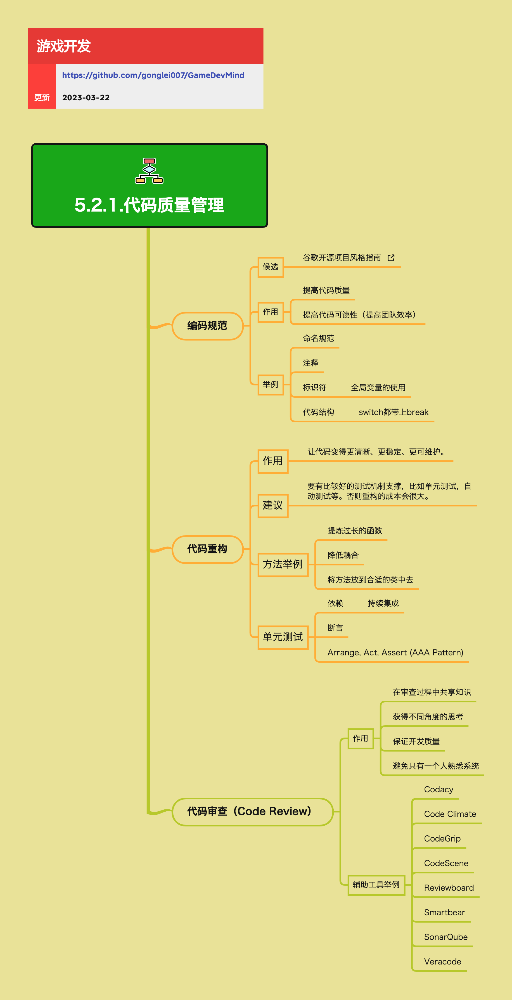

<h2 align="center">代码质量管理</h2>

从长期来说，高质量、设计合理的代码可以给项目带来高效性、稳定性和产品的优良体验。代码质量管理包括编码规范、代码重构、代码审查等方面，是保证项目长期可维护性的重要手段。

**关键词:** 
*Code Review,Code Refactoring,Code Style,编码规范,代码重构,单元测试*

**标签:** 
*等级: 中级, 阶段: 开发, 分类: 管理能力, 角色: 客户端开发|服务端开发|全栈开发|管理*

## 图谱

## 管理方法

### 编码规范

**是什么？在哪用？**

- **作用**：定义代码编写的一致性和标准，确保团队成员编写的代码风格统一
- **应用场景**：
  - 所有代码编写场景
  - 多人协作的项目
  - 代码审查
  - 新成员入职培训
- **做什么的？** 定义代码编写的一致性和标准，确保团队成员编写的代码风格统一。
- **在哪用？** 所有代码编写场景，特别是多人协作的项目。

**会遇到哪些问题？用什么解决？**

- **如何制定适合团队的编码规范？**
  - **问题**：需要制定适合团队的编码规范
  - **解决方向**：
    - **作用：**
      - **提高代码质量：通过统一的规范减少常见错误和潜在问题：** 统一规范
        - 减少常见错误
        - 减少潜在问题
        - 提高代码质量
    - 参考行业标准（如Google风格指南）
    - 根据团队实际情况调整
    - 团队讨论达成共识
    - 使用自动化工具检查
    - 定期更新规范
    - **候选规范：**
      - [谷歌开源项目风格指南](https://zh-google-styleguide.readthedocs.io/en/latest/google-cpp-styleguide/) - 可以参考并适配到自己的项目

- **如何确保团队成员遵守编码规范？**
  - **问题**：需要确保团队成员遵守编码规范
  - **解决方向**：
    - **作用：**
      - **提高代码可读性（提高团队效率）：统一的风格让团队成员更容易理解和维护代码：** 统一风格
        - 提高代码可读性
        - 提高团队效率
        - 便于理解和维护
    - 使用代码格式化工具（如Prettier、clang-format）
    - 集成到CI/CD流程
    - 代码审查时检查
    - 提供规范和工具文档
    - 新成员入职培训

- **如何平衡规范性和灵活性？**
  - **问题**：需要平衡规范性和灵活性
  - **解决方向**：
    - 核心规范必须遵守
    - 允许团队自定义部分规范
    - 定期审查和调整
    - 避免过度规范

- **编码规范的具体内容**
  - **问题**：编码规范应该包含哪些内容？
  - **解决方向**：
    - **举例：**
      - **命名规范：变量、函数、类等的命名约定，如驼峰命名、下划线命名等：** 命名规范
        - 变量命名约定
        - 函数命名约定
        - 类命名约定
        - 驼峰命名、下划线命名等
      - **注释：注释的格式、内容和位置规范：** 注释规范
        - 注释格式规范
        - 注释内容规范
        - 注释位置规范
      - **标识符：** 标识符使用规范
        - **全局变量的使用规范，避免过度使用全局变量：** 全局变量规范
          - 规范全局变量使用
          - 避免过度使用
      - **代码结构：** 代码结构规范
        - **switch都带上break，避免fall-through导致的bug：** switch规范
          - 使用break避免fall-through
          - 避免bug

**要点和思考方向：**
- 编码规范是代码质量管理的基础
- 通过统一的规范减少常见错误和潜在问题
- 统一的风格让团队成员更容易理解和维护代码
- 需要平衡规范性和灵活性
- 使用自动化工具确保规范执行

### 代码重构

**是什么？在哪用？**

- **作用**：在不改变代码外部行为的前提下，改善代码的内部结构，提高代码质量
- **应用场景**：
  - 当代码变得难以维护、理解或扩展时
  - 消除技术债务
  - 提高代码可读性和可维护性
  - 优化代码性能
  - 准备添加新功能前的代码整理
- **做什么的？** 在不改变代码外部行为的前提下，改善代码的内部结构，提高代码质量。
- **在哪用？** 当代码变得难以维护、理解或扩展时，需要进行重构。

**会遇到哪些问题？用什么解决？**

- **如何判断何时需要重构？**
  - **问题**：需要判断何时需要重构
  - **解决方向**：
    - 代码有"坏味道"（Code Smell）：长函数、重复代码、过大的类等
    - 添加新功能困难，需要修改多处代码
    - 代码难以理解，需要大量注释才能看懂
    - 测试难以编写，依赖关系复杂
    - 性能问题，需要优化代码结构

- **如何安全地进行重构？**
  - **问题**：需要安全地进行重构
  - **解决方向**：
    - **建议：**
      - **要有比较好的测试机制支撑，比如单元测试，自动测试等。否则重构的成本会很大：测试是重构的安全网，没有测试的重构风险很高：** 测试支撑
        - 建立测试机制
        - 使用单元测试
        - 使用自动测试
        - 降低重构成本
    - 建立完善的测试机制（单元测试、集成测试）
    - 小步重构，每次只做小的改动
    - 使用版本控制，便于回滚
    - 重构前先理解代码，不要盲目重构
    - 使用重构工具（IDE的重构功能）

- **如何避免重构引入新的bug？**
  - **问题**：需要避免重构引入新的bug
  - **解决方向**：
    - 重构前确保有足够的测试覆盖
    - 重构后运行所有测试
    - 使用自动化测试验证行为不变
    - 代码审查，让其他人检查重构
    - 逐步重构，每次验证后再继续

- **重构的具体方法**
  - **问题**：有哪些常用的重构方法？
  - **解决方向**：
    - **作用：**
      - **让代码变得更清晰、更稳定、更可维护：通过重构消除技术债务，提高代码质量：** 重构目标
        - 让代码更清晰
        - 让代码更稳定
        - 让代码更可维护
        - 消除技术债务
    - **方法举例：**
      - **提炼过长的函数：将长函数拆分成多个小函数，提高可读性：** 提炼函数
        - 拆分长函数
        - 提高可读性
      - **降低耦合：减少模块之间的依赖关系，提高代码的模块化程度：** 降低耦合
        - 减少模块依赖
        - 提高模块化程度
      - **将方法放到合适的类中去：遵循单一职责原则，将方法放在最合适的类中：** 方法移动
        - 遵循单一职责原则
        - 将方法放到合适的类中

- **单元测试支持**
  - **问题**：如何通过单元测试支持重构？
  - **解决方向**：
    - **单元测试：** 单元测试支持
      - **依赖：** 测试依赖
        - **持续集成：将单元测试集成到CI/CD流程中，自动运行测试：** CI集成
          - 集成到CI/CD流程
          - 自动运行测试
      - **断言：使用断言验证代码行为是否符合预期：** 断言验证
        - 使用断言
        - 验证代码行为
        - 验证是否符合预期
      - **Arrange, Act, Assert (AAA Pattern)：测试的标准结构模式：** AAA模式
        - **Arrange：准备测试数据和环境：** 准备阶段
          - 准备测试数据
          - 准备测试环境
        - **Act：执行被测试的代码：** 执行阶段
          - 执行被测试代码
        - **Assert：验证结果是否符合预期：** 验证阶段
          - 验证结果
          - 验证是否符合预期

**要点和思考方向：**
- 代码重构是提高代码质量的重要手段
- 通过重构消除技术债务，让代码更清晰、更稳定、更可维护
- 测试是重构的安全网，没有测试的重构风险很高
- 小步重构，逐步改善，避免大范围改动
- 使用重构工具和自动化测试提高重构效率

### 代码审查（Code Review）

**是什么？在哪用？**

- **作用**：通过团队成员对代码的审查，发现潜在问题，分享知识，提高代码质量
- **应用场景**：
  - 所有代码提交前
  - 重要功能或核心代码的修改
  - 新成员代码的审查
  - 代码重构后的审查
- **做什么的？** 通过团队成员对代码的审查，发现潜在问题，分享知识，提高代码质量。
- **在哪用？** 所有代码提交前，特别是重要功能或核心代码的修改。

**会遇到哪些问题？用什么解决？**

- **如何高效地进行代码审查？**
  - **问题**：需要高效地进行代码审查
  - **解决方向**：
    - **作用：**
      - **在审查过程中共享知识：通过代码审查，团队成员可以学习不同的编程技巧和最佳实践：** 知识共享
        - 学习编程技巧
        - 学习最佳实践
        - 共享知识
    - 建立代码审查流程和规范
    - 使用代码审查工具提高效率
    - 明确审查重点和检查清单
    - 控制审查代码量，避免过大
    - 及时反馈，避免阻塞

- **如何平衡审查的严格程度和开发效率？**
  - **问题**：需要平衡审查的严格程度和开发效率
  - **解决方向**：
    - **作用：**
      - **保证开发质量：在代码合并前发现问题，避免bug进入主分支：** 质量保证
        - 在合并前发现问题
        - 避免bug进入主分支
        - 保证开发质量
    - 根据代码重要性调整审查严格程度
    - 核心代码严格审查，工具代码可以放宽
    - 建立审查优先级机制
    - 使用自动化工具辅助审查
    - 避免过度审查影响开发效率

- **如何让代码审查成为学习机会而非负担？**
  - **问题**：需要让代码审查成为学习机会而非负担
  - **解决方向**：
    - **作用：**
      - **获得不同角度的思考：不同的人有不同的视角，可以发现作者忽略的问题：** 多角度思考
        - 获得不同视角
        - 发现忽略的问题
      - **避免只有一个人熟悉系统：通过代码审查，让更多人了解系统的实现细节：** 知识传播
        - 让更多人了解系统
        - 了解实现细节
        - 避免知识孤岛
    - 建立积极的审查文化，以学习为主
    - 审查者提供建设性意见，而非批评
    - 审查者解释建议的原因和好处
    - 鼓励讨论和交流
    - 将审查作为团队学习的机会

- **代码审查工具**
  - **问题**：有哪些工具可以辅助代码审查？
  - **解决方向**：
    - **辅助工具举例：**
      - **Codacy：自动化代码质量检查工具：** Codacy
        - 自动化检查
        - 代码质量检查
      - **Code Climate：代码质量分析和监控平台：** Code Climate
        - 代码质量分析
        - 代码质量监控
      - **CodeGrip：代码审查和分析工具：** CodeGrip
        - 代码审查
        - 代码分析
      - **CodeScene：代码演进分析和可视化工具：** CodeScene
        - 代码演进分析
        - 代码可视化
      - **Reviewboard：代码审查平台：** Reviewboard
        - 代码审查平台
      - **Smartbear：代码审查和协作工具：** Smartbear
        - 代码审查
        - 协作工具
      - **SonarQube：代码质量和安全分析平台：** SonarQube
        - 代码质量分析
        - 安全分析
      - **Veracode：应用安全测试平台：** Veracode
        - 应用安全测试

**要点和思考方向：**
- 代码审查是保证代码质量的重要环节
- 通过代码审查共享知识，获得不同角度的思考
- 在代码合并前发现问题，避免bug进入主分支
- 让更多人了解系统实现细节，避免知识孤岛
- 建立积极的审查文化，将审查作为学习机会
- 使用自动化工具提高审查效率

## 更多资料
### 在线资料
* [Google 开源项目风格指南](https://zh-google-styleguide.readthedocs.io/en/latest/google-cpp-styleguide/)
* [How To Improve Code Quality With Code Reviews and Refactoring](https://hackernoon.com/how-to-improve-code-quality-with-code-reviews-and-refactoring-bc5135mp) - 关于如何通过代码审查和重构提高代码质量。
* [一文梳理Code Review方法论与实践总结](https://zhuanlan.zhihu.com/p/598751710) - 作为卓越工程文化的一部分，Code Review其实一直在进行中，只是各团队根据自身情况张驰有度，松紧可能也不一，这里简单梳理一下CR的方法和团队实践。
* [如何有效地进行代码 Review？](https://zhuanlan.zhihu.com/p/268749337) - 有效的代码 Review 不但能提高代码的质量，更能促进团队沟通协作，建立更高的工程质量标准，无论对个人还是团队都有着重要的价值。本文就为什么要做代码 Review 以及如何有效地做代码 Review 分享一下个人的看法。