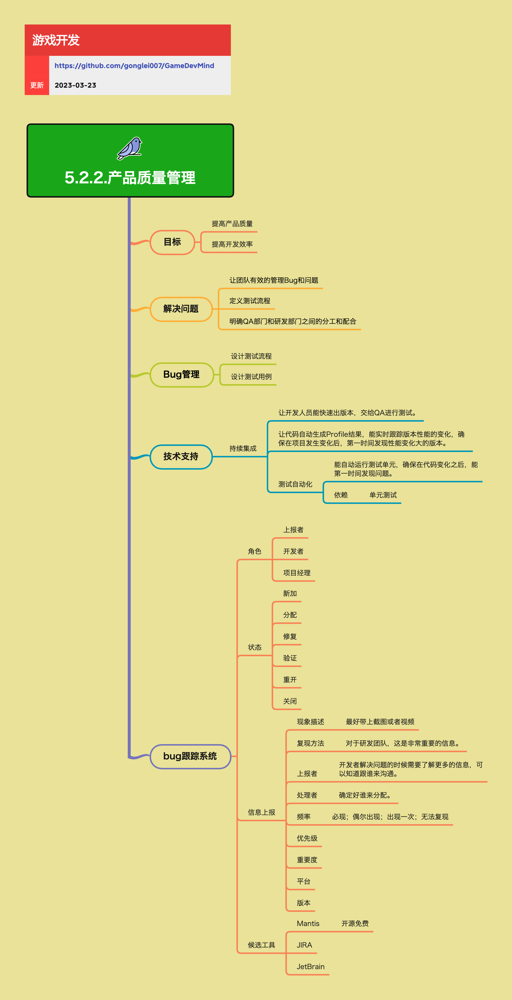

<h2 align="center">产品质量管理</h2>

质量保证，不仅仅是对结果负责。它也是促进在过程中尽早的发现问题，解决问题。大幅降低去解决历史问题的高昂代价。产品质量管理包括Bug管理、测试流程、技术支持等方面，是保证游戏产品质量的重要环节。

**关键词:** 
*Bug管理,Mantis,JIRA,持续集成,测试自动化,测试流程*

**标签:** 
*等级: 中级, 阶段: 开发, 分类: 管理能力, 角色: 管理|测试|客户端开发|服务端开发*

## 图谱

## 管理目标

**目标：**
- **提高产品质量：** 通过系统化的质量管理流程，确保游戏产品的质量达到预期标准
- **提高开发效率：** 通过自动化工具和清晰的流程，减少重复工作，提高团队协作效率

## 解决的问题

**解决问题：**
- **让团队有效的管理Bug和问题：** 建立Bug跟踪系统，确保所有问题都能被记录、分配、跟踪和解决
- **定义测试流程：** 明确测试的步骤、方法和标准，确保测试的系统性和有效性
- **明确QA部门和研发部门之间的分工和配合：** 建立清晰的协作机制，避免职责不清导致的效率问题

## 管理方法

### Bug管理

**做什么的？** 系统化地管理游戏开发过程中发现的所有Bug和问题。

**在哪用？** 整个游戏开发周期，从开发阶段到发布后的维护阶段。

**会遇到哪些问题？**
- 如何高效地收集和记录Bug？
- 如何确保Bug得到及时处理？
- 如何跟踪Bug的处理进度？

**要点和思考方向：**

**设计测试流程：** 定义从测试到Bug修复的完整流程，包括测试用例设计、Bug上报、分配、修复、验证等环节

**设计测试用例：** 系统化地设计测试用例，覆盖功能测试、性能测试、兼容性测试等方面

### Bug跟踪系统

**做什么的？** 用于记录、跟踪和管理Bug的工具系统。

**在哪用？** 所有需要Bug管理的项目，特别是多人协作的项目。

**会遇到哪些问题？**
- 如何选择合适的Bug跟踪工具？
- 如何设计Bug跟踪流程？
- 如何确保Bug信息的完整性？

**要点和思考方向：**

**角色：**
- **上报者：** 发现并上报Bug的人员，通常是QA或测试人员
- **开发者：** 负责修复Bug的开发人员
- **项目经理：** 负责Bug的分配和优先级管理

**状态：**
- **新加：** Bug刚被上报，尚未分配
- **分配：** Bug已分配给开发者
- **修复：** 开发者已修复Bug，等待验证
- **验证：** QA验证Bug是否已修复
- **重开：** Bug验证未通过，重新打开
- **关闭：** Bug已验证通过，关闭

**信息上报：**
- **现象描述：** 最好带上截图或者视频，让开发者能直观地了解问题
- **复现方法：** 对于研发团队，这是非常重要的信息。清晰的复现步骤能大大提高修复效率
- **上报者：** 开发者解决问题的时候需要了解更多的信息，可以知道跟谁来沟通
- **处理者：** 确定好谁来分配，明确责任人
- **频率：** 必现；偶尔出现；出现一次；无法复现。频率信息有助于判断问题的严重性和优先级
- **优先级：** 根据Bug的影响范围和严重程度设定优先级
- **重要度：** 评估Bug对产品的影响程度
- **平台：** 记录Bug出现的平台，如iOS、Android、PC等
- **版本：** 记录Bug出现的版本号，便于追踪和回归测试

**候选工具：**
- **Mantis：** 开源免费的Bug跟踪系统，适合中小型团队
- **JIRA：** 功能强大的项目管理和Bug跟踪工具，适合大型团队
- **JetBrain：** JetBrains提供的项目管理工具

### 技术支持

**做什么的？** 通过技术手段支持产品质量管理，包括持续集成、自动化测试等。

**在哪用？** 需要频繁构建和测试的项目，特别是敏捷开发项目。

**会遇到哪些问题？**
- 如何快速构建和发布测试版本？
- 如何自动发现性能问题？
- 如何提高测试效率？

**要点和思考方向：**

**持续集成：**
- **让开发人员能快速出版本，交给QA进行测试：** 自动化构建流程，减少手动操作，提高效率
- **让代码自动生成Profile结果，能实时跟踪版本性能的变化，确保在项目发生变化后，第一时间发现性能变化大的版本：** 通过自动化性能分析，及时发现性能回归问题

**测试自动化：**
- **能自动运行测试单元，确保在代码变化之后，能第一时间发现问题：** 自动化测试可以在代码提交后立即运行，快速发现回归问题
- **依赖：**
  - **单元测试：** 测试自动化的基础，需要编写足够的单元测试用例

可以参考 [4.3.3.DevOps](../4.生产能力/4.3.3.DevOps.md) 中的持续集成和持续交付相关内容。

## 更多资料
### 在线资料
