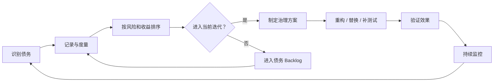

## 技术债务管理

技术债务是开发过程中为了短期速度而对代码质量、架构设计做出的妥协，它像金融债务一样会产生"利息"——随着时间推移增加维护成本、降低开发效率。技术债务管理包括债务的定义与分类、识别与度量、偿还策略，以及与业务需求的平衡，是保证项目长期可持续交付的关键能力。

**关键词:** 
*技术债务,架构债务,代码异味,复杂度,偿还计划,童子军规则,质量扫描,AI Coding*

**标签:** 
*等级: 中级, 阶段: 开发, 分类: 管理能力, 角色: 客户端开发|服务端开发|全栈开发|管理*

## 图谱

## 目录

- [定义与分类](#定义与分类)
- [识别与度量](#识别与度量)
- [管理策略](#管理策略)
- [与业务平衡](#与业务平衡)
- [更多资料](#更多资料)

----

> 💡 **AI Coding 总览**（为何要掌握知识才能更好操作 AI、指南的三类内容等）见 [阅读说明 - AI Coding 总览](../../阅读说明.md#ai-coding-总览)。

---

## 定义与分类

| 维度 | 内容 |
|------|------|
| **作用** | 理解技术债务的本质和种类，建立团队对技术债务的共同认知，为后续识别和管理打下基础 |
| **应用场景** | 项目初期制定质量策略时 技术债务复盘和评估时 新成员入职培训 与PM/管理层沟通技术状态时 |
| **做什么的？** | 定义技术债务的概念、成因和分类体系，帮助团队认清债务的来源和影响 |
| **在哪用？** | 所有需要解释和评估技术债务的场景，特别是跨角色沟通时 |

| 问题 | 解决方向 |
|------|----------|
| **什么是技术债务？** | 概念类比金融债务：为了快速交付而做的短期妥协，就像借债——当下解决问题，但未来要支付"利息"（额外的维护成本、理解成本、修改成本）。Ward Cunningham 1992年提出此概念，强调"交付未完成的工作就像举债" |
| **技术债务有哪些分类？** | **架构债务**：架构设计与需求不匹配、模块耦合过重、缺乏分层、没有扩展点。举例：把单服架构硬撑到多服需求。 **代码债务**：命名混乱、函数过长、重复代码、缺乏注释、硬编码。举例：一个函数500行，到处是魔法数字。 **测试债务**：测试覆盖率不足、缺少关键场景测试、测试代码自身质量差。举例：核心战斗逻辑无单元测试。 **文档债务**：设计文档缺失或过时、API文档不完善、架构图不更新。举例：核心模块没有说明文档，只有代码。 **依赖债务**：第三方库版本老旧、存在已知漏洞、自研组件耦合过度无法升级。举例：还在用3年前已停止维护的UI插件。 **流程债务**：缺乏CI/CD、手工部署、无自动化检查。举例：每次发布靠人工拷贝文件。 |
| **技术债务产生的原因？** | 赶进度/Deadline压力：为了按时交付而牺牲质量 缺乏经验/知识：开发时不知道更好的做法 需求变化：原设计无法适应新需求，打补丁累积 缺乏规范/审查：没有统一的编码规范和代码审查机制 有意承担：明知有更好的设计，但评估后选择快速方案 |

| 要点和思考方向 |
|----------------|
| 技术债务的核心类比是金融债务——借时间，付利息 |
| 不是所有"不完美"都是债务：只有影响后续开发效率和质量的问题才是债务 |
| 债务分类帮助团队精准定位问题，不同类别需要不同的处理策略 |
| 有意承担和无意积累的债务要区别对待 |
| 建立分类体系是管理和沟通的第一步 |

| 类型 | AI Coding 指南 |
|------|----------------|
| **交互提示** | 说明需求；如「技术债务」「架构债务」「代码债务」「测试债务」「分类」 |
| **方法** | 让 AI 协助分类现有问题、解释债务概念、生成债务评估报告模板 |
| **应用** | 债务分类、概念解释、评估模板 |
| **提示词范例** | 「游戏项目运行3年，累积大量技术债务，请按架构/代码/测试/文档/依赖/流程六个维度给出分类定义和典型示例，并生成债务评估报告模板」 |

## 识别与度量

| 维度 | 内容 |
|------|------|
| **作用** | 建立系统化的技术债务发现和度量方法，将主观的"代码不好"转化为客观、可追踪的指标 |
| **应用场景** | 代码审查时 迭代回顾时 技术债务盘点时 技术选型和架构评审时 |
| **做什么的？** | 通过代码异味识别、复杂度度量、质量扫描工具等方式，发现和量化技术债务 |
| **在哪用？** | 代码审查、迭代回顾、债务盘点、架构评审等场景 |

| 问题 | 解决方向 |
|------|----------|
| **什么是代码异味（Code Smell）？** | 代码中暗示深层问题的表面症状。常见异味： **长函数（Long Method）**：函数超过50行，职责过多难以理解 **重复代码（Duplicated Code）**：相同逻辑在多处出现，修改时易遗漏 **大类（Large Class）**：一个类承担过多职责，违反单一职责原则 **过长参数列表（Long Parameter List）**：函数参数超过4-5个，耦合度过高 **发散式变化（Divergent Change）**：改一个需求需要修改多个类 **霰弹式修改（Shotgun Surgery）**：修改一个类导致多处变动 **依恋情结（Feature Envy）**：函数过度依赖其他类的数据 **数据泥团（Data Clumps）**：多组数据总是一起出现，应封装成对象 **Switch语句（Switch Statements）**：大量switch/if-else判断类型，应使用多态 |
| **如何度量代码复杂度？** | **圈复杂度（Cyclomatic Complexity）**：衡量代码路径数量，通常<10为优，>20需要重构 **认知复杂度（Cognitive Complexity）**：衡量代码对人类理解的难度，考虑嵌套、递归等因素 **耦合度**：模块间依赖强度，高耦合增加修改风险 **内聚度**：模块内部元素的关联紧密程度，低内聚说明职责分散 **技术债务比率**：债务修复时间 / 总开发时间，如SonarQube的债务比率指标 |
| **有哪些质量扫描工具？** | **SonarQube**：代码质量与安全分析平台，支持30+语言，提供债务度量、代码异味、漏洞检测。可集成到CI/CD流程 **SonarLint**：IDE插件，实时检测代码异味和潜在问题 **CodeScene**：代码演进分析工具，通过Git历史分析热点模块和技术债务趋势 **NDepend**（.NET）：代码依赖分析和质量度量 **Clang-Tidy**（C++）：静态分析工具，检测代码异味和潜在bug **ESLint/RuboCop/Pylint**：各语言的静态质量检查工具 **自定义脚本**：如统计TODO/FIXME数量、函数长度分布、文件行数分布 |
| **如何建立度量的基线和目标？** | 先度量现状，建立基线 设定可达到的改善目标（如：圈复杂度<10的函数占比从60%提升到80%） 区分"硬约束"（必须修复）和"软目标"（持续改善） 定期回顾度量趋势，而非只看绝对值 避免"度量崇拜"：指标是工具不是目的 |

| 要点和思考方向 |
|----------------|
| 代码异味是技术债务的表征，学会识别异味是基本功 |
| 复杂度指标不是绝对值，要与项目规模和团队能力匹配 |
| 工具能自动发现大量问题，但需要人工判断优先级和修复策略 |
| 度量要有基线和趋势，单点数据没有意义 |
| 度量是为了改善，不是为了追责或攀比 |
| 建立"技术债务看板"让债务可视化 |

| 类型 | AI Coding 指南 |
|------|----------------|
| **交互提示** | 说明需求；如「代码异味」「圈复杂度」「SonarQube」「静态分析」「质量基线」 |
| **方法** | 让 AI 分析代码异味、计算复杂度、配置质量工具、生成度量报告 |
| **应用** | 异味识别、复杂度分析、工具配置、基线设定 |
| **提示词范例** | 「这段 C# 游戏逻辑代码疑似有代码异味（长函数、重复逻辑），请分析并指出具体的异味类型，估算圈复杂度，并建议 SonarQube 的配置要点和适合本项目的质量基线」 |

## 管理策略

| 维度 | 内容 |
|------|------|
| **作用** | 建立系统化的技术债务管理流程——从登记、可视化、优先级排序到偿还执行，让债务管理从"偶尔想起来修一下"变成团队日常实践 |
| **应用场景** | 每次迭代规划时 代码审查后 技术债务盘点会议 新功能开发前的代码整理 |
| **做什么的？** | 将技术债务纳入日常管理流程，通过登记、可视化、排序、偿还等手段系统化地控制和减少债务 |
| **在哪用？** | 迭代规划、代码审查、技术复盘等团队流程中 |

| 问题 | 解决方向 |
|------|----------|
| **如何登记和可视化技术债务？** | **技术债务登记表**：记录债务描述、位置、类型、严重度、发现日期、责任人 **看板管理**：在Jira/Trello/飞书上建立"技术债务"列/标签，直观展示 **代码标注**：使用TODO/FIXME/HACK等注释标记，配合工具统计 **债务墙（Debt Wall）**：物理或电子白板，贴满债务卡片形成视觉冲击 **SonarQube仪表盘**：自动化扫描结果的集中展示 |
| **如何进行优先级排序？** | 评估维度：**影响范围**（影响多少人/多少模块）+ **恶化速度**（利息有多高）+ **修复成本**（需要多少时间） **四象限法**： · 高影响+低成本 → 立即修复 · 高影响+高成本 → 制定计划分期偿还 · 低影响+低成本 → 有空顺手修 · 低影响+高成本 → 接受现状，不主动修 **严重度分级**： · P0-阻断性：导致开发无法继续，必须立即修 · P1-严重：严重影响开发效率，迭代内修复 · P2-一般：有影响但可绕过，排队修复 · P3-轻微：美学问题，随手修 |
| **如何制定偿还计划？** | **"债务冲刺"**：专门安排一个迭代集中偿还技术债务 **"20%规则"**：每个迭代预留20%的时间处理技术债务 **"搭车偿还"**：修改某模块时顺带修复该模块的债务 **"准备金"模式**：为每类债务分配时间额度，如"测试债务每月8小时" **关键原则**：偿还计划要可视、可追踪、有明确责任人 |
| **什么是"童子军规则"（Boy Scout Rule）？** | 源于童子军的训诫："离开营地时比你发现它时更干净"。应用到代码上：**每次提交代码时，让代码比之前更好一点**——哪怕只是改一个变量名、拆一个函数、删一段死代码。这是成本最低、可持续的债务管理方式，不需要专门排期，融入日常工作。 |
| **如何确保偿还有效而非引入新问题？** | 偿还前确保有测试覆盖 小步偿还，每次改动可控 代码审查验证偿还质量 优先修"利息最高"的债务 偿还后更新记录和度量 |

| 要点和思考方向 |
|----------------|
| 技术债务管理的核心不是"零债务"，而是"可控债务" |
| 可视化是管理的第一步——看不见就没法管 |
| 优先级排序比埋头苦干更重要——有限的资源修最重要的债务 |
| 童子军规则让债务管理成为习惯而非负担 |
| 偿还债务需要团队共识和时间预算支持 |
| 使用工具自动化登记和追踪，减少人工成本 |
| 定期复盘债务趋势，调整策略 |

| 类型 | AI Coding 指南 |
|------|----------------|
| **交互提示** | 说明需求；如「技术债务看板」「优先级」「偿还计划」「童子军规则」「TODO统计」 |
| **方法** | 让 AI 协助设计债务登记模板、排序矩阵、偿还计划、TODO统计脚本 |
| **应用** | 债务登记、看板设计、优先级评估、偿还排期 |
| **提示词范例** | 「游戏项目需建立技术债务管理流程，请设计债务登记表模板（含类型/严重度/影响/成本），四象限优先级排序矩阵，以及按迭代的偿还计划模板（含20%规则和童子军规则落地建议）」 |

## 与业务平衡

| 维度 | 内容 |
|------|------|
| **作用** | 在业务需求和代码质量之间找到平衡点，学会何时承担债务、何时偿还债务、如何与PM有效沟通技术债务的价值 |
| **应用场景** | 迭代规划时与PM协商时间分配 紧急需求赶工时判断是否可承担债务 技术债务爆发影响业务时 向管理层争取重构时间时 |
| **做什么的？** | 建立技术与业务的沟通桥梁，让技术债务管理从"程序员的执念"变成"团队的共同决策" |
| **在哪用？** | 所有需要技术团队与PM/管理层协作决策的场景 |

| 问题 | 解决方向 |
|------|----------|
| **何时可以主动承担技术债务？** | **可以承担的时机**： · MVP阶段/原型验证：快速验证想法，后续可能推倒重来 · 紧急线上故障修复：先止血再治本，但必须登记债务 · 明确即将废弃的模块：生命周期短，不值得投入 · 有明确的偿还时间窗口：如"下个迭代重构"，且排了时间 **不能承担的底线**： · 影响系统稳定性和数据安全 · 涉及用户资产/支付等核心链路 · 完全没有偿还计划 |
| **如何推动偿还技术债务？** | **用业务语言沟通**（关键！）： · 不说"代码太烂需要重构" · 说"这个模块修改一个功能需要2天，重构后只需2小时，每月能节省XX人天" · 说"这个债不还，下个版本的XX核心功能有延期风险" · 说"测试覆盖率不足导致每次上线都有回滚风险" **提供数据支撑**：用度量数据说话——圈复杂度趋势、Bug率、修改时长趋势 **化整为零**：不一次性要2周重构时间，而是每个迭代要20%的债务时间 **绑定业务需求**："要实现XX功能，需要先清理这块的债务，否则开发成本翻倍" |
| **如何与PM/管理层沟通？** | **理解对方的语言和目标**：PM关注交付速度、功能完整度、上线时间；管理层关注ROI、风险、团队产能 **用类比建立共识**：技术债务就像房贷——不还本金可以，但要付更多利息；一直不还最终会破产 **展示"不还"的成本**： · 新功能开发越来越慢（利息在涨） · Bug越来越多、上线风险增大 · 新人上手困难、老员工流失 **提供选择题而非判断题**：不直接说"需要重构"，而是给出"A方案：快速做，2周交付但有XX债务；B方案：稳健做，4周交付但质量好；C方案：折中，3周" |
| **如何避免过度追求完美？** | 判断标准：**这段代码未来会被频繁修改吗？** · 频繁修改的核心模块 → 值得高质量投入 · 几乎不改的工具脚本 → 能用就行 · 明确短期后重写的模块 → 不必过度设计 **YAGNI原则**（You Ain't Gonna Need It）：不要为"可能"的需求过度设计 **80/20**：花20%的时间获得80%的质量提升，剩下的20%留到真正需要的时候 |

| 要点和思考方向 |
|----------------|
| 技术债务管理的本质是风险管理，不是追求完美 |
| 与业务方沟通的核心是"翻译"——把技术问题翻译成业务影响 |
| 学会主动承担可控的债务，而不是被动积累失控的债务 |
| 数据比感受更有说服力——用度量数据支撑沟通 |
| 提供选择而非结论——让PM/管理层参与决策 |
| 技术债务严重到影响团队士气时，偿还就变成了"留人"问题 |
| 0债务既不可能也不经济——追求的是"健康债务水平" |

| 类型 | AI Coding 指南 |
|------|----------------|
| **交互提示** | 说明需求；如「业务平衡」「沟通PM」「债务决策」「成本评估」「重构ROI」 |
| **方法** | 让 AI 协助评估债务的ROI、撰写给PM的沟通文案、设计多方案比较 |
| **应用** | 债务ROI分析、PM沟通、方案比较、成本预估 |
| **提示词范例** | 「某游戏战斗模块累积较多技术债务，新功能开发从1天涨到3天，请帮我评估：1）不偿还的长期成本 2）偿还的工时预估 3）用业务语言撰写给PM的沟通要点 4）给出快速方案/稳健方案/折中方案三种选择」 |

## 更多资料

* [Technical Debt - Martin Fowler](https://martinfowler.com/bliki/TechnicalDebt.html) — Martin Fowler 对技术债务的经典论述，包括债务象限模型。
* [Refactoring: Improving the Design of Existing Code](https://martinfowler.com/books/refactoring.html) — Martin Fowler 的重构经典，系统阐述代码异味和重构方法。
* [SonarQube Documentation](https://docs.sonarsource.com/sonarqube/latest/) — SonarQube 官方文档，覆盖质量门、债务度量等功能。
* [Clean Code](https://www.oreilly.com/library/view/clean-code-a/9780136083238/) — Robert C. Martin（Uncle Bob）的著作，关于写好代码的原则和实践。
* [Managing Technical Debt - Software Engineering Institute](https://www.sei.cmu.edu/our-work/projects/display.cfm?customel_datapageid_4050=19159) — CMU SEI 关于技术债务管理的系统性研究。
* [游戏项目技术债务治理实践](https://zhuanlan.zhihu.com/) — 知乎上关于游戏项目中技术债务治理的实践分享。
