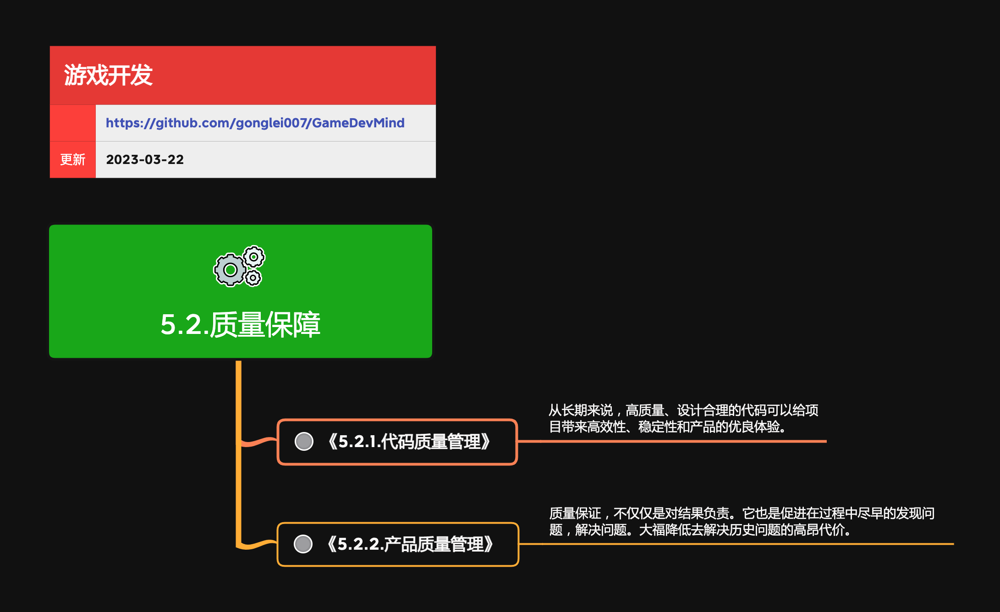

<h2 align="center">质量保障</h2>

质量保障，不仅仅是对结果负责。它也是促进在过程中尽早的发现问题，解决问题。大福降低去解决历史问题的高昂代价。

**关键词:**  
*QA,持续集成,Bug,单元测试*

**标签:** 
*等级: 中级, 阶段: 开发, 分类: 管理能力, 角色: 管理|测试|客户端开发|服务端开发*

## 图谱

## 子主题
* [5.2.1.代码质量管理](5.2.1.代码质量管理.md)
* [5.2.2.产品质量管理](5.2.2.产品质量管理.md)
