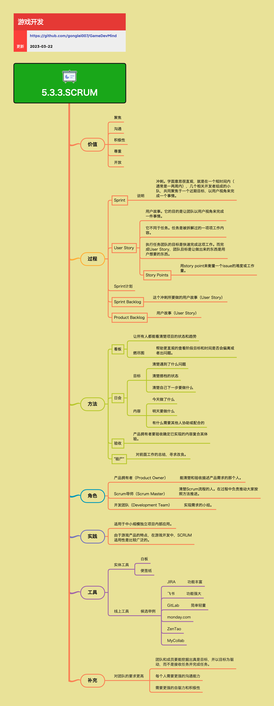

<h2 align="center">SCRUM</h2>

SCRUM是被广泛应用的项目过程管理方法，在游戏开发领域应用也非常广泛。SCRUM是一种敏捷开发框架，通过短周期的迭代、持续沟通和团队协作，帮助团队高效地交付有价值的产品。

**关键词:**  
*Scrum,Sprint,User Story,Product Backlog,Sprint Backlog,看板,日会*

**标签:** 
*等级: 中级, 阶段: 开发, 分类: 管理能力, 角色: 管理*

## 图谱

## 核心价值

**价值：**
- **聚焦：** 团队聚焦于当前Sprint的目标，避免分散注意力
- **沟通：** 通过日会、看板等方式促进团队沟通
- **积极性：** 团队成员主动参与，自驱力强
- **尊重：** 尊重每个团队成员的意见和贡献
- **开放：** 开放地讨论问题，寻求改进

## 核心概念

## Sprint

**是什么？在哪用？**

- **作用**：冲刺，一个短期的开发周期
- **应用场景**：
  - SCRUM的核心时间单位
  - 通常1-2周
  - 短期开发周期
- **做什么的？** 冲刺，一个短期的开发周期。
- **在哪用？** SCRUM的核心时间单位，通常1-2周。

**会遇到哪些问题？用什么解决？**

- **如何规划Sprint？**
  - **问题**：需要规划Sprint
  - **解决方向**：
    - **说明：冲刺。字面意思很直观，就是在一个短时间内（通常是一两周内），几个相关开发者组成的小队，共同聚焦于一个近期目标，以用户视角来完成一个事情：** Sprint说明
      - 短期时间（1-2周）
      - 相关开发者组成小队
      - 聚焦近期目标
      - 以用户视角完成
    - 确定Sprint目标
    - 选择要完成的User Story
    - 估算工作量
    - 分配任务

- **如何确保Sprint成功？**
  - **问题**：需要确保Sprint成功
  - **解决方向**：
    - 聚焦Sprint目标
    - 定期检查进度
    - 及时调整计划
    - 团队协作

**要点和思考方向：**
- Sprint是SCRUM的核心时间单位
- 在短时间内聚焦于一个近期目标
- 以用户视角完成事情
- 需要团队协作和聚焦

## User Story

**是什么？在哪用？**

- **作用**：用户故事，以用户视角描述需求
- **应用场景**：
  - 用于定义和描述产品需求
  - 用于Sprint计划
  - 用于产品规划
- **做什么的？** 用户故事，以用户视角描述需求。
- **在哪用？** 用于定义和描述产品需求。

**会遇到哪些问题？用什么解决？**

- **如何编写好的User Story？**
  - **问题**：需要编写好的User Story
  - **解决方向**：
    - **用户故事。它的目的是让团队以用户视角来完成一件事情：从用户角度思考需求，而不是从技术角度：** 用户视角
      - 以用户视角思考
      - 而非技术角度
    - 使用标准格式（作为...，我希望...，以便...）
    - 从用户角度描述
    - 明确价值
    - 可测试和可验收

- **如何估算User Story的工作量？**
  - **问题**：需要估算User Story的工作量
  - **解决方向**：
    - **Story Points：用story point来衡量一个issue的难度或工作量：使用相对估算而非绝对时间，更准确且易于比较：** Story Points
      - 衡量难度或工作量
      - 相对估算
      - 更准确
      - 易于比较
    - 使用Story Points进行相对估算
    - 团队共同估算
    - 参考历史数据
    - 考虑复杂度和不确定性

- **User Story和任务的区别是什么？**
  - **问题**：需要理解User Story和任务的区别
  - **解决方向**：
    - **它不同于任务。任务是被拆解过的一项项工作内容：User Story关注价值，任务关注实现：** 区别
      - User Story关注价值
      - 任务关注实现
    - **执行任务团队的目标是快速完成这项工作。而完成User Story，团队目标是让做出来的东西是用户想要的东西：关注价值交付，而非仅仅完成任务：** 目标区别
      - 任务目标：快速完成
      - User Story目标：用户想要的东西
    - User Story关注价值，任务关注实现
    - User Story以用户视角，任务以技术视角
    - User Story可独立交付价值，任务是实现步骤

**要点和思考方向：**
- User Story让团队以用户视角完成事情
- User Story关注价值，任务关注实现
- 使用Story Points进行相对估算
- 从用户角度思考需求，而非技术角度
- 关注价值交付，而非仅仅完成任务

## Sprint计划

**是什么？在哪用？**

- **作用**：在Sprint开始时，团队计划本次Sprint要完成的工作
- **应用场景**：
  - 每个Sprint开始时
  - 需要规划Sprint工作时
- **做什么的？** 在Sprint开始时，团队计划本次Sprint要完成的工作。
- **在哪用？** 每个Sprint开始时。

**会遇到哪些问题？用什么解决？**

- **如何制定Sprint计划？**
  - **问题**：需要制定Sprint计划
  - **解决方向**：
    - 确定Sprint目标
    - 从Product Backlog选择User Story
    - 估算工作量
    - 分配任务
    - 确定验收标准

- **如何确保Sprint计划可行？**
  - **问题**：需要确保Sprint计划可行
  - **解决方向**：
    - 基于团队能力估算
    - 考虑历史速度
    - 预留缓冲时间
    - 团队共同参与计划

**要点和思考方向：**
- Sprint计划是Sprint成功的基础
- 需要团队共同参与制定
- 基于团队能力和历史数据
- 明确Sprint目标和验收标准

## Sprint Backlog

**是什么？在哪用？**

- **作用**：Sprint待办事项列表，包含本次Sprint要完成的User Story
- **应用场景**：
  - Sprint期间
  - 团队从Sprint Backlog中选择工作
  - 跟踪Sprint进度
- **做什么的？** Sprint待办事项列表，包含本次Sprint要完成的User Story。
- **在哪用？** Sprint期间，团队从Sprint Backlog中选择工作。

**会遇到哪些问题？用什么解决？**

- **如何管理Sprint Backlog？**
  - **问题**：需要管理Sprint Backlog
  - **解决方向**：
    - **这个冲刺所要做的用户故事（User Story）：从Product Backlog中选择优先级高的User Story：** Sprint Backlog内容
      - 包含User Story
      - 从Product Backlog选择
      - 优先级高的
    - 从Product Backlog选择优先级高的User Story
    - 定期更新状态
    - 跟踪进度
    - 及时调整

**要点和思考方向：**
- Sprint Backlog包含本次Sprint要完成的User Story
- 从Product Backlog中选择优先级高的User Story
- 需要定期更新和跟踪进度

## Product Backlog

**是什么？在哪用？**

- **作用**：产品待办事项列表，包含所有待开发的User Story
- **应用场景**：
  - 产品整个生命周期
  - 持续维护和更新
  - Sprint计划时选择User Story
- **做什么的？** 产品待办事项列表，包含所有待开发的User Story。
- **在哪用？** 产品整个生命周期，持续维护和更新。

**会遇到哪些问题？用什么解决？**

- **如何维护Product Backlog？**
  - **问题**：需要维护Product Backlog
  - **解决方向**：
    - **用户故事（User Story）：所有待开发的功能和需求，按优先级排序：** Product Backlog内容
      - 包含所有待开发的User Story
      - 按优先级排序
    - 持续添加新的User Story
    - 定期调整优先级
    - 细化User Story
    - 移除不再需要的User Story

- **如何确定优先级？**
  - **问题**：需要确定User Story优先级
  - **解决方向**：
    - 基于业务价值
    - 基于用户需求
    - 基于技术依赖
    - Product Owner负责优先级管理

**要点和思考方向：**
- Product Backlog包含所有待开发的User Story
- 按优先级排序，持续维护和更新
- Product Owner负责管理和优先级

## 实践方法

## 看板

**是什么？在哪用？**

- **作用**：可视化项目状态和进度的工具
- **应用场景**：
  - 整个项目过程中
  - 让团队了解当前状态
  - 跟踪Sprint进度
- **做什么的？** 可视化项目状态和进度的工具。
- **在哪用？** 整个项目过程中，让团队了解当前状态。

**会遇到哪些问题？用什么解决？**

- **如何设计看板？**
  - **问题**：需要设计看板
  - **解决方向**：
    - **让所有人都能看清楚项目的状态和趋势：通过可视化提高透明度：** 看板目标
      - 看清楚项目状态
      - 看清楚趋势
      - 提高透明度
    - 设计清晰的列（待办、进行中、完成等）
    - 使用卡片表示User Story或任务
    - 显示关键信息
    - 定期更新

- **如何让看板真正发挥作用？**
  - **问题**：需要让看板发挥作用
  - **解决方向**：
    - **燃尽图：帮助更直观的查看阶段目标和时间是否会偏离或者出问题：** 燃尽图
      - 查看阶段目标
      - 查看时间是否偏离
      - 发现问题
    - 保持看板实时更新
    - 在日会中使用看板
    - 使用燃尽图跟踪进度
    - 团队共同维护

**要点和思考方向：**
- 看板让所有人都能看清楚项目的状态和趋势
- 通过可视化提高透明度
- 使用燃尽图帮助查看阶段目标和时间是否偏离
- 需要团队共同维护，保持实时更新

## 日会

**是什么？在哪用？**

- **作用**：每日站会，团队成员同步进度和问题
- **应用场景**：
  - 每个工作日
  - 通常15分钟左右
  - 团队同步和协作
- **做什么的？** 每日站会，团队成员同步进度和问题。
- **在哪用？** 每个工作日，通常15分钟左右。

**会遇到哪些问题？用什么解决？**

- **如何让日会高效？**
  - **问题**：需要让日会高效
  - **解决方向**：
    - **目标：** 日会目标
      - **清楚遇到了什么问题：及时发现和解决问题：** 发现问题
        - 清楚遇到的问题
        - 及时解决
      - **清楚搭档的状态：了解团队成员的工作状态：** 了解状态
        - 清楚搭档状态
        - 了解工作状态
      - **清楚自己下一步要做什么：明确当天的工作目标：** 明确目标
        - 清楚下一步
        - 明确工作目标
    - 控制时间（15分钟左右）
    - 保持站立（提高效率）
    - 聚焦关键信息
    - 及时解决问题

- **如何避免日会变成汇报会？**
  - **问题**：需要避免日会变成汇报会
  - **解决方向**：
    - **内容：** 日会内容
      - **今天做了什么：分享已完成的工作：** 今天工作
        - 分享已完成工作
      - **明天要做什么：计划下一步工作：** 明天计划
        - 计划下一步工作
      - **有什么需要其他人协助或配合的：提出需要帮助的地方：** 需要协助
        - 提出需要帮助
        - 协助配合
    - 聚焦协作而非汇报
    - 强调问题和障碍
    - 促进团队讨论
    - 避免详细汇报

**要点和思考方向：**
- 日会是团队同步和协作的重要方式
- 清楚遇到的问题、搭档的状态、自己下一步要做什么
- 分享今天做了什么、明天要做什么、需要什么协助
- 控制时间，保持高效
- 聚焦协作而非汇报

## 验收

**是什么？在哪用？**

- **作用**：Product Owner验收Sprint完成的工作
- **应用场景**：
  - 每个Sprint结束时
  - 需要确认交付内容时
- **做什么的？** Product Owner验收Sprint完成的工作。
- **在哪用？** 每个Sprint结束时。

**会遇到哪些问题？用什么解决？**

- **如何进行验收？**
  - **问题**：需要进行验收
  - **解决方向**：
    - **产品拥有者要验收确定已实现的内容符合其体验：确保交付的内容符合预期，以用户视角验收：** 验收目标
      - 确定已实现内容
      - 符合体验
      - 符合预期
      - 以用户视角验收
    - 演示完成的功能
    - 检查是否符合User Story
    - 以用户视角验收
    - 及时反馈

**要点和思考方向：**
- 验收确保交付的内容符合预期
- 以用户视角验收，而非技术视角
- Product Owner负责验收
- 及时反馈，确保质量

## "验尸"（回顾会）

**是什么？在哪用？**

- **作用**：Sprint回顾会，总结经验和改进点
- **应用场景**：
  - 每个Sprint结束时
  - 需要总结和改进时
- **做什么的？** Sprint回顾会，总结经验和改进点。
- **在哪用？** 每个Sprint结束时。

**会遇到哪些问题？用什么解决？**

- **如何进行回顾会？**
  - **问题**：需要进行回顾会
  - **解决方向**：
    - **对前面工作的总结，寻求改良：持续改进，让团队不断成长：** 回顾目标
      - 总结前面工作
      - 寻求改良
      - 持续改进
      - 团队成长
    - 总结做得好的地方
    - 找出问题和改进点
    - 制定改进计划
    - 团队共同参与

**要点和思考方向：**
- 回顾会是持续改进的重要方式
- 对前面工作进行总结，寻求改良
- 持续改进，让团队不断成长
- 需要团队共同参与，开放讨论

## 角色

## 产品拥有者（Product Owner）

**是什么？在哪用？**

- **作用**：负责产品需求和优先级管理
- **应用场景**：
  - 产品整个生命周期
  - 需求管理
  - 优先级管理
  - Sprint验收
- **做什么的？** 负责产品需求和优先级管理。

**会遇到哪些问题？用什么解决？**

- **如何做好Product Owner？**
  - **问题**：需要做好Product Owner
  - **解决方向**：
    - **能清楚和验收描述产品需求的那个人：代表用户和利益相关者，确保团队开发正确的产品：** Product Owner职责
      - 清楚描述需求
      - 验收需求
      - 代表用户
      - 代表利益相关者
      - 确保开发正确产品
    - 深入了解用户需求
    - 管理Product Backlog
    - 确定优先级
    - 验收Sprint成果

**要点和思考方向：**
- Product Owner是产品需求的负责人
- 能清楚和验收描述产品需求
- 代表用户和利益相关者，确保团队开发正确的产品
- 负责管理Product Backlog和优先级

## Scrum导师（Scrum Master）

**是什么？在哪用？**

- **作用**：推动团队按照SCRUM流程工作
- **应用场景**：
  - 整个SCRUM过程
  - 需要推动SCRUM流程时
  - 需要移除障碍时
- **做什么的？** 推动团队按照SCRUM流程工作。

**会遇到哪些问题？用什么解决？**

- **如何做好Scrum Master？**
  - **问题**：需要做好Scrum Master
  - **解决方向**：
    - **清楚Scrum流程的人。在过程中负责推动大家按照方法推进：帮助团队理解和使用SCRUM，移除障碍：** Scrum Master职责
      - 清楚Scrum流程
      - 推动按照方法推进
      - 帮助理解SCRUM
      - 移除障碍
    - 帮助团队理解SCRUM
    - 推动SCRUM流程执行
    - 移除团队障碍
    - 促进团队协作

**要点和思考方向：**
- Scrum Master是SCRUM流程的推动者
- 清楚Scrum流程，推动大家按照方法推进
- 帮助团队理解和使用SCRUM，移除障碍
- 促进团队协作和持续改进

## 开发团队（Development Team）

**是什么？在哪用？**

- **作用**：实现需求的开发小组
- **应用场景**：
  - 整个开发过程
  - 实现User Story
  - Sprint执行
- **做什么的？** 实现需求的开发小组。

**会遇到哪些问题？用什么解决？**

- **如何做好开发团队？**
  - **问题**：需要做好开发团队
  - **解决方向**：
    - **实现需求的小组：跨职能团队，自组织完成工作：** 开发团队特点
      - 实现需求
      - 跨职能团队
      - 自组织
      - 完成工作
    - 跨职能协作
    - 自组织完成工作
    - 主动承担责任
    - 持续改进

**要点和思考方向：**
- 开发团队是实现需求的小组
- 跨职能团队，自组织完成工作
- 需要主动承担责任，持续改进
- 团队协作和沟通能力很重要

## 适用场景

**实践：**
- **适用于中小规模独立项目内部应用：** SCRUM适合中小型团队和项目
- **由于游戏产品的特点，在游戏开发中，SCRUM适用性是比较广泛的：** 游戏开发需要快速迭代和持续调整，SCRUM的灵活性很适合

## 工具

**实体工具：**
- **白板：** 用于看板和日会
- **便签纸：** 用于记录User Story和任务

**线上工具：**
- **候选举例：**
  - **JIRA：** 功能丰富，适合大型团队
  - **飞书：** 功能强大，集成度高
  - **GitLab：** 简单轻量，适合小型团队
  - **monday.com：** 项目管理工具
  - **ZenTao：** 开源项目管理工具
  - **MyCollab：** 开源协作工具

## 补充说明

**对团队的要求更高：**
- **团队和成员要能挖掘出真实目标，并以目标为驱动，而不是接收任务并完成任务：** 需要主动思考，而非被动执行
- **每个人需要更强的沟通能力：** 频繁的沟通和协作需要良好的沟通技巧
- **需要更强的自驱力和积极性：** 自组织团队需要成员主动承担责任

## 更多资料
* [Scrum vs. PMP: everything you want to know](https://monday.com/blog/rnd/scrum-vs-pmp/)