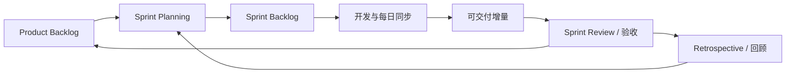

## SCRUM

SCRUM是被广泛应用的项目过程管理方法，在游戏开发领域应用也非常广泛。SCRUM是一种敏捷开发框架，通过短周期的迭代、持续沟通和团队协作，帮助团队高效地交付有价值的产品。

**关键词:**  
*Scrum,Sprint,User Story,Product Backlog,Sprint Backlog,看板,日会,AI Coding*

**标签:** 
*等级: 中级, 阶段: 开发, 分类: 管理能力, 角色: 管理*

## 图谱

## 目录

- [价值与核心概念](#价值与核心概念)
- [迭代与产物](#迭代与产物)
- [实践方法](#实践方法)
- [角色与职责](#角色与职责)
- [适用场景与工具](#适用场景与工具)
- [更多资料](#更多资料)

----

> 💡 **AI Coding 总览**（为何要掌握知识才能更好操作 AI、指南的三类内容等）见 [阅读说明 - AI Coding 总览](../../阅读说明.md#ai-coding-总览)。

---

## 价值与核心概念

### 核心价值

| 价值 | 说明 |
|------|------|
| **聚焦** | 团队聚焦于当前Sprint的目标，避免分散注意力 |
| **沟通** | 通过日会、看板等方式促进团队沟通 |
| **积极性** | 团队成员主动参与，自驱力强 |
| **尊重** | 尊重每个团队成员的意见和贡献 |
| **开放** | 开放地讨论问题，寻求改进 |

### 核心概念

## 迭代与产物

```mermaid
flowchart LR
    PB["Product Backlog"] --> SP["Sprint Planning"] --> SB["Sprint Backlog"]
    SB --> DEV["开发与每日同步"] --> INC["可交付增量"]
    INC --> RV["Sprint Review / 验收"] --> RT["Retrospective / 回顾"]
    RV --> PB
    RT --> SP
```

### Sprint

| 维度 | 内容 |
|------|------|
| **作用** | 冲刺，一个短期的开发周期 |
| **应用场景** | SCRUM的核心时间单位；通常1-2周；短期开发周期 |
| **做什么的？** | 冲刺，一个短期的开发周期 |
| **在哪用？** | SCRUM的核心时间单位，通常1-2周 |

| 问题 | 解决方向 |
|------|----------|
| **如何规划Sprint？** 短时间内（1-2周），相关开发者组成小队，聚焦近期目标，以用户视角完成 | 确定Sprint目标；选择要完成的User Story；估算工作量；分配任务 |
| **如何确保Sprint成功？** | 聚焦Sprint目标；定期检查进度；及时调整计划；团队协作 |

| 要点和思考方向 |
|----------------|
| Sprint是SCRUM的核心时间单位 |
| 在短时间内聚焦于一个近期目标 |
| 以用户视角完成事情 |
| 需要团队协作和聚焦 |

| 类型 | AI Coding 指南 |
|------|----------------|
| **交互提示** | 说明需求；如「Sprint」「冲刺」「目标」「1-2周」 |
| **方法** | 让 AI 协助规划 Sprint 目标、工作量估算、任务分配 |
| **应用** | Sprint 规划、目标设定、进度检查 |
| **提示词范例** | 「团队需规划 2 周 Sprint，请协助设计 Sprint 目标模板、User Story 选择标准，以及工作量估算与任务分配流程」 |

### User Story

| 维度 | 内容 |
|------|------|
| **作用** | 用户故事，以用户视角描述需求 |
| **应用场景** | 用于定义和描述产品需求；用于Sprint计划；用于产品规划 |
| **做什么的？** | 用户故事，以用户视角描述需求 |
| **在哪用？** | 用于定义和描述产品需求 |

| 问题 | 解决方向 |
|------|----------|
| **如何编写好的User Story？** 以用户视角思考，而非技术角度 | 使用标准格式（作为...，我希望...，以便...）；从用户角度描述；明确价值；可测试和可验收 |
| **如何估算User Story的工作量？** Story Points：相对估算，更准确且易于比较 | 使用Story Points进行相对估算；团队共同估算；参考历史数据；考虑复杂度和不确定性 |
| **User Story和任务的区别？** User Story关注价值，任务关注实现；User Story目标是用户想要的东西，任务目标是快速完成 | User Story关注价值，任务关注实现；User Story以用户视角，任务以技术视角；User Story可独立交付价值，任务是实现步骤 |

| 要点和思考方向 |
|----------------|
| User Story让团队以用户视角完成事情 |
| User Story关注价值，任务关注实现 |
| 使用Story Points进行相对估算 |
| 从用户角度思考需求，而非技术角度 |
| 关注价值交付，而非仅仅完成任务 |

| 类型 | AI Coding 指南 |
|------|----------------|
| **交互提示** | 说明需求；如「User Story」「作为...我希望...以便...」「Story Points」 |
| **方法** | 让 AI 协助编写 User Story、估算、拆分任务 |
| **应用** | User Story 编写、Story Points 估算、任务拆分 |
| **提示词范例** | 「需编写 User Story，请协助将需求转化为「作为...，我希望...，以便...」格式，并设计 Story Points 相对估算的参考标准」 |

### Sprint计划

| 维度 | 内容 |
|------|------|
| **作用** | 在Sprint开始时，团队计划本次Sprint要完成的工作 |
| **应用场景** | 每个Sprint开始时；需要规划Sprint工作时 |
| **做什么的？** | 在Sprint开始时，团队计划本次Sprint要完成的工作 |
| **在哪用？** | 每个Sprint开始时 |

| 问题 | 解决方向 |
|------|----------|
| **如何制定Sprint计划？** | 确定Sprint目标；从Product Backlog选择User Story；估算工作量；分配任务；确定验收标准 |
| **如何确保Sprint计划可行？** | 基于团队能力估算；考虑历史速度；预留缓冲时间；团队共同参与计划 |

| 要点和思考方向 |
|----------------|
| Sprint计划是Sprint成功的基础 |
| 需要团队共同参与制定 |
| 基于团队能力和历史数据 |
| 明确Sprint目标和验收标准 |

| 类型 | AI Coding 指南 |
|------|----------------|
| **交互提示** | 说明需求；如「Sprint 计划」「目标」「验收标准」「工作量」 |
| **方法** | 让 AI 协助制定 Sprint 计划、选择 User Story、设定验收标准 |
| **应用** | Sprint 计划、目标设定、可行性评估 |
| **提示词范例** | 「Sprint 计划需从 Product Backlog 选 User Story，请协助设计选择标准、工作量估算流程，以及 Sprint 目标与验收标准的模板」 |

### Sprint Backlog

| 维度 | 内容 |
|------|------|
| **作用** | Sprint待办事项列表，包含本次Sprint要完成的User Story |
| **应用场景** | Sprint期间；团队从Sprint Backlog中选择工作；跟踪Sprint进度 |
| **做什么的？** | Sprint待办事项列表，包含本次Sprint要完成的User Story |
| **在哪用？** | Sprint期间，团队从Sprint Backlog中选择工作 |

| 问题 | 解决方向 |
|------|----------|
| **如何管理Sprint Backlog？** 从Product Backlog中选择优先级高的User Story | 从Product Backlog选择优先级高的User Story；定期更新状态；跟踪进度；及时调整 |

| 要点和思考方向 |
|----------------|
| Sprint Backlog包含本次Sprint要完成的User Story |
| 从Product Backlog中选择优先级高的User Story |
| 需要定期更新和跟踪进度 |

| 类型 | AI Coding 指南 |
|------|----------------|
| **交互提示** | 说明需求；如「Sprint Backlog」「优先级」「状态」「进度」 |
| **方法** | 让 AI 协助设计 Backlog 管理、状态流转、进度跟踪 |
| **应用** | Backlog 管理、进度跟踪、状态更新 |
| **提示词范例** | 「Sprint Backlog 需管理本次 Sprint 的 User Story，请协助设计状态列（待办/进行中/完成）、更新规范，以及与 JIRA/飞书的看板配置要点」 |

### Product Backlog

| 维度 | 内容 |
|------|------|
| **作用** | 产品待办事项列表，包含所有待开发的User Story |
| **应用场景** | 产品整个生命周期；持续维护和更新；Sprint计划时选择User Story |
| **做什么的？** | 产品待办事项列表，包含所有待开发的User Story |
| **在哪用？** | 产品整个生命周期，持续维护和更新 |

| 问题 | 解决方向 |
|------|----------|
| **如何维护Product Backlog？** 所有待开发的User Story，按优先级排序 | 持续添加新的User Story；定期调整优先级；细化User Story；移除不再需要的User Story |
| **如何确定优先级？** | 基于业务价值；基于用户需求；基于技术依赖；Product Owner负责优先级管理 |

| 要点和思考方向 |
|----------------|
| Product Backlog包含所有待开发的User Story |
| 按优先级排序，持续维护和更新 |
| Product Owner负责管理和优先级 |

| 类型 | AI Coding 指南 |
|------|----------------|
| **交互提示** | 说明需求；如「Product Backlog」「优先级」「User Story」「维护」 |
| **方法** | 让 AI 协助设计 Backlog 结构、优先级规则、维护流程 |
| **应用** | Product Backlog 维护、优先级管理、需求细化 |
| **提示词范例** | 「Product Backlog 需持续维护，请协助设计 User Story 优先级评估维度（业务价值、用户需求、技术依赖），以及 Backlog 梳理与细化的流程」 |

## 实践方法

### 看板

| 维度 | 内容 |
|------|------|
| **作用** | 可视化项目状态和进度的工具 |
| **应用场景** | 整个项目过程中；让团队了解当前状态；跟踪Sprint进度 |
| **做什么的？** | 可视化项目状态和进度的工具 |
| **在哪用？** | 整个项目过程中，让团队了解当前状态 |

| 问题 | 解决方向 |
|------|----------|
| **如何设计看板？** 让所有人都能看清楚项目状态和趋势，提高透明度 | 设计清晰的列（待办、进行中、完成等）；使用卡片表示User Story或任务；显示关键信息；定期更新 |
| **如何让看板真正发挥作用？** 燃尽图：帮助查看阶段目标和时间是否偏离 | 保持看板实时更新；在日会中使用看板；使用燃尽图跟踪进度；团队共同维护 |

| 要点和思考方向 |
|----------------|
| 看板让所有人都能看清楚项目的状态和趋势 |
| 通过可视化提高透明度 |
| 使用燃尽图帮助查看阶段目标和时间是否偏离 |
| 需要团队共同维护，保持实时更新 |

| 类型 | AI Coding 指南 |
|------|----------------|
| **交互提示** | 说明需求；如「看板」「燃尽图」「状态」「可视化」 |
| **方法** | 让 AI 协助设计看板列、卡片信息、燃尽图 |
| **应用** | 看板设计、燃尽图、进度可视化 |
| **提示词范例** | 「团队需看板跟踪 Sprint 进度，请协助设计看板列（待办/进行中/完成）、卡片信息字段，以及燃尽图与阶段目标偏离的检查要点」 |

### 日会

| 维度 | 内容 |
|------|------|
| **作用** | 每日站会，团队成员同步进度和问题 |
| **应用场景** | 每个工作日；通常15分钟左右；团队同步和协作 |
| **做什么的？** | 每日站会，团队成员同步进度和问题 |
| **在哪用？** | 每个工作日，通常15分钟左右 |

| 日会目标 | 说明 |
|----------|------|
| 清楚遇到了什么问题 | 及时发现和解决问题 |
| 清楚搭档的状态 | 了解团队成员的工作状态 |
| 清楚自己下一步要做什么 | 明确当天的工作目标 |

| 日会内容 | 说明 |
|----------|------|
| 今天做了什么 | 分享已完成的工作 |
| 明天要做什么 | 计划下一步工作 |
| 有什么需要其他人协助或配合的 | 提出需要帮助的地方 |

| 问题 | 解决方向 |
|------|----------|
| **如何让日会高效？** | 控制时间（15分钟左右）；保持站立（提高效率）；聚焦关键信息；及时解决问题 |
| **如何避免日会变成汇报会？** | 聚焦协作而非汇报；强调问题和障碍；促进团队讨论；避免详细汇报 |

| 要点和思考方向 |
|----------------|
| 日会是团队同步和协作的重要方式 |
| 清楚遇到的问题、搭档的状态、自己下一步要做什么 |
| 分享今天做了什么、明天要做什么、需要什么协助 |
| 控制时间，保持高效 |
| 聚焦协作而非汇报 |

| 类型 | AI Coding 指南 |
|------|----------------|
| **交互提示** | 说明需求；如「日会」「站会」「15分钟」「今天/明天/阻碍」 |
| **方法** | 让 AI 协助设计日会流程、时间控制、高效协作 |
| **应用** | 日会流程、时间控制、问题同步 |
| **提示词范例** | 「日会需 15 分钟内同步进度，请协助设计日会流程（今天做了什么/明天做什么/需要什么协助），以及避免变成汇报会的引导话术」 |

### 验收

| 维度 | 内容 |
|------|------|
| **作用** | Product Owner验收Sprint完成的工作 |
| **应用场景** | 每个Sprint结束时；需要确认交付内容时 |
| **做什么的？** | Product Owner验收Sprint完成的工作 |
| **在哪用？** | 每个Sprint结束时 |

| 问题 | 解决方向 |
|------|----------|
| **如何进行验收？** 确保交付内容符合预期，以用户视角验收 | 演示完成的功能；检查是否符合User Story；以用户视角验收；及时反馈 |

| 要点和思考方向 |
|----------------|
| 验收确保交付的内容符合预期 |
| 以用户视角验收，而非技术视角 |
| Product Owner负责验收 |
| 及时反馈，确保质量 |

| 类型 | AI Coding 指南 |
|------|----------------|
| **交互提示** | 说明需求；如「验收」「Product Owner」「用户视角」「演示」 |
| **方法** | 让 AI 协助设计验收标准、演示流程、反馈模板 |
| **应用** | 验收标准、演示、反馈 |
| **提示词范例** | 「Sprint 结束需 Product Owner 验收，请协助设计以用户视角的验收检查清单、演示流程，以及不符合预期时的反馈与改进流程」 |

### "验尸"（回顾会）

| 维度 | 内容 |
|------|------|
| **作用** | Sprint回顾会，总结经验和改进点 |
| **应用场景** | 每个Sprint结束时；需要总结和改进时 |
| **做什么的？** | Sprint回顾会，总结经验和改进点 |
| **在哪用？** | 每个Sprint结束时 |

| 问题 | 解决方向 |
|------|----------|
| **如何进行回顾会？** 对前面工作总结，寻求改良，持续改进，让团队成长 | 总结做得好的地方；找出问题和改进点；制定改进计划；团队共同参与 |

| 要点和思考方向 |
|----------------|
| 回顾会是持续改进的重要方式 |
| 对前面工作进行总结，寻求改良 |
| 持续改进，让团队不断成长 |
| 需要团队共同参与，开放讨论 |

| 类型 | AI Coding 指南 |
|------|----------------|
| **交互提示** | 说明需求；如「回顾会」「Retro」「改进」「总结」 |
| **方法** | 让 AI 协助设计回顾会流程、改进模板、总结框架 |
| **应用** | 回顾会、改进计划、持续改进 |
| **提示词范例** | 「Sprint 回顾会需总结与改进，请协助设计回顾会流程（做得好的/需改进的/改进计划），以及让团队开放讨论的引导问题」 |

## 角色与职责

### 角色

### 产品拥有者（Product Owner）

| 维度 | 内容 |
|------|------|
| **作用** | 负责产品需求和优先级管理 |
| **应用场景** | 产品整个生命周期；需求管理；优先级管理；Sprint验收 |
| **做什么的？** | 负责产品需求和优先级管理 |

| 问题 | 解决方向 |
|------|----------|
| **如何做好Product Owner？** 能清楚和验收描述产品需求；代表用户和利益相关者，确保开发正确的产品 | 深入了解用户需求；管理Product Backlog；确定优先级；验收Sprint成果 |

| 要点和思考方向 |
|----------------|
| Product Owner是产品需求的负责人 |
| 能清楚和验收描述产品需求 |
| 代表用户和利益相关者，确保团队开发正确的产品 |
| 负责管理Product Backlog和优先级 |

| 类型 | AI Coding 指南 |
|------|----------------|
| **交互提示** | 说明需求；如「Product Owner」「需求」「优先级」「验收」 |
| **方法** | 让 AI 协助设计 PO 职责、需求描述、优先级管理 |
| **应用** | 需求管理、优先级、验收 |
| **提示词范例** | 「Product Owner 需管理需求与优先级，请协助设计需求描述模板、优先级评估表，以及 Sprint 验收的职责与流程」 |

### Scrum导师（Scrum Master）

| 维度 | 内容 |
|------|------|
| **作用** | 推动团队按照SCRUM流程工作 |
| **应用场景** | 整个SCRUM过程；需要推动SCRUM流程时；需要移除障碍时 |
| **做什么的？** | 推动团队按照SCRUM流程工作 |

| 问题 | 解决方向 |
|------|----------|
| **如何做好Scrum Master？** 清楚Scrum流程，推动大家按照方法推进；帮助团队理解SCRUM，移除障碍 | 帮助团队理解SCRUM；推动SCRUM流程执行；移除团队障碍；促进团队协作 |

| 要点和思考方向 |
|----------------|
| Scrum Master是SCRUM流程的推动者 |
| 清楚Scrum流程，推动大家按照方法推进 |
| 帮助团队理解和使用SCRUM，移除障碍 |
| 促进团队协作和持续改进 |

| 类型 | AI Coding 指南 |
|------|----------------|
| **交互提示** | 说明需求；如「Scrum Master」「流程」「障碍」「推动」 |
| **方法** | 让 AI 协助设计 SM 职责、障碍处理、流程推动 |
| **应用** | 流程推动、障碍移除、团队协作 |
| **提示词范例** | 「Scrum Master 需推动流程、移除障碍，请协助设计 SM 职责清单、常见障碍的识别与处理流程，以及帮助团队理解 Scrum 的引导材料」 |

### 开发团队（Development Team）

| 维度 | 内容 |
|------|------|
| **作用** | 实现需求的开发小组 |
| **应用场景** | 整个开发过程；实现User Story；Sprint执行 |
| **做什么的？** | 实现需求的开发小组 |

| 问题 | 解决方向 |
|------|----------|
| **如何做好开发团队？** 跨职能团队，自组织完成工作 | 跨职能协作；自组织完成工作；主动承担责任；持续改进 |

| 要点和思考方向 |
|----------------|
| 开发团队是实现需求的小组 |
| 跨职能团队，自组织完成工作 |
| 需要主动承担责任，持续改进 |
| 团队协作和沟通能力很重要 |

| 类型 | AI Coding 指南 |
|------|----------------|
| **交互提示** | 说明需求；如「开发团队」「跨职能」「自组织」「协作」 |
| **方法** | 让 AI 协助设计团队协作、任务认领、沟通机制 |
| **应用** | 团队协作、自组织、持续改进 |
| **提示词范例** | 「开发团队需跨职能、自组织完成 Sprint，请协助设计任务认领与协作机制、跨职能沟通要点，以及团队持续改进的实践建议」 |

## 适用场景与工具

### 适用场景

| 实践 | 说明 |
|------|------|
| **适用于中小规模独立项目内部应用** | SCRUM适合中小型团队和项目 |
| **游戏开发中SCRUM适用性广泛** | 游戏开发需要快速迭代和持续调整，SCRUM的灵活性很适合 |

### 工具

| 类型 | 工具 | 说明 |
|------|------|------|
| **实体工具** | 白板 | 用于看板和日会 |
| **实体工具** | 便签纸 | 用于记录User Story和任务 |
| **线上工具** | JIRA | 功能丰富，适合大型团队 |
| **线上工具** | 飞书 | 功能强大，集成度高 |
| **线上工具** | GitLab | 简单轻量，适合小型团队 |
| **线上工具** | monday.com | 项目管理工具 |
| **线上工具** | ZenTao | 开源项目管理工具 |
| **线上工具** | MyCollab | 开源协作工具 |

### 补充说明

| 对团队的要求 | 说明 |
|--------------|------|
| **挖掘真实目标，以目标为驱动** | 需要主动思考，而非被动执行；不是接收任务并完成任务 |
| **更强的沟通能力** | 频繁的沟通和协作需要良好的沟通技巧 |
| **更强的自驱力和积极性** | 自组织团队需要成员主动承担责任 |

## 更多资料

| 链接 | 说明 |
|------|------|
| [Scrum vs. PMP: everything you want to know](https://monday.com/blog/rnd/scrum-vs-pmp/) | SCRUM与PMP对比 |
