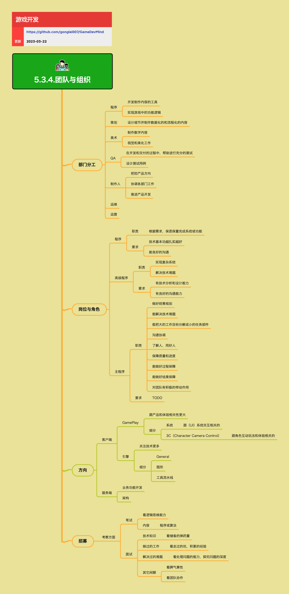

<h2 align="center">团队与组织</h2>

推进产品、解决问题的都是人。人的协作健康，产品才健康。团队与组织包括部门分工、岗位角色、技术方向、人员招募等方面，是保证项目成功的重要因素。

**关键词:**  
*团队角色,主程序,部门分工,岗位职责,技术方向,人员招募*

**标签:** 
*等级: 中级, 阶段: 开发, 分类: 管理能力, 角色: 管理*

## 图谱

## 部门分工

**做什么的？** 定义不同部门的职责和分工，确保团队协作高效。

**在哪用？** 所有需要多部门协作的游戏项目。

**会遇到哪些问题？**
- 如何合理划分部门职责？
- 如何避免职责重叠或遗漏？
- 如何促进部门间的协作？

**要点和思考方向：**

### 程序

- **开发制作内容的工具：** 为团队提供内容制作工具，提高生产效率
- **实现游戏中的功能逻辑：** 实现游戏的核心功能和系统

### 策划

- **设计细节并制作数据化的和流程化的内容：** 设计游戏玩法、数值、流程等内容

### 美术

- **制作数字内容：** 制作游戏所需的美术资源
- **视觉和美化工作：** 负责游戏的视觉表现

### QA

- **在开发和交付的过程中，帮助进行充分的测试：** 确保产品质量
- **设计测试用例：** 系统化地进行测试

### 制作人

- **把控产品方向：** 确定产品的定位和发展方向
- **协调各部门工作：** 促进部门间的协作
- **推进产品开发：** 推动项目按计划推进

### 运维

负责服务器运维、监控、部署等工作。

### 运营

负责产品上线后的运营工作，包括用户获取、留存、活动策划等。

## 岗位与角色

**做什么的？** 定义不同岗位的职责和要求，帮助团队明确角色定位。

**在哪用？** 团队组建、人员招聘、绩效评估等场景。

**会遇到哪些问题？**
- 如何定义岗位职责？
- 如何评估人员能力？
- 如何培养团队成员？

**要点和思考方向：**

### 程序

**职责：**
- **根据需求，保质保量完成系统或功能：** 按时高质量完成开发任务

**要求：**
- **技术基本功越扎实越好：** 扎实的技术基础是高效开发的前提
- **能良好的沟通：** 与策划、美术等协作需要良好的沟通能力

### 高级程序

**职责：**
- **实现复杂系统：** 能够设计和实现复杂的系统
- **解决技术难题：** 能够解决项目中的技术难点

**要求：**
- **有技术分析和设计能力：** 能够分析问题，设计解决方案
- **有良好的沟通能力：** 能够与团队有效沟通技术方案

### 主程序

**职责：**
- **做好统筹规划：** 规划技术架构和开发计划
- **能解决技术难题：** 解决项目中的关键技术问题
- **能把大的工作目标分解成小的任务部件：** 将复杂任务拆解为可执行的小任务
- **沟通协调：** 协调团队内外的沟通
- **了解人，用好人：** 了解团队成员的能力和特点，合理分配任务
- **保障质量和进度：** 确保项目质量和进度
- **能做好过程保障：** 在开发过程中及时发现问题并解决
- **能做好结果保障：** 确保最终交付的质量
- **对团队有积极的带动作用：** 激励团队，营造良好的工作氛围

**要求：**
- 需要具备技术能力、管理能力、沟通能力等多方面的综合能力

## 技术方向

**做什么的？** 定义技术人员的专业方向和发展路径。

**在哪用？** 人员招聘、职业规划、团队建设等场景。

**会遇到哪些问题？**
- 如何划分技术方向？
- 如何培养专业人才？
- 如何平衡专业化和通用性？

**要点和思考方向：**

### 客户端

**GamePlay：**
- **跟产品和体验相关性更大：** 直接影响玩家的游戏体验
- **细分：**
  - **系统：** 跟（UI）系统交互相关的功能开发
  - **3C（Character Camera Control）：** 跟角色互动玩法和体验相关的功能开发

**引擎：**
- **关注技术更多：** 关注底层技术和性能优化
- **细分：**
  - **General：** 通用引擎功能
  - **图形：** 图形渲染相关
  - **工具流水线：** 工具和流水线开发

### 服务端

- **业务功能开发：** 实现游戏的服务端业务逻辑
- **架构：** 设计和维护服务端架构

## 人员招募

**做什么的？** 招聘合适的技术人员，组建高效的开发团队。

**在哪用？** 团队组建和人员补充。

**会遇到哪些问题？**
- 如何评估候选人的能力？
- 如何判断候选人是否适合团队？
- 如何吸引优秀人才？

**要点和思考方向：**

### 考察方面

**笔试：**
- **看逻辑思维能力：** 通过编程题考察逻辑思维
- **内容：**
  - **程序或算法：** 考察编程能力和算法基础

**面试：**
- **技术知识：**
  - **看储备的弹药量：** 考察技术知识的广度和深度
- **做过的工作：**
  - **看走过的坑，积累的经验：** 通过实际项目经验了解候选人的能力
- **解决过的难题：**
  - **看处理问题的能力，探究问题的深度：** 了解候选人的问题解决能力和思考深度
- **其它闲聊：**
  - **看脾气秉性：** 了解候选人的性格特点
  - **看团队协作：** 了解候选人的协作能力

## 更多资料
