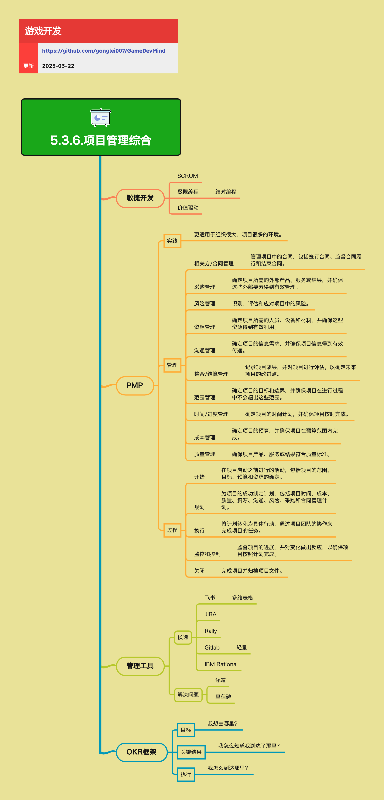

<h2 align="center">项目管理综合</h2>

软件开发是一个复杂的过程，需要组织中各个环节的紧密配合、协调和有效的激励。经过了半个多世纪的积累，这个过程管理是有一些具体的好的方法来促进的。项目管理综合包括敏捷开发、PMP、管理工具、OKR框架等方面，为项目成功提供系统化的方法。

**关键词:**  
*敏捷开发,PMP,飞书,JIRA,OKR,极限编程,结对编程,价值驱动*

**标签:** 
*等级: 中级, 阶段: 开发, 分类: 管理能力, 角色: 管理*

## 图谱

## 敏捷开发

**做什么的？** 一种以快速响应变化、持续交付价值为核心的开发方法。

**在哪用？** 需要快速迭代、适应变化的项目，特别是游戏开发。

**会遇到哪些问题？**
- 如何快速响应变化？
- 如何持续交付价值？
- 如何提高团队协作效率？

**要点和思考方向：**

### SCRUM

参考 [5.3.3.SCRUM](./5.3.3.SCRUM.md) 了解详细的SCRUM方法。

### 极限编程

- **结对编程：** 两名开发者共同编写代码，提高代码质量和知识共享

### 价值驱动

以价值为导向，优先交付高价值的功能，而非按计划执行。

## PMP（项目管理专业）

**做什么的？** 一套系统化的项目管理知识体系和方法。

**在哪用？** 大型项目、多项目环境、需要严格管理的项目。

**会遇到哪些问题？**
- 如何系统化管理项目？
- 如何应对复杂的项目环境？
- 如何确保项目成功？

**要点和思考方向：**

### 实践

- **更适用于组织很大、项目很多的环境：** PMP适合大型组织和多项目管理的场景

### 管理

- **相关方/合同管理：** 管理项目中的合同，包括签订合同、监督合同履行和结束合同
- **采购管理：** 确定项目所需的外部产品、服务或结果，并确保这些外部要素得到有效管理
- **风险管理：** 识别、评估和应对项目中的风险
- **资源管理：** 确定项目所需的人员、设备和材料，并确保这些资源得到有效利用
- **沟通管理：** 确定项目的信息需求，并确保项目信息得到有效传递
- **整合/结算管理：** 记录项目成果，并对项目进行评估，以确定未来项目的改进点
- **范围管理：** 确定项目的目标和边界，并确保项目在进行过程中不会超出这些范围
- **时间/进度管理：** 确定项目的时间计划，并确保项目按时完成
- **成本管理：** 确定项目的预算，并确保项目在预算范围内完成
- **质量管理：** 确保项目产品、服务或结果符合质量标准

### 过程

- **开始：** 在项目启动之前进行的活动，包括项目的范围、目标、预算和资源的确定
- **规划：** 为项目的成功制定计划，包括项目时间、成本、质量、资源、沟通、风险、采购和合同管理计划
- **执行：** 将计划转化为具体行动，通过项目团队的协作来完成项目的任务
- **监控和控制：** 监督项目的进展，并对变化做出反应，以确保项目按照计划完成
- **关闭：** 完成项目并归档项目文件

## 管理工具

**做什么的？** 用于支持项目管理的软件工具。

**在哪用？** 所有需要项目管理的场景。

**会遇到哪些问题？**
- 如何选择合适的项目管理工具？
- 如何让工具真正发挥作用？
- 如何平衡工具的复杂性和易用性？

**要点和思考方向：**

### 候选工具

- **飞书：**
  - **多维表格：** 灵活的数据管理和可视化
- **JIRA：** 功能丰富的项目管理工具，适合大型团队
- **Rally：** 敏捷项目管理工具
- **Gitlab：**
  - **轻量：** 简单轻量的项目管理工具，适合小型团队
- **IBM Rational：** 企业级项目管理工具

### 解决问题

- **泳道：** 可视化不同角色或团队的工作流程
- **里程碑：** 标记项目关键节点，跟踪进度

## OKR框架

**做什么的？** 目标与关键结果框架，用于设定和跟踪目标。

**在哪用？** 需要明确目标和衡量结果的场景，从个人到组织都可以使用。

**会遇到哪些问题？**
- 如何设定有效的目标？
- 如何衡量目标达成情况？
- 如何确保目标对齐？

**要点和思考方向：**

### 目标

- **我想去哪里？** 设定清晰、有挑战性的目标

### 关键结果

- **我怎么知道我到达了那里？** 设定可衡量的关键结果，用于判断目标是否达成

### 执行

- **我怎么到达那里？** 制定执行计划，持续跟踪和调整

## 更多资料
* [Google软件工程之文化篇](https://www.bmpi.dev/dev/software-engineering-at-google/culture/)