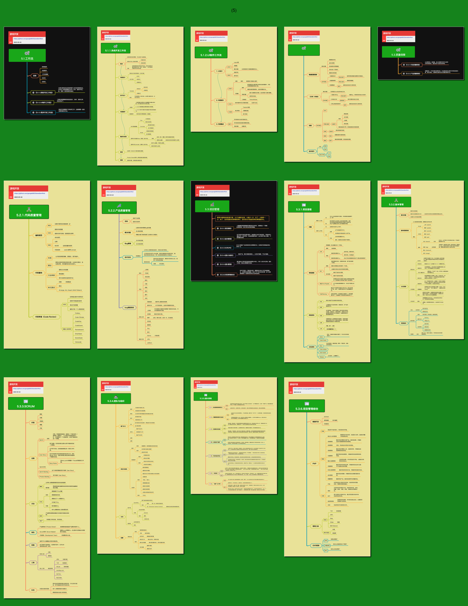

<h2 align="center">管理能力</h2>

----

## 目录

* [5.1.工作流](5.1.工作流.md)
    * [⭕ 5.1.1.系统开发工作流](5.1.1.系统开发工作流.md)
    * [5.1.2.UI制作工作流](5.1.2.UI制作工作流.md)
    * [5.1.3.更多开发工作流](5.1.3.更多开发工作流.md)
* [5.2.质量保障](5.2.质量保障.md)
    * [5.2.1.代码质量管理](5.2.1.代码质量管理.md)
    * [5.2.2.产品质量管理](5.2.2.产品质量管理.md)
* [5.3.项目管理](5.3.项目管理.md)
    * [5.3.1.项目里程](5.3.1.项目里程.md)
    * [5.3.2.版本管理](5.3.2.版本管理.md)
    * [5.3.3.SCRUM](5.3.3.SCRUM.md)
    * [5.3.4.团队与组织](5.3.4.团队与组织.md)
    * [⭕ 5.3.5.团队管理](5.3.5.团队管理.md)
    * [5.3.6.项目管理综合](5.3.6.项目管理综合.md)

 

----

## 预览

