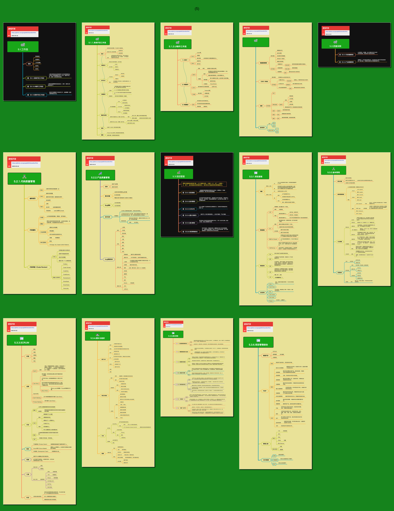

## 管理能力

管理能力关注游戏生产过程中的人、决策、流程、质量和风险。它不负责实现自动化工具或生产线，而是定义角色分工、评审与验收、质量门禁、版本策略、项目节奏和组织协作。

**关键词:** 
*工作流,质量保障,代码质量,产品质量,项目管理,版本管理,团队管理,SCRUM*

**标签:** 
*等级: 中级|高级, 阶段: 开发|管理, 分类: 管理能力, 角色: 管理|客户端开发|服务端开发*

## 目录

* [5.1.研发与内容流程管理](5.1.工作流.md)
    * [⭕ 5.1.1.系统开发工作流](5.1.1.系统开发工作流.md)
    * [5.1.2.UI制作工作流](5.1.2.UI制作工作流.md)
    * [5.1.3.更多开发工作流](5.1.3.更多开发工作流.md)
* [5.2.质量保障](5.2.质量保障.md)
    * [5.2.1.代码质量管理](5.2.1.代码质量管理.md)
    * [5.2.2.产品质量管理](5.2.2.产品质量管理.md)
* [5.3.项目管理](5.3.项目管理.md)
    * [5.3.1.项目里程](5.3.1.项目里程.md)
    * [5.3.2.版本管理](5.3.2.版本管理.md)
    * [5.3.3.SCRUM](5.3.3.SCRUM.md)
    * [5.3.4.团队与组织](5.3.4.团队与组织.md)
    * [⭕ 5.3.5.团队管理](5.3.5.团队管理.md)
    * [5.3.6.项目管理综合](5.3.6.项目管理综合.md)

> **分层边界：** 构建、数据转换、制品生成和 CI/CD 执行机制属于 [4.生产能力](../4.生产能力/4.生产能力.md)；本模块关注这些流程中的职责、决策、门禁和风险控制。

 

----

## 预览

