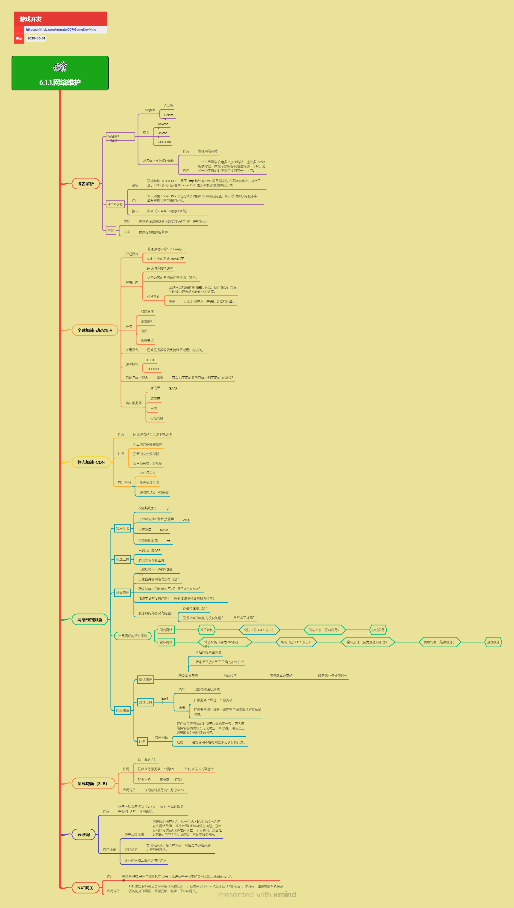

<h2 align="center">网络维护</h2>

关于网络连接、故障、速度等维护相关事项。

**关键词:**  
*全球加速,CDN,负载均衡,NAT网关,dig,ping,telnet,mtr*

**标签:** 
*等级: 中级, 阶段: 运营, 分类: 运营能力, 角色: 运维|服务端开发*

## 图谱

## 域名解析

**是什么？在哪用？**

- **作用**：将域名转换为IP地址的基础服务，是游戏服务访问的入口
- **应用场景**：
  - 游戏服务器入口域名解析
  - 多线路加速IP解析
  - 移动端域名解析
- **DNS（域名解析）**：将域名转换为IP地址的基础服务，是游戏服务访问的入口
- **HTTP DNS**：基于HTTP协议的域名解析服务，用于移动端，避免运营商Local DNS的域名劫持和跨网访问问题
- **应用场景**：游戏服务器入口域名解析、多线路加速IP解析

**会遇到哪些问题？用什么解决？**

- **如何避免域名劫持？**
  - **问题**：域名劫持影响网络质量
  - **解决方向**：
    - **问题：域名劫持、跨网访问慢、单点故障：** 常见问题
      - 域名劫持
      - 跨网访问慢
      - 单点故障
    - **解决方案：**
      - **使用HTTP DNS避免Local DNS劫持：** HTTP DNS
        - 避免Local DNS劫持
        - 提高解析成功率
      - **支持多IP解析，提供多个加速线路，前端可策略选择：** 多IP解析
        - 提供多个加速线路
        - 前端策略选择
      - **使用Anycast、Unicast技术提升解析稳定性：** 技术提升
        - Anycast技术
        - Unicast技术
        - 提升解析稳定性
      - **结合CDN Pop节点优化解析路径：** CDN优化
        - 结合CDN Pop节点
        - 优化解析路径

- **如何提高解析稳定性？**
  - **问题**：需要提高解析稳定性
  - **解决方向**：
    - 使用Anycast、Unicast技术
    - 支持多IP解析
    - 使用付费DNS服务
    - 结合CDN Pop节点

- **如何优化跨网访问？**
  - **问题**：跨网访问慢
  - **解决方向**：
    - 使用HTTP DNS
    - 支持多IP解析
    - 结合CDN Pop节点
    - 优化解析路径

**要点和思考方向：**
- 更多线路意味着可以更精确判断用户网络质量
- 付费和免费DNS服务在稳定性和功能上有差异
- 一个产品可设定多个加速线路，提供多个IP解析时，前端可根据策略选择
- 使用HTTP DNS避免Local DNS劫持
- 结合CDN Pop节点优化解析路径

## 全球加速-动态加速

**是什么？在哪用？**

- **作用**：实现跨地区网络访问的动态加速，让游戏服务器支持跨区域用户访问
- **应用场景**：
  - 游戏服务器需要支持全球用户访问
  - 实时性要求高的游戏
  - 跨区域网络访问优化
- **作用**：实现跨地区网络访问的动态加速，让游戏服务器支持跨区域用户访问
- **应用场景**：游戏服务器需要支持全球用户访问，特别是实时性要求高的游戏

**会遇到哪些问题？用什么解决？**

- **如何解决延迟问题？**
  - **问题**：需要解决延迟问题
  - **解决方向**：
    - **延迟问题：** 延迟要求
      - **普通游戏体验：200ms以下：** 普通游戏
        - 延迟要求200ms以下
      - **实时性高的游戏：35ms以下：** 实时游戏
        - 延迟要求35ms以下
    - **解决方案：**
      - **使用加速通道、线路解析、回源、边缘节点等技术：** 加速技术
        - 加速通道
        - 线路解析
        - 回源
        - 边缘节点
      - **支持HTTP、TCP/UDP等加速协议：** 加速协议
        - HTTP协议
        - TCP/UDP协议
      - **与域名解析配合，为不同服务商解析到不同加速线路：** 域名配合
        - 与域名解析配合
        - 不同服务商解析到不同线路
    - 使用加速通道和边缘节点
    - 优化线路解析和回源
    - 选择合适的加速协议

- **如何优化成本？**
  - **问题**：全球网络加速费用占比很高
  - **解决方向**：
    - **价格优化：让服务器靠近用户占比更高的区域：** 成本优化
      - 服务器靠近用户占比高的区域
      - 降低加速成本
    - 让服务器靠近用户占比更高的区域
    - 优化加速线路选择
    - 合理配置加速资源

**要点和思考方向：**
- 加速通道、线路解析、回源、边缘节点的配置和选择
- 与域名解析配合使用，实现更灵活的加速策略
- 候选服务商：腾讯云GAAP、阿里云、网宿、橙域网络等
- 延迟要求：普通游戏200ms以下，实时性高的游戏35ms以下
- 成本优化：让服务器靠近用户占比更高的区域

## 静态加速-CDN

**是什么？在哪用？**

- **作用**：实现游戏静态资源下载加速
- **应用场景**：
  - 游戏包分发
  - 热更资源存储
  - 游戏内动态下载数据
  - 静态资源加速
- **作用**：实现游戏静态资源下载加速
- **应用场景**：
  - 游戏包分发
  - 热更资源存储
  - 游戏内动态下载数据

**会遇到哪些问题？用什么解决？**

- **如何避免用户访问旧资源？**
  - **问题**：新上传数据未预热、更新文件未刷新导致用户访问旧资源
  - **解决方向**：
    - **问题：新上传数据未预热、更新文件未刷新导致用户访问旧资源：** 资源问题
      - 新上传数据未预热
      - 更新文件未刷新
      - 用户访问旧资源
    - **解决方案：**
      - **新上传的数据要预热：** 数据预热
        - 新上传数据要预热
        - 确保用户能访问到新资源
      - **更新的文件要刷新：** 文件刷新
        - 更新文件要刷新
        - 清除旧资源缓存
      - **注意每日预热有上限额度：** 预热限制
        - 每日预热有上限额度
        - 需要合理规划预热

- **如何选择合适的CDN？**
  - **问题**：需要选择合适的CDN
  - **解决方向**：
    - CDN主要用于静态资源加速，不适合动态业务
    - 考虑CDN的节点分布
    - 考虑CDN的预热和刷新功能
    - 考虑CDN的成本和性能

**要点和思考方向：**
- CDN主要用于静态资源加速，不适合动态业务
- 预热和刷新是CDN使用中的关键操作
- 需要关注CDN的预热额度限制
- 新上传的数据要预热，更新的文件要刷新
- 合理规划预热，避免超出每日额度

## 网络线路排查

**是什么？在哪用？**

- **作用**：排查网络连接问题，定位故障点
- **应用场景**：
  - 玩家无法连接
  - 延迟高
  - 掉线等网络问题排查
  - 网络故障定位
- **作用**：排查网络连接问题，定位故障点
- **应用场景**：玩家无法连接、延迟高、掉线等网络问题排查

**会遇到哪些问题？用什么解决？**

- **如何排查网络连接问题？**
  - **问题**：需要排查网络连接问题
  - **解决方向**：
    - **常用排查方法：** 排查方法
      - **`dig`：检查域名解析是否正确：** dig命令
        - 检查域名解析
        - 检查解析是否正确
      - **`ping`：排查解析地址和连接质量：** ping命令
        - 排查解析地址
        - 排查连接质量
      - **`telnet`：排查端口是否开放：** telnet命令
        - 排查端口开放
      - **`mtr`：排查线路路由问题：** mtr命令
        - 排查线路路由
    - **排查工具：** 工具选择
      - **网络万用表APP：** 网络万用表
        - 移动端排查工具
      - **腾讯华佗诊断工具：** 华佗诊断
        - 专业诊断工具
    - 使用dig检查域名解析
    - 使用ping排查连接质量
    - 使用telnet排查端口
    - 使用mtr排查路由

- **如何按照检查路径排查？**
  - **问题**：需要按照检查路径排查
  - **解决方向**：
    - **检查路径（从外到内）：** 排查路径
      1. **玩家切换Wifi/4G试试：** 网络切换
         - 切换网络环境
      2. **玩家自身网络是否有问题？** 玩家网络
         - 检查玩家网络
      3. **玩家端解析的地址对不对？是否走的加速IP？** 地址解析
         - 检查解析地址
         - 检查是否走加速IP
      4. **加速本身有没有问题？（需要加速服务商协助检查）：** 加速检查
         - 检查加速服务
         - 需要服务商协助
      5. **服务器内部有没有问题？** 服务器检查
         - **有没有性能问题？** 性能问题
           - 检查性能
         - **服务之间的访问有没有问题？是否走了外网？** 服务访问
           - 检查服务访问
           - 检查是否走外网
    - 按照从外到内的路径排查
    - 逐步定位故障点

- **如何理解产品网络路径？**
  - **问题**：需要理解产品网络路径
  - **解决方向**：
    - **产品网络路径举例：** 网络路径
      - **国内网络：域名解析 → 高防（防DDOS攻击） → 负载均衡（隐藏服务） → 游戏服务：** 国内路径
        - 域名解析
        - 高防（防DDOS攻击）
        - 负载均衡（隐藏服务）
        - 游戏服务
      - **全球网络：域名解析（要为DNS做加速） → 高防（防DDOS攻击） → 全球加速（要为服务做加速） → 负载均衡（隐藏服务） → 游戏服务：** 全球路径
        - 域名解析（DNS加速）
        - 高防（防DDOS攻击）
        - 全球加速（服务加速）
        - 负载均衡（隐藏服务）
        - 游戏服务
    - 理解网络路径各环节
    - 根据路径排查问题

**要点和思考方向：**
- 按照从外到内的检查路径排查：玩家网络 → 地址解析 → 加速服务 → 服务器内部
- 使用dig、ping、telnet、mtr等工具排查问题
- 使用网络万用表APP、腾讯华佗诊断工具等专业工具
- 理解产品网络路径：国内网络和全球网络的不同路径
- 逐步定位故障点，从外到内排查

## 网络测速

**是什么？在哪用？**

- **作用**：测试网络传输速度和质量，定位网络瓶颈
- **应用场景**：
  - 评估加速效果
  - 排查网络性能问题
  - 网络质量测试
- **作用**：测试网络传输速度和质量，定位网络瓶颈
- **应用场景**：评估加速效果、排查网络性能问题

**会遇到哪些问题？用什么解决？**

- **如何测试网络速度？**
  - **问题**：需要测试网络速度
  - **解决方向**：
    - **测试路径：** 测试路径
      - **玩家本地网络：本地网络质量测试、是否接入到正确的加速节点：** 本地网络
        - 本地网络质量测试
        - 检查加速节点接入
      - **加速线路：** 加速线路
        - 测试加速线路速度
      - **服务器本地网络：** 服务器网络
        - 测试服务器网络速度
      - **服务器业务处理时长：** 业务处理
        - 测试业务处理时长
    - **测速工具：** 工具使用
      - **`iperf3`：网络传输速度测试：** iperf3工具
        - **在服务器上启动服务端：** 服务端启动
          - 启动服务端
        - **在测速机器上调用客户端测试数据传输速度：** 客户端测试
          - 调用客户端
          - 测试传输速度
    - 按照测试路径逐步测试
    - 使用iperf3等工具测试

- **如何处理时间同步问题？**
  - **问题**：客户端与服务端时间无法高精度一致
  - **解决方向**：
    - **时间同步问题：客户端与服务端时间无法高精度一致，因为网络传输的精确时长无法确定，客户端无法正确获取服务器的精确时间：** 时间问题
      - 时间无法高精度一致
      - 网络传输时长不确定
    - **处理方式：通常使用本地时间差来记录分析问题：** 处理方式
      - 使用本地时间差
      - 记录分析问题
    - 使用本地时间差记录
    - 考虑网络传输延迟
    - 分析时间差数据

**要点和思考方向：**
- 按照测试路径测试：玩家本地网络 → 加速线路 → 服务器本地网络 → 服务器业务处理时长
- 使用iperf3等工具测试网络传输速度
- 时间同步问题：客户端与服务端时间无法高精度一致
- 处理方式：通常使用本地时间差来记录分析问题
- 逐步测试各环节，定位网络瓶颈

## 负载均衡（SLB）

**是什么？在哪用？**

- **作用**：
  - 统一服务入口
  - 隐藏业务服务器（公网IP），降低被攻击的可能性
  - 轮询主机，解决高可用问题
- **应用场景**：
  - 作为游戏服务端业务的总入口
  - 需要统一服务入口时
  - 需要提升服务可用性时
- **作用**：
  - 统一服务入口
  - 隐藏业务服务器（公网IP），降低被攻击的可能性
  - 轮询主机，解决高可用问题
- **应用场景**：作为游戏服务端业务的总入口

**会遇到哪些问题？用什么解决？**

- **如何实现统一服务入口？**
  - **问题**：需要实现统一服务入口
  - **解决方向**：
    - **统一服务入口：** 入口统一
      - 提供统一入口
      - 简化客户端连接
    - 配置负载均衡器
    - 设置统一域名
    - 配置路由规则

- **如何提升安全性？**
  - **问题**：需要提升安全性
  - **解决方向**：
    - **隐藏业务服务器（公网IP），降低被攻击的可能性：** 安全提升
      - 隐藏真实服务器IP
      - 降低被攻击可能性
    - 隐藏真实服务器IP
    - 只暴露负载均衡器IP
    - 配置安全规则

- **如何解决高可用问题？**
  - **问题**：需要解决高可用问题
  - **解决方向**：
    - **轮询主机，解决高可用问题：** 高可用
      - 轮询多个主机
      - 解决单点故障
    - 配置多个后端服务器
    - 实现健康检查
    - 自动故障转移

**要点和思考方向：**
- 负载均衡是游戏服务架构中的重要组件
- 通过隐藏真实服务器IP，提升安全性
- 通过多主机轮询，提升服务可用性
- 作为游戏服务端业务的总入口，统一服务入口
- 配置健康检查和自动故障转移，确保高可用

## 云联网

**是什么？在哪用？**

- **作用**：让云上私有网络间（VPC）、VPC与本地数据中心间（IDC）内网互联
- **应用场景**：
  - 绕开故障线路
  - 游戏加速
  - 企业内网和云服务之间的连通
  - 跨区域网络连接
- **作用**：让云上私有网络间（VPC）、VPC与本地数据中心间（IDC）内网互联
- **应用场景**：
  - 绕开故障线路：假设服务器在A点，从地区B到达服务A发生网络故障，但从地区C到达A没有问题，可在C和A之间建立云联网，让地区B的用户先到达地区C，再转至服务器A
  - 游戏加速：实现玩家就近接入POP点，然后走内部通道到达服务器源站
  - 企业内网和云服务之间的连通

**会遇到哪些问题？用什么解决？**

- **如何绕开故障线路？**
  - **问题**：需要绕开故障线路
  - **解决方向**：
    - **绕开故障线路：假设服务器在A点，从地区B到达服务A发生网络故障，但从地区C到达A没有问题，可在C和A之间建立云联网，让地区B的用户先到达地区C，再转至服务器A：** 故障绕行
      - 建立云联网
      - 绕开故障线路
      - 通过备用路径连接
    - 建立云联网连接
    - 配置路由规则
    - 实现故障自动切换

- **如何实现游戏加速？**
  - **问题**：需要实现游戏加速
  - **解决方向**：
    - **游戏加速：实现玩家就近接入POP点，然后走内部通道到达服务器源站：** 加速实现
      - 就近接入POP点
      - 走内部通道
      - 到达服务器源站
    - 配置POP点
    - 建立内部通道
    - 优化路由路径

- **如何实现内网互联？**
  - **问题**：需要实现内网互联
  - **解决方向**：
    - **企业内网和云服务之间的连通：** 内网连通
      - 企业内网
      - 云服务连通
    - 建立VPC间连接
    - 建立VPC与IDC连接
    - 配置内网路由

**要点和思考方向：**
- 云联网提供内网级别的网络连接，延迟和稳定性更好
- 可用于网络故障时的备用路径
- 可用于优化游戏加速路径
- 实现玩家就近接入POP点，走内部通道到达服务器源站
- 支持VPC间、VPC与IDC间的内网互联

## NAT网关

**是什么？在哪用？**

- **作用**：在公有VPC子网中使用NAT网关可允许私有子网中的实例发出出站Internet流量
- **应用场景**：
  - 私有网络中的主机需要访问外网
  - 需要调用第三方API的服务器
  - 需要下载外部资源的服务器
- **作用**：在公有VPC子网中使用NAT网关可允许私有子网中的实例发出出站Internet流量
- **应用场景**：各种游戏服务器都会被配置到私有网络中，私有网络中的主机无法访问外网。如果有机器需要访问外部网络，就需要配置NAT网关

**会遇到哪些问题？用什么解决？**

- **如何让私有网络访问外网？**
  - **问题**：私有网络中的主机无法访问外网
  - **解决方向**：
    - **NAT网关是私有网络访问外网的桥梁：** NAT作用
      - 私有网络访问外网
      - 网络地址转换
    - 配置NAT网关
    - 设置路由规则
    - 配置安全组规则

- **如何保证安全性？**
  - **问题**：需要保证安全性
  - **解决方向**：
    - **游戏服务器通常配置在私有网络中，提升安全性：** 安全配置
      - 配置在私有网络
      - 提升安全性
    - 将服务器配置在私有网络
    - 只允许必要的出站流量
    - 配置安全组规则

- **如何配置NAT网关？**
  - **问题**：需要配置NAT网关
  - **解决方向**：
    - **需要访问外网的服务器（如需要调用第三方API）需要配置NAT网关：** 配置需求
      - 需要访问外网
      - 调用第三方API
      - 配置NAT网关
    - 创建NAT网关
    - 配置路由表
    - 绑定到私有子网
    - 配置安全规则

**要点和思考方向：**
- NAT网关是私有网络访问外网的桥梁
- 游戏服务器通常配置在私有网络中，提升安全性
- 需要访问外网的服务器（如需要调用第三方API）需要配置NAT网关
- 通过NAT网关实现私有网络访问外网，同时保持安全性
- 配置路由规则和安全组规则，控制访问权限

## 更多资料
## 辅助工具
* [华佗诊断分析系统](https://ping.huatuo.qq.com/)