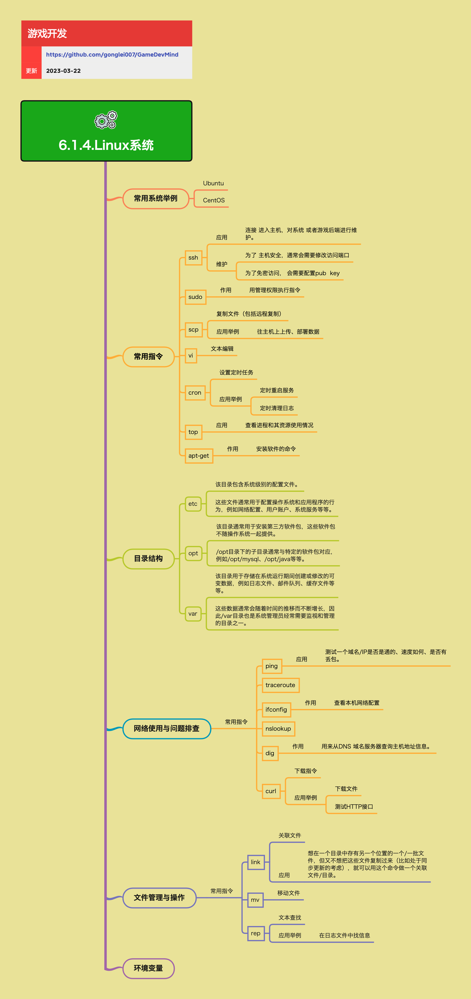

<h2 align="center">Linux系统</h2>

很多团队会使用Linux作为后端的运行环境，无论是游戏的后端开发，还是游戏运维，都会需要去操作Linux系统。
所以对于后端开发人员，是需要对Linux有一些了解的，以便日常工作中的操作或者跟运维人员的协作。

**关键词:**  
*Linux,Ubuntu,CentOS,ssh,远程管理,sudo,scp,vi,文本编辑,cron,定时任务,top,进程监控,apt-get,软件安装,ssh安全,ssh免密访问,pub key,权限问题,目录结构,/etc,/opt,/var,网络排查,ping,traceroute,ifconfig,nslookup,dig,DNS解析,curl,HTTP接口测试,link,ln,符号链接,硬链接,mv,文件移动,grep,文本查找,环境变量,PATH,JAVA_HOME*

**标签:** 
*等级: 初级|中级, 阶段: 学习|开发|运营, 分类: 运营能力, 角色: 服务端开发|运维*

## 图谱

## 子主题

### 常用系统

**是什么？在哪用？**

- **作用**：游戏服务器常用的Linux发行版，提供稳定的运行环境
- **应用场景**：
  - 游戏后端开发环境
  - 游戏服务器生产环境
  - 运维管理环境
- **常用系统**：
  - **Ubuntu**：基于Debian的Linux发行版，用户友好，适合开发和运维
  - **CentOS**：基于Red Hat Enterprise Linux的免费版本，稳定可靠，适合服务器环境

**会遇到哪些问题？用什么解决？**

- **如何选择合适的Linux发行版？**
  - **问题**：需要选择合适的Linux发行版
  - **解决方向**：
    - **系统选择考虑因素：** 选择因素
      - **团队熟悉度：** 团队熟悉度
        - 考虑团队对系统的熟悉程度
        - 选择团队熟悉的系统
      - **软件兼容性：** 软件兼容性
        - 考虑软件兼容性
        - 确保所需软件支持
      - **长期支持：** 长期支持
        - 考虑长期支持版本
        - 选择LTS版本
    - **系统特点：** 系统特点
      - **Ubuntu更适合开发环境：** Ubuntu特点
        - 用户友好
        - 软件包丰富
        - 适合开发
      - **CentOS更适合生产环境：** CentOS特点
        - 稳定可靠
        - 企业级支持
        - 适合生产
    - 根据团队熟悉度选择
    - 考虑软件兼容性和长期支持
    - Ubuntu更适合开发环境，CentOS更适合生产环境

- **如何处理系统兼容性问题？**
  - **问题**：系统兼容性问题
  - **解决方向**：
    - **软件兼容性：** 兼容性处理
      - 检查软件兼容性
      - 使用兼容的软件版本
      - 考虑容器化部署
    - 检查软件兼容性
    - 使用兼容的软件版本
    - 考虑容器化部署

**要点和思考方向：**
- Ubuntu和CentOS是游戏服务器常用的Linux发行版
- Ubuntu更适合开发环境，CentOS更适合生产环境
- 选择系统时需要考虑团队熟悉度、软件兼容性、长期支持等因素
- 根据实际需求选择合适的发行版
- 考虑系统的长期支持和维护成本

### 常用指令

**是什么？在哪用？**

- **作用**：Linux系统操作的基础指令，用于系统管理和维护
- **应用场景**：
  - 远程服务器管理
  - 系统维护
  - 文件操作
  - 进程监控
  - 软件安装
- **常用指令**：
  - **ssh**：连接进入主机，对系统或者游戏后端进行维护
  - **sudo**：用管理权限执行指令
  - **scp**：复制文件（包括远程复制），用于往主机上上传、部署数据
  - **vi**：文本编辑工具
  - **cron**：设置定时任务，如定时重启服务、定时清理日志
  - **top**：查看进程和其资源使用情况
  - **apt-get**：安装软件的命令（Ubuntu/Debian系统）

**会遇到哪些问题？用什么解决？**

- **如何解决ssh安全问题？**
  - **问题**：ssh安全问题：默认端口容易被扫描攻击
  - **解决方向**：
    - **ssh安全问题：** 安全配置
      - **问题：默认端口容易被扫描攻击：** 端口问题
        - 默认端口22容易被扫描
        - 容易被攻击
      - **解决方案：为了主机安全，通常会需要修改访问端口：** 端口修改
        - 修改SSH端口
        - 使用非标准端口
        - 配置防火墙规则
    - 修改SSH访问端口
    - 配置防火墙规则
    - 禁用密码认证，使用密钥认证
    - 限制SSH访问IP

- **如何实现ssh免密访问？**
  - **问题**：ssh免密访问：频繁输入密码不方便
  - **解决方向**：
    - **ssh免密访问：** 免密配置
      - **问题：频繁输入密码不方便：** 密码问题
        - 频繁输入密码
        - 操作不便
      - **解决方案：为了免密访问，会需要配置pub key：** 密钥配置
        - 生成SSH密钥对
        - 配置公钥到服务器
        - 实现免密访问
    - 生成SSH密钥对（ssh-keygen）
    - 将公钥配置到服务器（~/.ssh/authorized_keys）
    - 配置SSH客户端使用私钥
    - 实现免密访问

- **如何解决权限问题？**
  - **问题**：权限问题：普通用户无法执行某些管理操作
  - **解决方向**：
    - **权限问题：** 权限管理
      - **问题：普通用户无法执行某些管理操作：** 权限限制
        - 普通用户权限受限
        - 无法执行管理操作
      - **解决方案：使用sudo以管理权限执行指令：** sudo使用
        - 使用sudo执行管理指令
        - 配置sudo权限
        - 遵循最小权限原则
    - 使用sudo以管理权限执行指令
    - 配置sudo权限（/etc/sudoers）
    - 遵循最小权限原则
    - 避免使用root用户直接操作

- **如何使用cron定时任务？**
  - **问题**：需要使用定时任务
  - **解决方向**：
    - **cron定时任务：** 定时任务
      - 编辑crontab（crontab -e）
      - 设置定时任务规则
      - 定时重启服务、清理日志等
    - 编辑crontab配置
    - 设置定时任务规则
    - 测试定时任务执行
    - 查看定时任务日志

- **如何使用top监控系统？**
  - **问题**：需要监控系统资源使用情况
  - **解决方向**：
    - **top进程监控：** 进程监控
      - 使用top查看进程
      - 查看CPU、内存使用情况
      - 识别资源占用高的进程
    - 使用top查看进程和资源使用情况
    - 使用htop等增强工具
    - 分析系统性能瓶颈

**要点和思考方向：**
- 这些指令是Linux系统操作的基础，需要熟练掌握
- ssh是远程管理服务器的核心工具，安全配置很重要
- cron定时任务可以自动化很多运维工作
- top可以实时监控系统资源使用情况
- 掌握常用指令的基本用法和参数
- 注意ssh安全配置，使用密钥认证
- 合理使用sudo，遵循最小权限原则

### 目录结构

**是什么？在哪用？**

- **作用**：Linux系统的目录结构，用于组织和管理系统文件
- **应用场景**：
  - 系统配置管理
  - 软件安装管理
  - 日志和缓存管理
  - 系统维护
- **重要目录**：
  - **/etc**：该目录包含系统级别的配置文件。这些文件通常用于配置操作系统和应用程序的行为，例如网络配置、用户账户、系统服务等等
  - **/opt**：该目录通常用于安装第三方软件包，这些软件包不随操作系统一起提供。/opt目录下的子目录通常与特定的软件包对应，例如/opt/mysql、/opt/java等等
  - **/var**：该目录用于存储在系统运行期间创建或修改的可变数据，例如日志文件、邮件队列、缓存文件等等。这些数据通常会随着时间的推移而不断增长，因此/var目录也是系统管理员经常需要监视和管理的目录之一

**会遇到哪些问题？用什么解决？**

- **如何管理/etc配置文件？**
  - **问题**：需要管理/etc配置文件
  - **解决方向**：
    - **/etc目录管理：** 配置管理
      - **配置文件备份：** 备份策略
        - 修改前需要备份
        - 使用版本控制
        - 记录修改历史
      - **配置文件修改：** 修改注意
        - 谨慎修改配置文件
        - 测试配置修改
        - 验证配置正确性
    - 修改前需要备份配置文件
    - 使用版本控制管理配置
    - 测试配置修改效果
    - 记录配置修改历史

- **如何管理/opt第三方软件？**
  - **问题**：需要管理第三方软件
  - **解决方向**：
    - **/opt目录管理：** 软件管理
      - **软件安装：** 安装管理
        - 在/opt目录安装第三方软件
        - 便于管理和维护
        - 避免与系统软件冲突
      - **软件组织：** 组织方式
        - 按软件包组织目录
        - 例如/opt/mysql、/opt/java
    - 在/opt目录安装第三方软件
    - 按软件包组织目录结构
    - 便于管理和维护
    - 避免与系统软件冲突

- **如何管理/var可变数据？**
  - **问题**：/var目录数据不断增长，占用磁盘空间
  - **解决方向**：
    - **/var目录管理：** 数据管理
      - **定期清理：** 清理策略
        - 定期清理日志文件
        - 清理缓存文件
        - 清理临时文件
      - **日志轮转：** 日志管理
        - 配置日志轮转
        - 限制日志文件大小
        - 自动清理旧日志
      - **磁盘监控：** 监控机制
        - 监控/var目录大小
        - 设置磁盘使用告警
        - 及时清理空间
    - 定期清理日志和缓存文件
    - 配置日志轮转机制
    - 监控磁盘使用情况
    - 设置磁盘使用告警

**要点和思考方向：**
- 了解Linux目录结构有助于理解系统组织方式
- /etc目录存放配置文件，修改前需要备份
- /opt目录适合安装第三方软件，便于管理
- /var目录需要定期清理，避免占用过多磁盘空间
- 理解各目录的作用和使用场景
- 建立配置文件备份和版本控制机制
- 定期清理/var目录，防止磁盘空间不足

### 网络使用与问题排查

**是什么？在哪用？**

- **作用**：网络工具用于测试网络连通性、排查网络问题、测试接口
- **应用场景**：
  - 网络连通性测试
  - 网络问题排查
  - DNS解析查询
  - HTTP接口测试
  - 网络配置管理
- **常用工具**：
  - **ping**：测试一个域名/IP是否是通的、速度如何、是否有丢包
  - **traceroute**：追踪数据包从源到目的地的路径
  - **ifconfig**：查看本机网络配置
  - **nslookup**：查询DNS解析信息
  - **dig**：用来从DNS域名服务器查询主机地址信息
  - **curl**：下载指令，可用于下载文件、测试HTTP接口

**会遇到哪些问题？用什么解决？**

- **如何解决网络连通性问题？**
  - **问题**：网络连通性问题：无法连接服务器、网络延迟高、丢包
  - **解决方向**：
    - **网络连通性问题：** 连通性排查
      - **问题：无法连接服务器、网络延迟高、丢包：** 连接问题
        - 无法连接服务器
        - 网络延迟高
        - 丢包问题
      - **解决方案：使用ping测试连通性，使用traceroute追踪路径：** 排查工具
        - 使用ping测试连通性
        - 使用traceroute追踪路径
        - 分析网络延迟和丢包
    - 使用ping测试连通性
    - 使用traceroute追踪路径
    - 分析网络延迟和丢包情况
    - 检查防火墙和路由配置

- **如何解决DNS解析问题？**
  - **问题**：DNS解析问题：域名无法解析、解析到错误IP
  - **解决方向**：
    - **DNS解析问题：** DNS排查
      - **问题：域名无法解析、解析到错误IP：** 解析问题
        - 域名无法解析
        - 解析到错误IP
      - **解决方案：使用nslookup或dig查询DNS解析信息：** DNS工具
        - 使用nslookup查询DNS
        - 使用dig查询DNS
        - 检查DNS配置
    - 使用nslookup或dig查询DNS解析信息
    - 检查DNS服务器配置
    - 验证DNS解析结果
    - 检查本地DNS缓存

- **如何解决网络配置问题？**
  - **问题**：网络配置问题：网络接口配置错误、IP地址冲突
  - **解决方向**：
    - **网络配置问题：** 配置排查
      - **问题：网络接口配置错误、IP地址冲突：** 配置问题
        - 网络接口配置错误
        - IP地址冲突
      - **解决方案：使用ifconfig查看和配置网络接口：** 配置工具
        - 使用ifconfig查看网络配置
        - 使用ifconfig配置网络接口
        - 检查IP地址冲突
    - 使用ifconfig查看和配置网络接口
    - 检查网络配置文件（/etc/network/interfaces）
    - 验证IP地址和子网掩码
    - 检查路由表配置

- **如何测试HTTP接口？**
  - **问题**：接口测试问题：需要测试HTTP接口是否正常
  - **解决方向**：
    - **接口测试问题：** 接口测试
      - **问题：需要测试HTTP接口是否正常：** 测试需求
        - 测试HTTP接口
        - 验证接口功能
      - **解决方案：使用curl测试HTTP接口：** curl工具
        - 使用curl测试HTTP接口
        - 测试GET、POST等请求
        - 查看响应结果
    - 使用curl测试HTTP接口
    - 测试GET、POST、PUT、DELETE等请求
    - 查看响应状态码和内容
    - 测试接口性能和稳定性

**要点和思考方向：**
- 网络排查是运维中的常见工作，需要掌握这些工具
- ping是最基础的网络测试工具
- traceroute可以定位网络路径中的问题节点
- curl不仅可以下载文件，还可以测试HTTP接口，非常实用
- 掌握网络工具的基本用法和参数
- 按照从简单到复杂的顺序排查网络问题
- 结合多个工具综合分析网络问题

### 文件管理与操作

**是什么？在哪用？**

- **作用**：文件管理工具用于文件操作、文件关联、文本查找
- **应用场景**：
  - 文件移动和重命名
  - 文件关联和链接
  - 日志文件查找
  - 文本内容搜索
- **常用工具**：
  - **link（ln）**：关联文件，想在一个目录中存有另一个位置的一个/一批文件，但又不想把这些文件复制过来（比如处于同步更新的考虑），就可以用这个命令做一个关联文件/目录
  - **mv**：移动文件
  - **grep**：文本查找，在日志文件中找信息

**会遇到哪些问题？用什么解决？**

- **如何解决文件同步问题？**
  - **问题**：文件同步问题：需要在多个位置访问同一文件，但不想复制
  - **解决方向**：
    - **文件同步问题：** 文件关联
      - **问题：需要在多个位置访问同一文件，但不想复制：** 同步需求
        - 多位置访问同一文件
        - 避免文件复制
        - 保持文件同步
      - **解决方案：使用link创建符号链接或硬链接：** 链接创建
        - 使用ln创建符号链接（ln -s）
        - 使用ln创建硬链接
        - 符号链接和硬链接的区别
    - **链接类型：** 链接类型
      - **符号链接（软链接）：** 符号链接
        - 指向文件路径
        - 可以跨文件系统
        - 删除源文件后失效
      - **硬链接：** 硬链接
        - 指向文件inode
        - 不能跨文件系统
        - 删除源文件后仍有效
    - 使用ln创建符号链接或硬链接
    - 根据需求选择合适的链接类型
    - 注意符号链接和硬链接的区别

- **如何使用mv移动文件？**
  - **问题**：需要移动或重命名文件
  - **解决方向**：
    - **mv文件移动：** 文件移动
      - 使用mv移动文件
      - 使用mv重命名文件
      - 移动目录
    - 使用mv移动文件或目录
    - 使用mv重命名文件
    - 注意移动操作的权限要求

- **如何解决日志查找问题？**
  - **问题**：日志查找问题：在大量日志中查找特定信息
  - **解决方向**：
    - **日志查找问题：** 文本查找
      - **问题：在大量日志中查找特定信息：** 查找需求
        - 大量日志文件
        - 查找特定信息
        - 快速定位问题
      - **解决方案：使用grep进行文本搜索：** grep工具
        - 使用grep进行文本搜索
        - 支持正则表达式
        - 支持多文件搜索
    - **grep高级用法：** grep用法
      - **正则表达式：** 正则支持
        - 支持正则表达式
        - 模式匹配
      - **多文件搜索：** 多文件
        - 搜索多个文件
        - 递归搜索目录
      - **输出控制：** 输出控制
        - 显示行号
        - 显示上下文
        - 高亮匹配
    - 使用grep进行文本搜索
    - 使用正则表达式提高搜索精度
    - 结合其他命令（如find、awk）使用
    - 保存搜索结果到文件

**要点和思考方向：**
- link可以创建文件关联，避免重复存储
- mv可以移动或重命名文件
- grep是日志分析的重要工具，支持正则表达式，功能强大
- 理解符号链接和硬链接的区别和使用场景
- 掌握grep的正则表达式用法
- 结合多个命令提高文件操作效率

### 环境变量

**是什么？在哪用？**

- **作用**：配置系统环境、应用程序运行环境
- **应用场景**：
  - 设置PATH环境变量
  - 设置JAVA_HOME等开发环境变量
  - 设置数据库连接等应用环境变量
  - 配置系统运行环境
- **常用环境变量**：
  - **PATH**：系统命令搜索路径
  - **JAVA_HOME**：Java开发环境路径
  - **数据库连接**：数据库相关环境变量

**会遇到哪些问题？用什么解决？**

- **如何设置环境变量？**
  - **问题**：需要设置环境变量
  - **解决方向**：
    - **环境变量设置：** 设置方法
      - **用户级别设置：** 用户级别
        - 编辑~/.bashrc或~/.bash_profile
        - export VARIABLE=value
        - source ~/.bashrc使配置生效
      - **系统级别设置：** 系统级别
        - 编辑/etc/profile或/etc/environment
        - 影响所有用户
        - 需要root权限
    - **设置方法：** 设置方式
      - **临时设置：** 临时设置
        - export VARIABLE=value
        - 当前会话有效
      - **永久设置：** 永久设置
        - 编辑配置文件
        - 系统重启后仍有效
    - 根据需求选择用户级别或系统级别设置
    - 使用export命令设置环境变量
    - 编辑配置文件实现永久设置

- **如何查看环境变量？**
  - **问题**：需要查看环境变量
  - **解决方向**：
    - **查看方法：** 查看方式
      - **查看单个变量：** 单个变量
        - echo $VARIABLE
        - 查看变量值
      - **查看所有变量：** 所有变量
        - env命令
        - printenv命令
        - set命令
    - 使用echo $VARIABLE查看单个变量
    - 使用env或printenv查看所有环境变量
    - 使用set查看所有变量和函数

- **如何修改环境变量？**
  - **问题**：需要修改环境变量
  - **解决方向**：
    - **修改方法：** 修改方式
      - **临时修改：** 临时修改
        - export VARIABLE=new_value
        - 当前会话有效
      - **永久修改：** 永久修改
        - 编辑配置文件
        - 修改export语句
        - source配置文件使生效
    - 根据需求选择临时或永久修改
    - 编辑配置文件修改环境变量
    - 使用source命令使配置生效

- **如何处理环境变量冲突？**
  - **问题**：环境变量冲突或覆盖问题
  - **解决方向**：
    - **冲突处理：** 冲突解决
      - **优先级：** 优先级
        - 用户级别优先于系统级别
        - 后加载的配置覆盖先加载的
      - **检查顺序：** 检查顺序
        - 检查配置文件加载顺序
        - 检查变量定义位置
    - 理解环境变量的优先级
    - 检查配置文件加载顺序
    - 避免环境变量冲突

**要点和思考方向：**
- 环境变量影响系统和应用程序的行为
- 需要了解如何设置、查看、修改环境变量
- 环境变量可以在用户级别或系统级别设置
- 理解用户级别和系统级别环境变量的区别
- 掌握环境变量的设置、查看、修改方法
- 注意环境变量的优先级和冲突问题
- 使用source命令使配置文件生效
