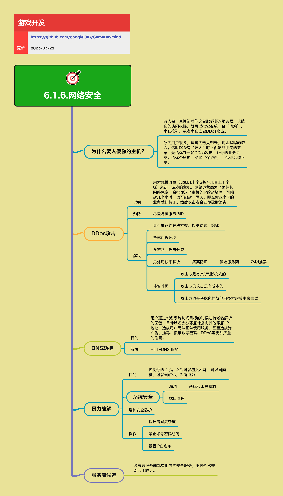

<h2 align="center">网络安全</h2>

如果你的产品数据还不错，那么恭喜你，你可能就要被一些“灰产”盯上了，他们会等着咬你一口。为了避免损失或被敲诈，有些事情你最好做好防备。

**关键词:** 
*网络安全,DDOS攻击,DDoS,DNS劫持,破解,暴力破解,肉机,矿机,服务器入侵,业务攻击,高防IP,负载均衡,反向代理,多链路,攻击分流,HTTPDNS,域名解析,系统安全,漏洞,端口管理,密码复杂度,密钥认证,IP白名单,安全防护,服务商选择,高防服务,安全监控,7x24小时技术支持,应急响应,木马,恶意代码*

**标签:** 
*等级: 中级, 阶段: 运营, 分类: 运营能力, 角色: 运维|管理*

## 图谱

## 为什么要关注网络安全？

**是什么？在哪用？**

- **作用**：保护游戏服务器和业务免受网络攻击，避免损失和被敲诈
- **应用场景**：
  - 游戏服务器防护
  - 业务安全保护
  - 数据安全保护
  - 用户数据保护
- **重要性**：如果你的产品数据还不错，那么恭喜你，你可能就要被一些"灰产"盯上了，他们会等着咬你一口。为了避免损失或被敲诈，有些事情你最好做好防备。

**会遇到哪些问题？用什么解决？**

- **如何应对服务器被入侵？**
  - **问题**：服务器被入侵：有人会一直惦记着你这台肥嘟嘟的服务器，攻破它的访问权限，就可以把它变成一台"肉鸡"，拿它挖矿，或者拿它去做DDos攻击
  - **解决方向**：
    - **服务器安全防护：** 安全防护
      - **系统安全：** 系统防护
        - 定期更新系统和工具
        - 修复安全漏洞
        - 关闭不必要的端口
      - **访问控制：** 访问控制
        - 使用密钥认证
        - 设置IP白名单
        - 提升密码复杂度
      - **安全监控：** 安全监控
        - 监控异常访问
        - 设置安全告警
        - 定期安全审计
    - 定期更新系统和工具，修复漏洞
    - 使用密钥认证，设置IP白名单
    - 监控异常访问，设置安全告警

- **如何应对业务被攻击？**
  - **问题**：业务被攻击：你的用户很多，运营的热火朝天，现金哗哗的流入。这时就会有"坏人"盯上你这只肥美的羔羊，先给你来一轮DDos攻击，让你的业务趴窝。给你个通知，给些"保护费"，保你后续平安
  - **解决方向**：
    - **业务安全防护：** 业务防护
      - **预防措施：** 预防
        - 隐藏真实IP
        - 使用高防服务
        - 建立应急响应机制
      - **应对措施：** 应对
        - 快速迁移环境
        - 多链路攻击分流
        - 使用高防IP
    - 提前做好防护，隐藏真实IP
    - 使用高防服务抵御攻击
    - 建立应急响应机制，快速应对攻击

**要点和思考方向：**
- 网络安全不是可选项，而是必需品
- 随着业务发展，被攻击的风险会越来越大
- 需要提前做好防护，而不是等到被攻击后再处理
- 攻击者有自己的"产业"模式，攻击是有成本的，也会考虑目标的价值
- 建立完善的安全防护体系
- 定期进行安全审计和漏洞修复
- 建立应急响应机制，快速应对攻击

## DDos攻击

**是什么？在哪用？**

- **作用**：用大规模流量攻击游戏服务器，导致服务无法访问
- **攻击方式**：用大规模流量（比如几十个G甚至几百上千个G）来访问游戏的主机，网络运营商为了确保其网络稳定，会把你这个主机的IP给封堵掉，可能封几个小时，也可能封一两天。那么你这个IP的业务就停转了。然后攻击者会让你破财消灾
- **应用场景**：
  - 游戏服务器攻击
  - 业务勒索
  - 竞争对手恶意攻击

**会遇到哪些问题？用什么解决？**

- **如何预防DDos攻击？**
  - **问题**：需要预防DDos攻击
  - **解决方向**：
    - **预防措施：** 预防方案
      - **尽量隐藏服务的IP：使用负载均衡、反向代理等方式隐藏真实IP：** IP隐藏
        - 使用负载均衡隐藏真实IP
        - 使用反向代理隐藏真实IP
        - 避免直接暴露服务器IP
    - 使用负载均衡、反向代理等方式隐藏真实IP
    - 避免直接暴露服务器IP
    - 建立安全防护体系

- **如何应对DDos攻击？**
  - **问题**：服务无法访问、业务停转、被勒索
  - **解决方向**：
    - **应对方案：** 应对措施
      - **最不推荐的解决方案：接受勒索，给钱（这会助长攻击者的气焰）：** 不推荐
        - 不要接受勒索
        - 不要给钱
        - 这会助长攻击者气焰
      - **快速迁移环境：更换IP，快速恢复服务：** 快速恢复
        - 更换IP地址
        - 快速迁移服务
        - 恢复业务运行
      - **多链路，攻击分流：使用多个IP和线路，分散攻击流量：** 攻击分流
        - 使用多个IP
        - 使用多个线路
        - 分散攻击流量
      - **买高防IP：使用高防服务来抵御攻击：** 高防服务
        - 使用高防IP服务
        - 抵御大规模攻击
        - 各家云服务商都有相应的安全服务，不过价格差别会比较大
    - 不要接受勒索，不要给钱
    - 快速迁移环境，更换IP恢复服务
    - 使用多链路攻击分流
    - 使用高防IP服务抵御攻击

- **如何理解攻击者的行为模式？**
  - **问题**：需要理解攻击者的行为模式
  - **解决方向**：
    - **斗智斗勇：** 策略思考
      - **攻击方是有其"产业"模式的：** 产业模式
        - 攻击者有产业模式
        - 攻击是有组织的
      - **攻击方的攻击是有成本的：** 攻击成本
        - 攻击需要成本
        - 攻击者会考虑成本
      - **攻击方也会考虑你值得他用多大的成本来尝试：** 目标价值
        - 攻击者会评估目标价值
        - 根据价值决定攻击强度
    - 理解攻击者的产业模式和成本
    - 根据业务价值评估攻击风险
    - 制定相应的防护策略

**要点和思考方向：**
- DDos攻击是最常见的网络攻击方式之一
- 预防比应对更重要，隐藏真实IP是关键
- 高防服务是有效的解决方案，但成本较高
- 需要建立应急响应机制，能够快速应对攻击
- 不要接受勒索，这会助长攻击者气焰
- 理解攻击者的行为模式，制定相应策略
- 建立完善的防护和应急响应机制

## DNS劫持

**是什么？在哪用？**

- **作用**：劫持域名解析，将用户引导到恶意网站
- **攻击方式**：用户通过域名系统访问目标的时候劫持域名解析的回包，目标域名会被恶意地指向其他恶意IP地址，造成用户无法正常使用服务，甚至造成弹广告、挂马、搜集账号密码、DDoS等更加严重的危害
- **应用场景**：
  - 域名解析攻击
  - 用户数据窃取
  - 恶意代码植入

**会遇到哪些问题？用什么解决？**

- **如何应对DNS劫持？**
  - **问题**：用户无法正常访问服务、被引导到恶意网站、账号密码泄露、被植入恶意代码
  - **解决方向**：
    - **DNS劫持防护：** 防护方案
      - **HTTPDNS服务：使用HTTP协议进行DNS解析，避免传统DNS被劫持的问题：** HTTPDNS
        - 使用HTTP协议进行DNS解析
        - 避免传统DNS被劫持
        - 提高解析安全性
    - 使用HTTPDNS服务避免DNS劫持
    - 使用HTTPS加密通信
    - 定期检查DNS解析是否正确

- **如何检测DNS劫持？**
  - **问题**：需要检测DNS劫持
  - **解决方向**：
    - **DNS检测：** 检测机制
      - **需要定期检查DNS解析是否正确：** 定期检查
        - 定期检查DNS解析
        - 验证解析结果
        - 监控DNS解析异常
    - 定期检查DNS解析是否正确
    - 监控DNS解析异常
    - 使用多个DNS服务器验证

- **如何保护移动端应用？**
  - **问题**：移动端应用特别容易受到DNS劫持
  - **解决方向**：
    - **移动端防护：** 移动防护
      - **移动端应用特别需要使用HTTPDNS：** 移动端HTTPDNS
        - 移动端使用HTTPDNS
        - 避免运营商DNS劫持
        - 提高解析成功率
    - 移动端应用特别需要使用HTTPDNS
    - 避免运营商Local DNS劫持
    - 提高移动端网络质量

**要点和思考方向：**
- DNS劫持是常见的网络攻击手段，影响面广
- HTTPDNS可以有效避免DNS劫持问题
- 需要定期检查DNS解析是否正确
- 移动端应用特别需要使用HTTPDNS
- 使用HTTPDNS服务提高解析安全性
- 定期检查DNS解析，监控异常情况
- 移动端应用必须使用HTTPDNS避免劫持

## 暴力破解

**是什么？在哪用？**

- **作用**：通过暴力破解密码等方式控制服务器
- **攻击目的**：控制你的主机。之后可以植入木马、可以当肉机、可以当矿机，为所欲为！
- **应用场景**：
  - 服务器入侵
  - 数据窃取
  - 资源滥用

**会遇到哪些问题？用什么解决？**

- **如何应对暴力破解攻击？**
  - **问题**：服务器被控制、数据泄露、被用作攻击工具、资源被滥用
  - **解决方向**：
    - **系统安全问题：** 系统安全
      - **漏洞：系统和工具漏洞可能被利用：** 漏洞管理
        - 定期更新系统和工具
        - 修复安全漏洞
        - 使用安全补丁
      - **端口管理：开放不必要的端口增加被攻击的风险：** 端口管理
        - 关闭不必要的端口
        - 只开放必要的服务
        - 遵循最小权限原则
    - 定期更新系统和工具，修复漏洞
    - 关闭不必要的端口，只开放必要的服务
    - 遵循最小权限原则

- **如何增强安全防护？**
  - **问题**：需要增强安全防护措施
  - **解决方向**：
    - **增加安全防护措施：** 安全防护
      - **提升密码复杂度：使用强密码，定期更换：** 密码管理
        - 使用强密码
        - 定期更换密码
        - 避免使用弱密码
      - **禁止帐号密码访问：使用密钥认证替代密码登录：** 密钥认证
        - 使用密钥认证
        - 禁止密码登录
        - 密钥比密码更安全
      - **设置IP白名单：限制只有特定IP可以访问：** IP白名单
        - 设置IP白名单
        - 限制访问来源
        - 提高安全性
    - 提升密码复杂度，使用强密码
    - 使用密钥认证替代密码登录
    - 设置IP白名单限制访问

- **如何监控和检测暴力破解？**
  - **问题**：需要监控和检测暴力破解行为
  - **解决方向**：
    - **安全监控：** 监控机制
      - **监控异常登录：** 登录监控
        - 监控登录失败次数
        - 设置登录失败锁定
        - 记录异常登录日志
      - **设置告警：** 告警机制
        - 设置安全告警
        - 及时响应异常
    - 监控登录失败次数
    - 设置登录失败锁定机制
    - 记录异常登录日志，设置告警

**要点和思考方向：**
- 暴力破解是常见的服务器入侵手段
- 需要定期更新系统和工具，修复漏洞
- 最小权限原则：只开放必要的端口和服务
- 使用密钥认证比密码更安全
- IP白名单可以有效限制访问来源
- 定期更新系统和工具，修复安全漏洞
- 使用密钥认证和IP白名单增强安全
- 监控异常登录，及时响应安全威胁

## 服务商选择

**是什么？在哪用？**

- **作用**：提供网络安全防护服务，如高防IP、DDoS防护、安全监控等
- **应用场景**：
  - 需要专业安全防护的游戏服务
  - DDoS攻击防护
  - 安全监控和告警
  - 应急响应支持

**会遇到哪些问题？用什么解决？**

- **如何选择服务商？**
  - **问题**：服务商选择困难、价格差异大、服务质量参差不齐
  - **解决方向**：
    - **服务商评估：** 评估标准
      - **对比不同服务商的价格和服务：** 价格对比
        - 对比价格差异
        - 对比服务内容
        - 评估性价比
      - **选择有良好口碑和案例的服务商：** 口碑选择
        - 查看服务商口碑
        - 查看成功案例
        - 评估服务质量
      - **根据业务规模和需求选择合适的方案：** 方案选择
        - 根据业务规模选择
        - 根据需求选择方案
        - 考虑扩展性
    - 对比不同服务商的价格和服务
    - 选择有良好口碑和案例的服务商
    - 根据业务规模和需求选择合适的方案

- **如何评估服务商能力？**
  - **问题**：需要评估服务商的能力
  - **解决方向**：
    - **能力评估：** 能力标准
      - **各家云服务商都有相应的安全服务，不过价格差别会比较大：** 服务商特点
        - 各家云服务商都有安全服务
        - 价格差别较大
        - 需要仔细对比
      - **建议选择有7x24小时技术支持的服务商：** 技术支持
        - 7x24小时技术支持
        - 快速响应能力
        - 专业服务团队
    - 评估服务商的技术能力和服务能力
    - 选择有7x24小时技术支持的服务商
    - 评估服务商的响应速度和专业水平

- **如何控制成本？**
  - **问题**：安全服务成本较高，需要控制成本
  - **解决方向**：
    - **成本控制：** 成本管理
      - **需要根据业务规模和预算选择合适的服务商：** 预算考虑
        - 根据业务规模选择
        - 根据预算选择
        - 平衡成本和需求
      - **安全服务是持续性的，需要考虑长期成本：** 长期成本
        - 安全服务是持续性的
        - 考虑长期成本
        - 评估总体拥有成本
    - 根据业务规模和预算选择合适的服务商
    - 考虑长期成本，评估总体拥有成本
    - 平衡成本和防护需求

**要点和思考方向：**
- 各家云服务商都有相应的安全服务，不过价格差别会比较大
- 需要根据业务规模和预算选择合适的服务商
- 安全服务是持续性的，需要考虑长期成本
- 建议选择有7x24小时技术支持的服务商
- 仔细对比不同服务商的价格和服务
- 选择有良好口碑和案例的服务商
- 考虑长期成本和技术支持能力

## 更多资料
* [DNS劫持原理？如何处理DNS劫持？](https://dun.163.com/news/p/18043a7b41f047ab8dc06ea3bdff6e9b)
