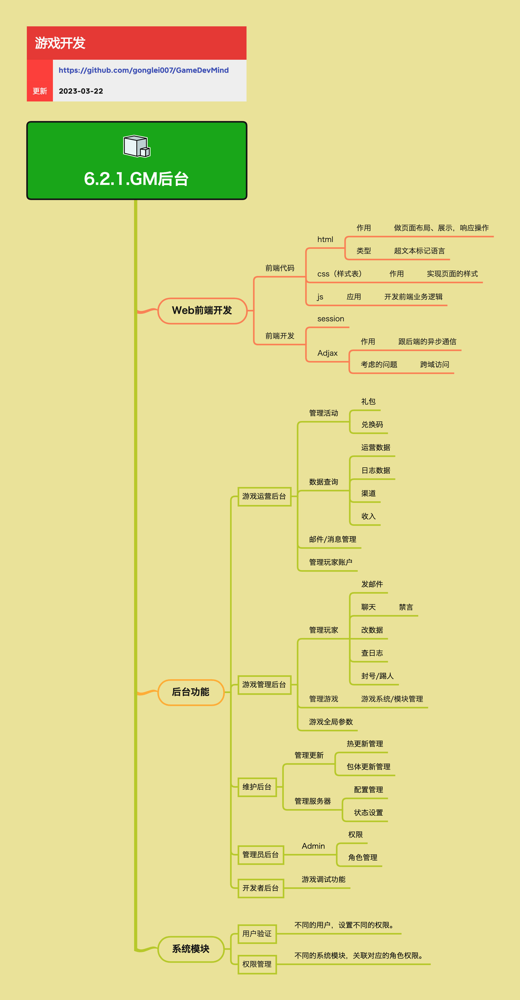

<h2 align="center">GM后台</h2>

产品上线后，需要有一套系统能让GM人员管理维护游戏。

**关键词:**  
*GM后台,GM,游戏运营后台,游戏管理后台,维护后台,管理员后台,开发者后台,Web前端开发,HTML,CSS,JS,JavaScript,session,会话管理,Ajax,异步通信,跨域访问,CORS,代理,活动管理,礼包,兑换码,数据查询,运营数据,日志数据,渠道,收入,邮件管理,消息管理,玩家账户管理,玩家管理,发邮件,聊天,禁言,改数据,查日志,封号,踢人,游戏系统管理,游戏模块管理,游戏全局参数,热更新管理,包体更新管理,服务器配置管理,服务器状态设置,权限管理,角色管理,Admin管理,用户验证,权限控制,RBAC,操作日志,游戏调试功能*

**标签:** 
*等级: 中级, 阶段: 开发|运营, 分类: 运营能力, 角色: 服务端开发|全栈开发|管理|运维*

## 图谱

## 子主题

### Web前端开发

**是做什么的？在哪用？**

- **作用**：开发GM后台的Web界面，提供用户交互界面
- **应用场景**：GM后台的前端界面开发

**会遇到哪些问题？用什么解决？**

- **前端代码组成**：
  - **HTML**：做页面布局、展示，响应操作（超文本标记语言）
  - **CSS（样式表）**：实现页面的样式
  - **JS**：开发前端业务逻辑
- **前端开发技术**：
  - **session**：管理用户会话状态
  - **Ajax**：跟后端的异步通信
    - **考虑的问题**：跨域访问（需要配置CORS或使用代理）

**要点和思考方向**

- GM后台通常是Web应用，需要掌握Web前端开发技术
- Ajax可以实现前后端异步通信，提升用户体验
- 跨域访问是Web开发中的常见问题，需要合理处理
- 前端代码需要与后端API配合，实现完整的功能

### 游戏运营后台

**是做什么的？在哪用？**

- **作用**：支持游戏运营活动的管理和数据查询
- **应用场景**：日常运营工作、活动管理、数据分析

**会遇到哪些问题？用什么解决？**

- **管理活动**：
  - **礼包**：创建、发放、管理游戏礼包
  - **兑换码**：生成、管理、查询兑换码
- **数据查询**：
  - **运营数据**：查看游戏运营指标
  - **日志数据**：查询游戏日志，分析问题
  - **渠道**：查看各渠道数据
  - **收入**：查看收入相关数据
- **邮件/消息管理**：向玩家发送邮件、消息
- **管理玩家账户**：查询、管理玩家账户信息

**要点和思考方向**

- 游戏运营后台是运营人员的主要工作平台
- 需要提供丰富的数据查询功能，支持运营决策
- 活动管理功能要灵活，支持快速创建和调整活动
- 数据查询性能很重要，需要考虑数据量大的情况

### 游戏管理后台

**是做什么的？在哪用？**

- **作用**：支持GM对玩家和游戏进行管理
- **应用场景**：玩家问题处理、游戏内容管理、参数调整

**会遇到哪些问题？用什么解决？**

- **管理玩家**：
  - **发邮件**：向玩家发送邮件
  - **聊天**：与玩家聊天沟通
    - **禁言**：对违规玩家进行禁言处理
  - **改数据**：修改玩家数据（如补偿、调整）
  - **查日志**：查询玩家相关日志
  - **封号/踢人**：对违规玩家进行封号或踢出处理
- **管理游戏**：
  - **游戏系统/模块管理**：管理游戏内的系统和模块
- **游戏全局参数**：调整游戏全局配置参数

**要点和思考方向**

- 游戏管理后台是GM处理玩家问题和游戏管理的主要工具
- 需要提供丰富的玩家管理功能，支持各种运营需求
- 数据修改功能要谨慎，需要有操作日志和权限控制
- 游戏参数调整要支持热更新，避免重启服务

### 维护后台

**是做什么的？在哪用？**

- **作用**：支持游戏版本更新和服务器维护
- **应用场景**：版本更新、服务器配置管理、服务状态控制

**会遇到哪些问题？用什么解决？**

- **管理更新**：
  - **热更新管理**：管理游戏热更新内容
  - **包体更新管理**：管理游戏包体更新
- **管理服务器**：
  - **配置管理**：管理服务器配置
  - **状态设置**：设置服务器状态（如维护中、正常等）

**要点和思考方向**

- 维护后台是技术运维的重要工具
- 热更新和包体更新管理要支持版本控制和回滚
- 服务器配置管理要支持多服务器批量操作
- 服务器状态设置要谨慎，避免影响玩家体验

### 管理员后台

**是做什么的？在哪用？**

- **作用**：管理系统管理员和权限
- **应用场景**：管理员账户管理、权限分配、角色管理

**会遇到哪些问题？用什么解决？**

- **Admin管理**：
  - **权限**：设置不同管理员的权限
  - **角色管理**：管理不同的角色和权限组合

**要点和思考方向**

- 管理员后台是系统安全的基础
- 需要实现细粒度的权限控制
- 角色管理可以简化权限分配，提高管理效率
- 需要记录所有管理员操作日志，便于审计

### 开发者后台

**是做什么的？在哪用？**

- **作用**：提供游戏调试和开发支持功能
- **应用场景**：开发调试、测试验证、问题排查

**会遇到哪些问题？用什么解决？**

- **游戏调试功能**：提供各种调试工具和功能，帮助开发者快速定位和解决问题

**要点和思考方向**

- 开发者后台主要用于开发和测试阶段
- 调试功能要强大，支持各种调试需求
- 生产环境要限制或禁用开发者后台，避免安全风险
- 调试功能要支持日志查看、数据修改、性能监控等

### 系统模块

**是做什么的？在哪用？**

- **作用**：提供GM后台的基础功能模块
- **应用场景**：所有后台功能的基础支撑

**会遇到哪些问题？用什么解决？**

- **用户验证**：
  - **问题**：需要确保只有授权用户才能访问后台
  - **解决方案**：不同的用户，设置不同的权限
- **权限管理**：
  - **问题**：需要控制不同用户对不同功能的访问权限
  - **解决方案**：不同的系统模块，关联对应的角色权限

**要点和思考方向**

- 用户验证和权限管理是GM后台安全的基础
- 需要实现基于角色的权限控制（RBAC）
- 权限要细化到功能模块级别，实现最小权限原则
- 需要记录所有用户操作，便于审计和问题追踪
