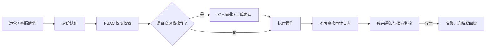

## GM后台

产品上线后，需要有一套系统能让GM人员管理维护游戏。

**关键词:**  
*GM后台,GM,游戏运营后台,游戏管理后台,维护后台,管理员后台,开发者后台,Web前端开发,HTML,CSS,JS,JavaScript,session,会话管理,Ajax,异步通信,跨域访问,CORS,代理,活动管理,礼包,兑换码,数据查询,运营数据,日志数据,渠道,收入,邮件管理,消息管理,玩家账户管理,玩家管理,发邮件,聊天,禁言,改数据,查日志,封号,踢人,游戏系统管理,游戏模块管理,游戏全局参数,热更新管理,包体更新管理,服务器配置管理,服务器状态设置,权限管理,角色管理,Admin管理,用户验证,权限控制,RBAC,操作日志,游戏调试功能,AI Coding*

**标签:** 
*等级: 中级, 阶段: 开发|运营, 分类: 运营能力, 角色: 服务端开发|全栈开发|管理|运维*

## 图谱

## 目录

- [前端与后台类型](#前端与后台类型)
- [系统模块](#系统模块)
- [延伸实践](#延伸实践)
- [更多资料](#更多资料)

----

> 💡 **AI Coding 总览**（为何要掌握知识才能更好操作 AI、指南的三类内容等）见 [阅读说明 - AI Coding 总览](../../阅读说明.md#ai-coding-总览)。

---

## 前端与后台类型

### Web前端开发

| 维度 | 内容 |
|------|------|
| **作用** | 开发GM后台的Web界面，提供用户交互界面 |
| **应用场景** | GM后台的前端界面开发；用户交互界面；数据展示和操作界面 |

| 前端代码组成 | 说明 |
|--------------|------|
| **HTML** | 页面布局、内容展示、响应操作 |
| **CSS** | 页面样式、视觉效果、响应式设计 |
| **JS** | 业务逻辑、交互处理、数据验证 |

| 问题 | 解决方向 |
|------|----------|
| **如何开发前端界面？** | 使用HTML做页面布局和展示；使用CSS实现页面样式；使用JavaScript开发业务逻辑 |
| **如何管理用户会话？** | 使用session管理用户会话状态；实现会话超时和自动登出；保护会话安全 |
| **如何实现前后端通信？** | 使用Ajax实现前后端异步通信；配置CORS或使用代理解决跨域问题；处理异步请求的错误和超时 |

| 要点和思考方向 |
|----------------|
| GM后台通常是Web应用，需要掌握Web前端开发技术 |
| Ajax可以实现前后端异步通信，提升用户体验 |
| 跨域访问是Web开发中的常见问题，需要合理处理 |
| 前端代码需要与后端API配合，实现完整的功能 |
| 掌握HTML、CSS、JavaScript等前端技术 |
| 使用session管理用户会话，使用Ajax实现异步通信 |
| 合理处理跨域访问问题 |

| 类型 | AI Coding 指南 |
|------|----------------|
| **交互提示** | 说明需求；如「HTML」「CSS」「JS」「session」「Ajax」「CORS」 |
| **方法** | 让 AI 设计前端架构、会话管理、跨域方案 |
| **应用** | GM 后台前端、登录会话、API 调用 |
| **提示词范例** | 「GM 后台需 Web 前端，请设计 session 会话管理、Ajax 与后端通信、CORS 或代理跨域方案，以及登录超时与安全要点」 |

### 游戏运营后台

| 维度 | 内容 |
|------|------|
| **作用** | 支持游戏运营活动的管理和数据查询 |
| **应用场景** | 日常运营工作；活动管理；数据分析；运营决策支持 |

| 问题 | 解决方向 |
|------|----------|
| **如何管理活动？** | 创建、发放、管理游戏礼包；生成、管理、查询兑换码；支持活动快速创建和调整 |
| **如何查询数据？** 运营数据、日志数据、渠道、收入 | 提供丰富的数据查询功能；支持运营指标、日志、渠道、收入等数据查询；优化数据查询性能 |
| **如何管理邮件和消息？** | 实现邮件和消息发送功能；支持批量发送和定时发送；记录发送日志 |
| **如何管理玩家账户？** | 提供玩家账户查询功能；支持账户信息管理；记录账户操作日志 |

| 要点和思考方向 |
|----------------|
| 游戏运营后台是运营人员的主要工作平台 |
| 需要提供丰富的数据查询功能，支持运营决策 |
| 活动管理功能要灵活，支持快速创建和调整活动 |
| 数据查询性能很重要，需要考虑数据量大的情况 |
| 提供完整的活动管理功能，支持礼包和兑换码管理 |
| 优化数据查询性能，支持大数据量查询 |
| 实现邮件、消息和玩家账户管理功能 |

| 类型 | AI Coding 指南 |
|------|----------------|
| **交互提示** | 说明需求；如「活动」「礼包」「兑换码」「数据查询」「邮件」「渠道」「收入」 |
| **方法** | 让 AI 设计运营功能、数据查询、接口 |
| **应用** | 活动管理、数据查询、邮件消息 |
| **提示词范例** | 「运营后台需活动管理（礼包、兑换码）、数据查询（运营、日志、渠道、收入）、邮件与玩家管理，请设计功能模块与数据查询性能优化要点」 |

### 游戏管理后台

| 维度 | 内容 |
|------|------|
| **作用** | 支持GM对玩家和游戏进行管理 |
| **应用场景** | 玩家问题处理；游戏内容管理；参数调整；GM日常工作 |

| 玩家管理功能 | 说明 |
|--------------|------|
| **发邮件** | 向玩家发送邮件、补偿邮件、通知邮件 |
| **聊天** | 与玩家聊天沟通、客服沟通 |
| **禁言** | 对违规玩家进行禁言处理 |
| **改数据** | 修改玩家数据（补偿、调整），需操作日志和权限控制 |
| **查日志** | 查询玩家相关日志 |
| **封号/踢人** | 对违规玩家进行封号或踢出处理 |

| 问题 | 解决方向 |
|------|----------|
| **如何管理玩家？** | 提供丰富的玩家管理功能；支持邮件、聊天、数据修改、日志查询、封号踢人等操作；数据修改要有操作日志和权限控制 |
| **如何管理游戏？** | 管理游戏内的系统和模块；调整游戏全局配置参数；支持热更新，避免重启服务 |

| 要点和思考方向 |
|----------------|
| 游戏管理后台是GM处理玩家问题和游戏管理的主要工具 |
| 需要提供丰富的玩家管理功能，支持各种运营需求 |
| 数据修改功能要谨慎，需要有操作日志和权限控制 |
| 游戏参数调整要支持热更新，避免重启服务 |

| 类型 | AI Coding 指南 |
|------|----------------|
| **交互提示** | 说明需求；如「发邮件」「禁言」「改数据」「查日志」「封号」「热更新」 |
| **方法** | 让 AI 设计玩家管理接口、操作日志、权限校验 |
| **应用** | 玩家管理、数据修改、操作审计 |
| **提示词范例** | 「GM 管理后台需发邮件、禁言、改数据、查日志、封号，请设计接口与操作日志记录，以及数据修改的权限控制与审计要点」 |

### 维护后台

| 维度 | 内容 |
|------|------|
| **作用** | 支持游戏版本更新和服务器维护 |
| **应用场景** | 版本更新；服务器配置管理；服务状态控制；技术运维工作 |

| 问题 | 解决方向 |
|------|----------|
| **如何管理更新？** | 管理游戏热更新和包体更新；支持版本控制和回滚；实现更新发布和回滚机制 |
| **如何管理服务器？** | 管理服务器配置，支持多服务器批量操作；设置服务器状态（维护中、正常等），谨慎操作 |

| 要点和思考方向 |
|----------------|
| 维护后台是技术运维的重要工具 |
| 热更新和包体更新管理要支持版本控制和回滚 |
| 服务器配置管理要支持多服务器批量操作 |
| 服务器状态设置要谨慎，避免影响玩家体验 |

| 类型 | AI Coding 指南 |
|------|----------------|
| **交互提示** | 说明需求；如「热更新」「包体更新」「服务器配置」「维护状态」 |
| **方法** | 让 AI 设计更新流程、版本控制、批量操作 |
| **应用** | 热更新管理、包体发布、服务器维护 |
| **提示词范例** | 「维护后台需热更新、包体更新、服务器配置管理，请设计版本控制与回滚流程、多服务器批量操作，以及服务器状态（维护中/正常）设置与影响评估」 |

### 管理员后台

| 维度 | 内容 |
|------|------|
| **作用** | 管理系统管理员和权限 |
| **应用场景** | 管理员账户管理；权限分配；角色管理；系统安全管理 |

| 问题 | 解决方向 |
|------|----------|
| **如何管理管理员权限？** | 设置不同管理员的权限；实现细粒度权限控制；使用角色管理简化权限分配 |
| **如何实现权限控制？** | 实现基于角色的权限控制（RBAC）；实现功能级和数据级权限验证 |
| **如何记录操作日志？** | 记录所有管理员操作日志；包含操作时间、操作人、操作内容；便于审计和问题追踪 |

| 要点和思考方向 |
|----------------|
| 管理员后台是系统安全的基础 |
| 需要实现细粒度的权限控制 |
| 角色管理可以简化权限分配，提高管理效率 |
| 需要记录所有管理员操作日志，便于审计 |
| 实现基于角色的权限控制（RBAC） |

| 类型 | AI Coding 指南 |
|------|----------------|
| **交互提示** | 说明需求；如「RBAC」「角色」「权限」「操作日志」「Admin」 |
| **方法** | 让 AI 设计 RBAC 模型、权限校验、审计日志 |
| **应用** | 权限管理、角色分配、操作审计 |
| **提示词范例** | 「管理员后台需 RBAC 权限控制，请设计角色与权限模型、功能级与数据级权限校验，以及操作日志（时间、操作人、内容）记录与审计」 |

### 开发者后台

| 维度 | 内容 |
|------|------|
| **作用** | 提供游戏调试和开发支持功能 |
| **应用场景** | 开发调试；测试验证；问题排查；开发阶段支持 |

| 调试功能 | 说明 |
|----------|------|
| **日志查看** | 查看游戏日志、日志搜索和过滤、日志分析 |
| **数据修改** | 修改游戏数据、测试数据设置、数据验证 |
| **性能监控** | 性能监控、性能分析、性能优化 |

| 问题 | 解决方向 |
|------|----------|
| **如何提供调试功能？** | 提供各种调试工具和功能；支持日志查看、数据修改、性能监控等 |
| **如何保证安全性？** | 生产环境限制或禁用开发者后台；仅在开发测试环境使用；实现权限控制和操作日志记录 |

| 要点和思考方向 |
|----------------|
| 开发者后台主要用于开发和测试阶段 |
| 调试功能要强大，支持各种调试需求 |
| 生产环境要限制或禁用开发者后台，避免安全风险 |

| 类型 | AI Coding 指南 |
|------|----------------|
| **交互提示** | 说明需求；如「调试」「日志」「数据修改」「性能监控」 |
| **方法** | 让 AI 设计调试功能、环境隔离、安全限制 |
| **应用** | 日志查看、数据修改、性能分析 |
| **提示词范例** | 「开发者后台需日志查看、数据修改、性能监控，请设计调试功能与接口，以及生产环境限制/禁用策略与权限控制」 |

## 系统模块

```mermaid
flowchart LR
    U["运营 / 客服请求"] --> A["身份认证"] --> R["RBAC 权限校验"]
    R --> D{"是否高风险操作？"}
    D -->|是| P["双人审批 / 工单确认"] --> X["执行操作"]
    D -->|否| X
    X --> L["不可篡改审计日志"] --> M["结果通知与指标监控"]
    M -->|异常| W["告警、冻结或回滚"]
```

| 维度 | 内容 |
|------|------|
| **作用** | 提供GM后台的基础功能模块 |
| **应用场景** | 所有后台功能的基础支撑；用户验证；权限管理；系统安全 |

| 问题 | 解决方向 |
|------|----------|
| **如何实现用户验证？** | 实现用户登录验证；不同用户设置不同权限；确保只有授权用户才能访问 |
| **如何实现权限管理？** | 实现基于角色的权限控制（RBAC）；系统模块关联对应的角色权限；权限细化到功能模块级别 |
| **如何记录操作日志？** | 记录所有用户操作日志；包含操作时间、操作人、操作内容；便于审计和问题追踪 |

| 要点和思考方向 |
|----------------|
| 用户验证和权限管理是GM后台安全的基础 |
| 需要实现基于角色的权限控制（RBAC） |
| 权限要细化到功能模块级别，实现最小权限原则 |
| 需要记录所有用户操作，便于审计和问题追踪 |

| 类型 | AI Coding 指南 |
|------|----------------|
| **交互提示** | 说明需求；如「登录」「用户验证」「RBAC」「操作日志」 |
| **方法** | 让 AI 设计登录流程、权限校验、审计体系 |
| **应用** | 用户验证、权限控制、操作审计 |
| **提示词范例** | 「GM 后台系统模块需用户验证、RBAC 权限、操作日志，请设计登录与会话验证、功能模块级权限校验，以及操作审计日志结构与查询」 |

---

## 延伸实践

| 类型 | 链接 |
|------|------|
| 🤖 AI 对话 | [用 Cursor 设计 GM RBAC](../../ai-cases/gm-rbac-design.md) |

## 更多资料

- [MDN Web Docs — Web 前端开发权威参考](https://developer.mozilla.org/zh-CN/docs/Web)
- [Ant Design — 企业级 UI 组件库，管理后台首选](https://ant.design/)
- [Role-based access control — Wikipedia](https://en.wikipedia.org/wiki/Role-based_access_control)
- [PlayFab — 微软游戏后端即服务平台](https://learn.microsoft.com/en-us/gaming/playfab/)
- [MDN CORS — 跨域资源共享详解](https://developer.mozilla.org/zh-CN/docs/Web/HTTP/CORS)
