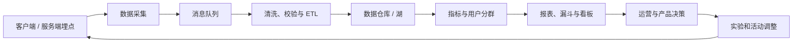

## 数据统计分析

在产品上运营过程中，需要各种数据的统计。游戏产品需要能收集这些数据供运营人员分析。

**关键词:**  
*DAU,ARPU,LTV,归因,AI Coding*

**标签:** 
*等级: 中级, 阶段: 运营, 分类: 运营能力, 角色: 管理|策划|运维*

## 图谱

## 目录

- [数据统计分析的作用](#数据统计分析的作用)
- [运营数据](#运营数据)
- [归因分析](#归因分析)
- [数据统计分析服务商](#数据统计分析服务商)
- [游戏数据](#游戏数据)

----

> 💡 **AI Coding 总览**（为何要掌握知识才能更好操作 AI、指南的三类内容等）见 [阅读说明 - AI Coding 总览](../../阅读说明.md#ai-coding-总览)。

---

## 数据统计分析的作用

| 维度 | 内容 |
|------|------|
| **作用** | 收集、统计、分析产品运营过程中的各种数据，支持运营决策 |
| **应用场景** | 产品运营监控；运营效果评估；运营决策支持；产品优化指导 |

| 具体内容 | 说明 |
|----------|------|
| **统计分析运营数据** | 留存、转化、日活等，用于评估产品运营效果 |
| **统计分析归因数据** | 了解产品导量来源，了解用户来源渠道 |
| **统计分析产品数据** | 分析产品本身的数据，如游戏难度、玩家行为等 |

| 问题 | 解决方向 |
|------|----------|
| **如何收集数据？** | 建立完善的数据收集体系；收集运营数据、归因数据、产品数据；确保数据准确性和完整性 |
| **如何分析数据？** | 从多个维度分析数据；使用专业的数据分析工具；深入挖掘数据价值 |
| **如何利用数据？** | 支持运营决策；指导产品优化；评估运营效果 |

| 要点和思考方向 |
|----------------|
| 数据统计分析是运营决策的基础 |
| 需要从多个维度分析数据，才能全面了解产品状况 |
| 数据收集要全面，分析要深入，才能发挥数据价值 |

| 类型 | AI Coding 指南 |
|------|----------------|
| **交互提示** | 说明需求；如「数据收集」「统计分析」「运营决策」「多维度分析」 |
| **方法** | 让 AI 设计数据采集体系、分析维度、决策支持流程 |
| **应用** | 数据收集、分析框架、运营决策支持 |
| **提示词范例** | 「产品需数据统计分析支持运营决策，请设计数据收集体系（运营、归因、产品数据）、多维度分析框架，以及数据准确性与完整性保障要点」 |

## 运营数据

| 维度 | 内容 |
|------|------|
| **作用** | 评估产品运营效果，支持运营决策 |
| **应用场景** | 日常运营监控；活动效果评估；产品优化决策；运营策略制定 |

| 指标类型 | 指标 | 说明 |
|----------|------|------|
| **获客** | 新增、eCPI | 新增用户数反映获客能力；eCPI评估获客成本 |
| **留存** | 次日/三日/七日留存率 | 反映产品初期吸引力、中期粘性、长期留存能力 |
| **活跃** | DAU、MAU | 日活跃用户数、月活跃用户数 |
| **变现** | 付费率、ARPU、ARPPU、LTV、eCPM | 付费用户占比；平均每用户收入；平均每付费用户收入；用户生命周期价值；千次展示成本 |

| 分析维度 | 说明 |
|----------|------|
| **设备** | 按设备类型分析（iOS、Android等） |
| **帐号** | 按帐号类型分析 |
| **角色** | 按游戏角色分析 |

| 问题 | 解决方向 |
|------|----------|
| **如何评估获客能力？** | 监控新增用户数；分析eCPI；优化获客策略 |
| **如何评估用户留存？** | 监控次日、三日、七日留存率；分析留存趋势；优化产品提升留存率 |
| **如何评估用户活跃度？** | 监控DAU和MAU；分析活跃度趋势 |
| **如何评估变现能力？** | 监控付费率、ARPU、ARPPU、LTV等；LTV需与获客成本对比评估ROI |
| **如何多维度分析数据？** | 从设备、账号、角色等多个维度分析；发现差异和问题；针对不同维度优化策略 |

| 要点和思考方向 |
|----------------|
| 运营数据是评估产品健康度的关键指标 |
| 留存率是游戏产品最重要的指标之一 |
| ARPU和ARPPU反映产品的变现能力 |
| LTV是评估用户价值的重要指标，需要与获客成本对比 |
| 多维度分析可以帮助发现问题和机会 |

| 类型 | AI Coding 指南 |
|------|----------------|
| **交互提示** | 说明需求；如「DAU」「MAU」「留存」「ARPU」「LTV」「付费率」「eCPI」 |
| **方法** | 让 AI 设计指标计算、多维度分析、报表结构 |
| **应用** | 运营指标统计、获客/留存/活跃/变现分析 |
| **提示词范例** | 「运营数据需统计获客（新增、eCPI）、留存（次日/三日/七日）、活跃（DAU、MAU）、变现（付费率、ARPU、ARPPU、LTV），请设计指标计算逻辑与按设备/账号/角色的多维度分析」 |

## 归因分析

| 维度 | 内容 |
|------|------|
| **作用** | 追踪并分析产品的数据，特别是广告效果数据 |
| **应用场景** | 买量时了解买量效果；广告投放效果评估；渠道效果分析；买量策略优化 |

| 服务商候选 | 说明 |
|------------|------|
| **Adjust** | 归因分析 |
| **AppsFlyer** | 营销数据、归因分析 |
| **Branch** | 深度链接和归因 |
| **智链引擎** | 国内归因服务 |
| **Kochava** | 归因和防作弊 |
| **Singular** | 营销分析平台 |

| 问题 | 解决方向 |
|------|----------|
| **如何评估广告投放效果？** | 检测广告效果数据；评估广告投放效果；优化广告投放策略 |
| **如何判断渠道效果？** | 追踪用户来源，了解用户渠道；评估不同渠道的广告效果 |
| **如何避免广告费用浪费？** | 使用归因分析服务；准确评估广告效果；优化广告费用分配 |
| **如何选择归因分析服务商？** | 对比不同服务商的功能和价格；根据业务需求选择；考虑国内和海外市场差异 |

| 要点和思考方向 |
|----------------|
| 归因分析是买量运营的基础工具 |
| 需要提前接入，才能在买量时准确评估效果 |
| 不同服务商的功能和价格有差异，需要根据需求选择 |

| 类型 | AI Coding 指南 |
|------|----------------|
| **交互提示** | 说明需求；如「归因」「广告效果」「渠道」「买量」「Adjust」「AppsFlyer」 |
| **方法** | 让 AI 设计归因接入、效果评估、渠道对比 |
| **应用** | 广告归因、买量效果、渠道分析 |
| **提示词范例** | 「买量需归因分析评估广告效果，请设计归因数据接入流程、渠道效果追踪、广告投放效果评估逻辑，以及 Adjust/AppsFlyer 等 SDK 接入要点」 |

## 数据统计分析服务商

| 维度 | 内容 |
|------|------|
| **作用** | 提供数据收集、存储、分析的一站式服务 |
| **应用场景** | 需要专业数据分析能力的团队；快速获得数据分析能力；降低数据分析成本 |

| 服务商候选 | 说明 |
|------------|------|
| **ThinkingData** | 运营数据、游戏分析数据 |
| **DataEye** | 游戏数据分析 |
| **App Annie** | 应用市场数据分析 |

| 问题 | 解决方向 |
|------|----------|
| **如何解决自建系统的问题？** | 使用专业的数据分析服务商；快速获得专业数据分析能力；降低开发成本和技术门槛 |
| **如何选择服务商？** | 对比不同服务商的功能和价格；根据业务需求选择；考虑数据安全和隐私保护 |
| **如何保证数据安全？** | 选择有良好安全记录的服务商；确保数据安全和隐私保护；满足合规要求 |

| 要点和思考方向 |
|----------------|
| 使用服务商可以快速获得专业的数据分析能力 |
| 需要根据业务需求选择合适的服务商 |
| 数据安全和隐私保护是重要考虑因素 |

| 类型 | AI Coding 指南 |
|------|----------------|
| **交互提示** | 说明需求；如「ThinkingData」「DataEye」「数据收集」「分析平台」「数据安全」 |
| **方法** | 让 AI 设计服务商选型、数据对接、安全合规 |
| **应用** | 服务商接入、数据对接、隐私合规 |
| **提示词范例** | 「需接入数据统计分析服务商（如 ThinkingData、DataEye），请设计数据对接流程、埋点规范、数据安全与隐私保护要点，以及自建 vs 服务商选型考量」 |

## 游戏数据

| 维度 | 内容 |
|------|------|
| **作用** | 分析游戏本身的数据，优化游戏体验 |
| **应用场景** | 游戏优化；难度调整；用户体验改进；游戏设计优化 |

| 问题 | 解决方向 |
|------|----------|
| **如何分析玩家行为？** | 采集玩家行为数据；分析玩家行为模式；了解玩家的游戏习惯和偏好 |
| **如何优化UI布局？** | 分析玩家点击和交互的热点区域；优化UI布局；提升用户体验 |
| **如何调整游戏难度？** | 分析玩家在不同关卡的表现；调整游戏难度；平衡游戏挑战性和可玩性 |
| **如何建立数据采集体系？** | 建立完善的数据采集体系；采集玩家行为、交互、关卡等数据；确保数据准确性和完整性 |

| 要点和思考方向 |
|----------------|
| 游戏数据分析可以帮助优化游戏体验 |
| 玩家行为分析可以了解玩家的游戏习惯和偏好 |
| 屏幕热点分析可以优化UI/UX设计 |
| 游戏难度分析可以平衡游戏挑战性和可玩性 |
| 需要建立完善的数据采集体系，才能进行有效分析 |

| 类型 | AI Coding 指南 |
|------|----------------|
| **交互提示** | 说明需求；如「玩家行为」「关卡难度」「UI热点」「数据采集」 |
| **方法** | 让 AI 设计行为埋点、难度分析、热点分析 |
| **应用** | 玩家行为分析、难度调整、UI 优化 |
| **提示词范例** | 「游戏数据需分析玩家行为、关卡难度、UI 热点，请设计数据采集埋点体系、行为模式分析逻辑、关卡表现统计，以及屏幕热点分析用于 UI 优化」 |

## 更多资料

- [Firebase Analytics — Google 游戏/应用数据分析平台](https://firebase.google.com/docs/analytics)
- [GameAnalytics — 专注游戏的免费数据分析服务](https://gameanalytics.com/)
- [ThinkingData（数数科技）— 游戏数据分析一站式平台](https://www.thinkingdata.cn/)
- [DataEye — 游戏行业数据分析服务商](https://www.dataeye.com/)
- [Unity Analytics — Unity 官方游戏分析工具](https://docs.unity.com/ugs/en-us/manual/analytics/manual/overview)
