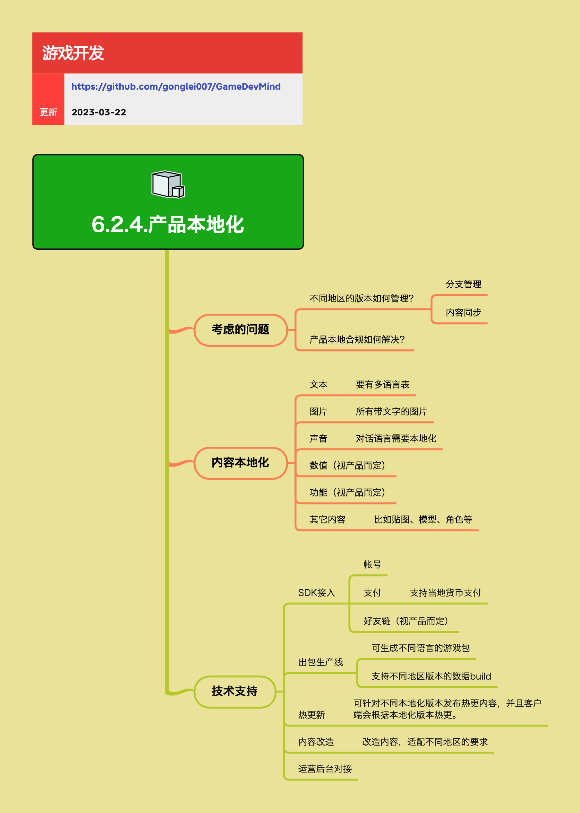

<h2 align="center">产品本地化</h2>

游戏产品在不同的国家进行运营，都需要做本地化的改造，以适应当地市场。这其中就会有很多需要技术来支持的工作。

**关键词:**  
*本地化,合规*

**标签:** 
*等级: 中级, 阶段: 开发|运营, 分类: 运营能力, 角色: 客户端开发|服务端开发|策划|管理*

## 图谱

## 子主题

### 产品本地化需要考虑的问题

**会遇到哪些问题？**

- **不同地区的版本如何管理？**
  - 问题：多个地区版本需要同时维护，如何管理不同版本的内容
  - 解决方案：
    - **分支管理**：为不同地区创建不同的版本分支
    - **内容同步**：保持不同地区版本的内容同步，避免功能差异过大
- **产品本地合规如何解决？**
  - 问题：不同地区有不同的法律法规要求，需要确保产品合规
  - 解决方案：需要了解各地区合规要求，在内容和技术上做相应调整

**要点和思考方向**

- 产品本地化不仅仅是翻译，还涉及内容、功能、合规等多个方面
- 版本管理是本地化的基础，需要建立清晰的版本管理策略
- 合规是本地化的前提，必须确保产品符合当地法律法规

### 内容本地化

**是做什么的？在哪用？**

- **作用**：将游戏内容适配到不同地区，包括文本、图片、声音等
- **应用场景**：游戏产品在不同国家/地区运营时的内容适配

**会遇到哪些问题？用什么解决？**

- **文本**：
  - 问题：游戏中有大量文本需要翻译
  - 解决方案：要有多语言表，支持多语言切换
- **图片**：
  - 问题：所有带文字的图片都需要本地化
  - 解决方案：为不同语言版本准备不同的图片资源
- **声音**：
  - 问题：对话语言需要本地化
  - 解决方案：为不同语言版本录制或准备不同的语音资源
- **数值（视产品而定）**：
  - 问题：不同地区的游戏数值可能需要调整
  - 解决方案：根据产品需求，可能需要调整游戏数值平衡
- **功能（视产品而定）**：
  - 问题：不同地区可能需要不同的功能
  - 解决方案：根据产品需求，可能需要为不同地区定制功能
- **其它内容**：
  - 问题：比如贴图、模型、角色等可能需要本地化
  - 解决方案：根据产品需求，可能需要调整美术资源

**要点和思考方向**

- 内容本地化是本地化的核心工作
- 多语言表是文本本地化的基础，需要设计好数据结构
- 图片和声音的本地化会增加资源包大小，需要合理规划
- 数值和功能的本地化需要根据产品策略决定

### 技术支持

**是做什么的？在哪用？**

- **作用**：提供本地化所需的技术支持，包括SDK接入、出包、热更新等
- **应用场景**：产品本地化的技术实现

**会遇到哪些问题？用什么解决？**

- **SDK接入**：
  - **帐号**：不同地区可能需要接入不同的账号系统
  - **支付**：
    - 问题：不同地区有不同的支付方式
    - 解决方案：支持当地货币支付，接入当地支付渠道
  - **好友链（视产品而定）**：根据产品需求，可能需要接入不同的社交平台
- **出包生产线**：
  - 问题：需要为不同地区生成不同的游戏包
  - 解决方案：
    - 可生成不同语言的游戏包
    - 支持不同地区版本的数据build
- **热更新**：
  - 问题：不同地区版本需要不同的热更内容
  - 解决方案：可针对不同本地化版本发布热更内容，并且客户端会根据本地化版本热更
- **内容改造**：
  - 问题：需要改造内容，适配不同地区的要求
  - 解决方案：建立内容改造流程，支持快速适配
- **运营后台对接**：
  - 问题：不同地区可能需要不同的运营后台功能
  - 解决方案：运营后台需要支持多地区、多语言

**要点和思考方向**

- SDK接入是本地化的基础，需要提前规划好接入方案
- 出包生产线要支持自动化，提高出包效率
- 热更新要支持多版本，避免不同地区版本混乱
- 内容改造要有规范流程，确保改造质量
- 运营后台要支持多地区管理，方便运营人员操作

### 本地化工作流程

**是做什么的？在哪用？**

- **作用**：规范本地化工作流程，确保本地化质量
- **应用场景**：产品本地化的全流程管理

**要点和思考方向**

- 本地化是一个系统工程，需要从内容、技术、运营等多个方面协同
- 需要建立清晰的本地化工作流程，包括：
  - 内容翻译和审核
  - 资源制作和替换
  - SDK接入和测试
  - 出包和发布
  - 热更新管理
- 需要建立本地化质量检查机制，确保本地化质量
- 需要建立版本管理机制，支持多地区版本并行维护
