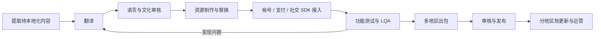

## 产品本地化

游戏产品在不同的国家进行运营，都需要做本地化的改造，以适应当地市场。这其中就会有很多需要技术来支持的工作。

**关键词:**  
*本地化,合规,AI Coding*

**标签:** 
*等级: 中级, 阶段: 开发|运营, 分类: 运营能力, 角色: 客户端开发|服务端开发|策划|管理*

## 图谱

## 目录

- [产品本地化需要考虑的问题](#产品本地化需要考虑的问题)
- [内容本地化](#内容本地化)
- [技术支持](#技术支持)
- [本地化工作流程](#本地化工作流程)

----

> 💡 **AI Coding 总览**（为何要掌握知识才能更好操作 AI、指南的三类内容等）见 [阅读说明 - AI Coding 总览](../../阅读说明.md#ai-coding-总览)。

---

## 产品本地化需要考虑的问题

| 维度 | 内容 |
|------|------|
| **作用** | 识别和解决产品本地化过程中的关键问题，确保本地化成功 |
| **应用场景** | 产品本地化规划阶段；多地区版本管理；本地化合规处理 |

| 问题 | 解决方向 |
|------|----------|
| **如何管理不同地区的版本？** | 为不同地区创建不同的版本分支；保持不同地区版本的内容同步，避免功能差异过大；建立清晰的版本管理策略 |
| **如何解决产品本地合规问题？** | 了解各地区合规要求；在内容和技术上做相应调整；确保产品符合当地法律法规 |

| 要点和思考方向 |
|----------------|
| 产品本地化不仅仅是翻译，还涉及内容、功能、合规等多个方面 |
| 版本管理是本地化的基础，需要建立清晰的版本管理策略 |
| 合规是本地化的前提，必须确保产品符合当地法律法规 |

| 类型 | AI Coding 指南 |
|------|----------------|
| **交互提示** | 说明需求；如「本地化」「多地区版本」「合规」「版本管理」 |
| **方法** | 让 AI 设计版本管理策略、合规检查清单 |
| **应用** | 多地区版本规划、合规评估 |
| **提示词范例** | 「产品需多地区本地化运营，请设计不同地区版本分支管理策略、内容同步机制，以及各地区合规要求（法律法规）的识别与适配要点」 |

## 内容本地化

| 维度 | 内容 |
|------|------|
| **作用** | 将游戏内容适配到不同地区，包括文本、图片、声音等 |
| **应用场景** | 游戏产品在不同国家/地区运营时的内容适配 |

| 内容类型 | 处理方式 | 说明 |
|----------|----------|------|
| **文本** | 多语言表、多语言切换 | 建立多语言表；设计好数据结构；实现文本资源加载和切换机制 |
| **图片** | 不同语言版本准备不同图片资源 | 图片本地化会增加资源包大小；需合理规划资源 |
| **声音** | 不同语言版本录制或准备不同语音资源 | 声音本地化会增加资源包大小；需合理规划资源 |
| **数值** | 视产品而定 | 根据产品需求调整游戏数值平衡；需根据产品策略决定 |
| **功能** | 视产品而定 | 根据产品需求为不同地区定制功能；需根据产品策略决定 |
| **其它** | 贴图、模型、角色等 | 根据产品需求调整美术资源；需根据产品策略决定 |

| 问题 | 解决方向 |
|------|----------|
| **如何处理文本本地化？** | 建立多语言表，支持多语言切换；设计好数据结构；实现文本资源加载和切换机制 |
| **如何处理图片本地化？** | 为不同语言版本准备不同的图片资源；合理规划资源；建立图片资源管理机制 |
| **如何处理声音本地化？** | 为不同语言版本录制或准备不同的语音资源；合理规划资源；建立声音资源管理机制 |
| **如何处理数值/功能/其它内容本地化？** | 根据产品需求和产品策略决定 |

| 要点和思考方向 |
|----------------|
| 内容本地化是本地化的核心工作 |
| 多语言表是文本本地化的基础，需要设计好数据结构 |
| 图片和声音的本地化会增加资源包大小，需要合理规划 |
| 数值和功能的本地化需要根据产品策略决定 |

| 类型 | AI Coding 指南 |
|------|----------------|
| **交互提示** | 说明需求；如「多语言表」「文本」「图片」「声音」「数值」「功能」 |
| **方法** | 让 AI 设计多语言数据结构、资源加载与切换 |
| **应用** | 文本本地化、图片/声音资源、数值与功能适配 |
| **提示词范例** | 「内容本地化需多语言表（文本）、图片/声音资源、数值与功能适配，请设计多语言数据结构、资源加载与切换机制，以及图片/声音资源包大小规划要点」 |

## 技术支持

| 维度 | 内容 |
|------|------|
| **作用** | 提供本地化所需的技术支持，包括SDK接入、出包、热更新等 |
| **应用场景** | 产品本地化的技术实现 |

| SDK类型 | 说明 |
|---------|------|
| **帐号** | 不同地区可能需要接入不同的账号系统；支持多种账号登录方式 |
| **支付** | 支持当地货币支付；接入当地支付渠道；支持多种支付方式 |
| **好友链（视产品而定）** | 根据产品需求接入不同的社交平台 |

| 问题 | 解决方向 |
|------|----------|
| **如何接入SDK？** | 不同地区接入不同的账号系统；支持当地货币支付，接入当地支付渠道；根据产品需求接入不同的社交平台 |
| **如何实现出包生产线？** | 可生成不同语言的游戏包；支持不同地区版本的数据build；实现自动化出包流程 |
| **如何实现热更新？** | 可针对不同本地化版本发布热更内容；客户端根据本地化版本热更 |
| **如何实现内容改造？** | 建立内容改造流程，支持快速适配；确保改造质量 |
| **如何对接运营后台？** | 运营后台需要支持多地区、多语言；方便运营人员操作 |

| 要点和思考方向 |
|----------------|
| SDK接入是本地化的基础，需要提前规划好接入方案 |
| 出包生产线要支持自动化，提高出包效率 |
| 热更新要支持多版本，避免不同地区版本混乱 |
| 内容改造要有规范流程，确保改造质量 |
| 运营后台要支持多地区管理，方便运营人员操作 |

| 类型 | AI Coding 指南 |
|------|----------------|
| **交互提示** | 说明需求；如「账号SDK」「支付SDK」「出包」「热更新」「运营后台」 |
| **方法** | 让 AI 设计 SDK 接入、出包流水线、热更多版本、后台多地区 |
| **应用** | 账号/支付接入、多语言出包、热更版本管理 |
| **提示词范例** | 「本地化技术支持需不同地区账号/支付 SDK、多语言出包流水线、多版本热更新、运营后台多地区支持，请设计 SDK 接入方案、自动化出包流程与热更版本管理」 |

## 本地化工作流程

```mermaid
flowchart LR
    S["提取待本地化内容"] --> T["翻译"] --> R["语言与文化审核"]
    R --> A["资源制作与替换"] --> SDK["帐号 / 支付 / 社交 SDK 接入"]
    SDK --> LQA["功能测试与 LQA"] --> B["多地区出包"] --> P["审核与发布"]
    P --> H["分地区热更新与运营"]
    LQA -->|发现问题| T
```

| 维度 | 内容 |
|------|------|
| **作用** | 规范本地化工作流程，确保本地化质量 |
| **应用场景** | 产品本地化的全流程管理；本地化项目执行；本地化质量保证 |

| 流程阶段 | 说明 |
|----------|------|
| **内容翻译和审核** | 内容翻译；内容审核；确保翻译质量 |
| **资源制作和替换** | 资源制作；资源替换；资源管理 |
| **SDK接入和测试** | SDK接入；SDK测试；确保SDK正常工作 |
| **出包和发布** | 出包；发布；版本管理 |
| **热更新管理** | 热更新管理；版本控制 |

| 问题 | 解决方向 |
|------|----------|
| **如何建立本地化工作流程？** | 建立清晰的本地化工作流程；包括内容翻译和审核、资源制作和替换、SDK接入和测试、出包和发布、热更新管理 |
| **如何保证本地化质量？** | 建立本地化质量检查机制；建立质量审核流程 |
| **如何管理多地区版本？** | 建立版本管理机制；支持多地区版本并行维护；实现版本同步和合并 |

| 要点和思考方向 |
|----------------|
| 本地化是一个系统工程，需要从内容、技术、运营等多个方面协同 |
| 需要建立清晰的本地化工作流程 |
| 需要建立本地化质量检查机制，确保本地化质量 |
| 需要建立版本管理机制，支持多地区版本并行维护 |

| 类型 | AI Coding 指南 |
|------|----------------|
| **交互提示** | 说明需求；如「翻译」「审核」「资源制作」「SDK接入」「出包」「热更新」 |
| **方法** | 让 AI 设计本地化流程、质量检查、版本管理 |
| **应用** | 本地化 SOP、质量审核、多地区版本维护 |
| **提示词范例** | 「本地化工作流程需内容翻译与审核、资源制作与替换、SDK 接入与测试、出包与发布、热更新管理，请设计完整流程、质量检查机制与多地区版本并行维护策略」 |

## 更多资料

| 链接 | 说明 |
|------|------|
| [Apple Localization Guide](https://developer.apple.com/localization/) | Apple 官方本地化指南，涵盖多语言资源管理与最佳实践 |
| [Google Play Localization](https://developer.android.com/distribute/best-practices/launch/localization-checklist) | Google Play 本地化检查清单与多语言发布指导 |
| [UE Localization Documentation](https://docs.unrealengine.com/en-US/ProductionPipelines/Localization/Overview/) | Unreal Engine 本地化系统完整文档，含文本本地化管道 |
| [Unity Localization Package](https://docs.unity3d.com/Packages/com.unity.localization@latest) | Unity 官方本地化包，支持文本/资源/字体多语言管理 |
| [LQA Best Practices](https://www.gamedeveloper.com/business/localization-quality-assurance-what-is-it-and-why-it-matters) | 本地化质量保障（LQA）最佳实践，含测试流程与checklist |
| [Crowdin Localization Platform](https://crowdin.com/page/game-localization) | 游戏本地化协作平台，支持翻译管理与CI/CD集成 |
