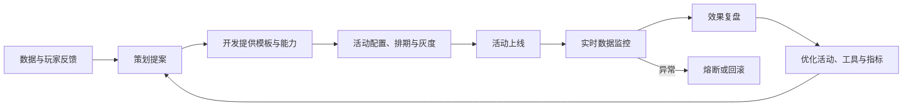

## LiveOps（实时运营）

LiveOps 是游戏上线后通过持续更新内容、活动、配置来保持玩家参与度和游戏收入的核心运营方式。不同于传统一次性发布的运营模式，LiveOps 强调实时响应和动态调整。

**关键词:** 
*LiveOps,实时运营,限时活动,赛季系统,热更新,AB测试,个性化推荐,PlayFab,AI Coding*

**标签:** 
*等级: 中级|高级, 阶段: 运营, 分类: 运营能力, 角色: 策划|服务端开发|客户端开发|数据分析|管理*

## 图谱

## 目录

- [LiveOps 的定义和价值](#liveops-的定义和价值)
- [LiveOps 的类型](#liveops-的类型)
- [LiveOps 的技术支撑](#liveops-的技术支撑)
- [LiveOps 的团队协作](#liveops-的团队协作)
- [常见工具和平台](#常见工具和平台)

----

> 💡 **AI Coding 总览**（为何要掌握知识才能更好操作 AI、指南的三类内容等）见 [阅读说明 - AI Coding 总览](../../阅读说明.md#ai-coding-总览)。

---

## LiveOps 的定义和价值

| 维度 | 内容 |
|------|------|
| **作用** | 通过持续更新内容、活动和配置，动态调整游戏体验，延长游戏生命周期，提升玩家留存和收入 |
| **应用场景** | 限时活动运营；赛季内容更新；实时数据驱动优化；玩家留存与回流策略 |

| 对比维度 | 传统运营 | LiveOps |
|----------|----------|---------|
| **更新频率** | 低频，数周或数月一次 | 高频，每日到每周 |
| **内容来源** | 预先规划，一次性发布 | 实时响应数据，动态调整 |
| **玩家反馈闭环** | 长周期，反馈滞后 | 短周期，快速迭代 |
| **技术依赖** | 依赖客户端更新 | 依赖热更新和配置管理 |
| **团队协作** | 相对独立，线性流程 | 紧密协作，闭环迭代 |

| 问题 | 解决方向 |
|------|----------|
| **什么是 LiveOps？** | 游戏上线后持续运营的方式；通过高频更新活动、内容、配置保持玩家新鲜感；核心是以数据驱动决策 |
| **为什么 LiveOps 重要？** | 延长游戏生命周期；提升玩家留存和活跃度；持续创造收入机会；快速响应市场变化和玩家反馈 |
| **如何从传统运营转向 LiveOps？** | 建立热更新技术能力；建立数据分析闭环；调整团队协作模式为快速迭代；引入活动管理和 AB 测试工具 |

| 要点和思考方向 |
|----------------|
| LiveOps 是现代游戏运营的核心模式，尤其在 F2P 手游中不可或缺 |
| 核心是"数据驱动 + 快速响应 + 持续迭代" |
| 需要技术、策划、数据分析三方面的紧密协作 |
| 成功案例：Fortnite、原神、Clash Royale 等均以 LiveOps 保持长期活跃 |

| 类型 | AI Coding 指南 |
|------|----------------|
| **交互提示** | 说明需求；如「LiveOps」「实时运营」「数据驱动」「快速迭代」「热更新」「玩家留存」 |
| **方法** | 让 AI 设计 LiveOps 整体方案、运营节奏规划、数据驱动决策流程 |
| **应用** | LiveOps 体系设计、运营节奏规划、数据闭环设计 |
| **提示词范例** | 「游戏需要建立 LiveOps 实时运营体系，请设计运营节奏规划（日/周/月活动日历）、数据驱动决策流程、与传统运营的过渡方案，以及策划-开发-数据分析闭环协作机制」 |

## LiveOps 的类型

| 维度 | 内容 |
|------|------|
| **作用** | 通过多样化、高频率的运营活动类型，保持玩家的新鲜感和参与度 |
| **应用场景** | 节日活动；赛季更新；日常任务；个性化运营；数据实验 |

| 活动类型 | 说明 | 适用场景 |
|----------|------|----------|
| **限时活动** | 在特定时间段内开放的临时活动（如节日活动、联动活动） | 短期留存拉升、付费刺激、节日营销 |
| **赛季系统** | 按周期（周/月/季）滚动的竞争或成长系统，含排名与奖励 | 长期留存、竞技激励、内容消耗 |
| **每日/每周挑战** | 周期性日常任务和挑战，提供稳定的日常活跃驱动 | 日常活跃维护、习惯养成 |
| **A/B测试** | 对部分玩家群体投放不同内容/价格/UI，对比效果后推广 | 定价优化、UI优化、内容验证 |
| **个性化推荐** | 基于玩家行为数据推送个性化内容、商品和活动 | 提高转化率、提升付费意愿 |

| 问题 | 解决方向 |
|------|----------|
| **如何设计限时活动？** | 设定明确的活动目标和KPI；合理控制活动频率避免疲劳；结合节日和热点话题增加吸引力 |
| **如何设计赛季系统？** | 确定赛季周期和主题；设计合理的奖励阶梯和排行榜机制；确保新赛季内容能覆盖不同阶段玩家 |
| **如何设计每日/每周挑战？** | 任务难度和奖励要平衡；与核心玩法挂钩，避免偏离游戏主线；提供适度多样性避免枯燥 |
| **如何实施 A/B 测试？** | 明确实验目标；控制变量保证结论可靠；样本量足够保证统计显著性；结果反馈到运营决策 |
| **如何实施个性化推荐？** | 建立用户标签和画像；设计推荐算法；平衡个性化与玩家隐私；持续优化推荐效果 |

| 要点和思考方向 |
|----------------|
| 活动类型要多样化但不能过度，保持玩家期待感 |
| 限时活动和赛季系统是 LiveOps 最重要的两种活动形式 |
| A/B 测试应以数据驱动决策，而非经验直觉 |
| 个性化推荐需要玩家数据的积累，建议逐步推进 |
| 活动日历需要提前规划，同时保留灵活调整空间 |

| 类型 | AI Coding 指南 |
|------|----------------|
| **交互提示** | 说明需求；如「限时活动」「赛季系统」「每日挑战」「A/B测试」「个性化推荐」「活动日历」 |
| **方法** | 让 AI 设计活动类型体系、活动日历规划、AB测试方案、推荐算法 |
| **应用** | 活动策划、赛季设计、AB测试执行、个性化推荐 |
| **提示词范例** | 「LiveOps 活动类型需限时活动（节日/联动）、赛季系统（排名/奖励）、每日/每周挑战、A/B测试与个性化推荐，请设计活动日历规划、各类型活动设计要点、AB 测试流程与推荐算法选型」 |

## LiveOps 的技术支撑

| 维度 | 内容 |
|------|------|
| **作用** | 提供 LiveOps 所需的技术基础设施，支持高频更新、数据分析和实验验证 |
| **应用场景** | 活动配置热更新；AB 实验框架；活动管理后台；数据分析流水线 |

| 技术组件 | 说明 | 关键能力 |
|----------|------|----------|
| **配置热更新** | 不通过客户端发版即可更新游戏配置、活动参数和资源 | 配置下发速度、版本兼容性、灰度发布、回滚机制 |
| **AB 测试框架** | 对玩家分群投放不同策略，实时收集数据对比效果 | 分群能力、指标追踪、统计显著性检验、实时实验管理 |
| **活动管理系统** | 可视化管理活动的创建、配置、排期和上下线 | 活动模板、排期管理、奖励配置、状态监控 |
| **数据分析 Pipeline** | 从数据采集、清洗、存储到分析和可视化的完整数据链 | 实时数据处理、多维度分析、报表自动生成、异常告警 |

| 问题 | 解决方向 |
|------|----------|
| **如何实现配置热更新？** | 使用远程配置服务；设计配置表结构和版本管理；实现灰度发布和快速回滚；确保客户端缓存和网络异常处理 |
| **如何搭建 AB 测试框架？** | 定义分群逻辑和分流算法；设计实验配置和指标追踪；保证统计显著性；建立实验决策流程（启动→监控→终止→推广） |
| **如何建设活动管理系统？** | 设计活动配置界面；支持活动模板和复用；实现排期和自动上下线；提供活动效果监控面板 |
| **如何建设数据分析 Pipeline？** | 设计数据埋点体系；搭建 ETL Pipeline；建立数据仓库；搭建可视化报表和看板；设置关键指标告警 |

| 要点和思考方向 |
|----------------|
| 热更新是 LiveOps 的基石，没有热更新能力就无法实现高频运营 |
| AB 测试框架要简单易用，降低策划使用门槛 |
| 活动管理系统应该让策划自主配置，减少开发介入 |
| 数据分析 Pipeline 需要支持实时和离线两种模式 |
| 技术选型时需权衡自研成本和第三方服务成熟度 |

| 类型 | AI Coding 指南 |
|------|----------------|
| **交互提示** | 说明需求；如「热更新」「AB测试框架」「活动管理系统」「数据Pipeline」「配置管理」「灰度发布」 |
| **方法** | 让 AI 设计技术架构、数据流、组件选型、系统设计 |
| **应用** | 热更新方案、AB 测试平台、活动管理后台、数据 Pipeline |
| **提示词范例** | 「LiveOps 技术支撑需配置热更新（灰度/回滚）、AB 测试框架（分群/显著性）、活动管理系统（模板/排期）与数据分析 Pipeline（埋点/ETL/看板），请设计整体技术架构与各组件数据流」 |

## LiveOps 的团队协作

| 维度 | 内容 |
|------|------|
| **作用** | 建立策划、开发、数据分析之间的快速协作闭环，支持 LiveOps 的高频迭代节奏 |
| **应用场景** | 活动从提案到上线的全流程；数据驱动的运营优化；异常事件的快速响应 |

| 角色 | 职责 | 在 LiveOps 闭环中的位置 |
|------|------|------------------------|
| **策划** | 设计活动方案、配置活动参数、制定运营策略 | 提出需求 → 配置活动 → 评估效果 |
| **开发** | 提供技术支撑、实现功能、保障系统稳定 | 搭建工具 → 支持配置 → 保障稳定性 |
| **数据分析** | 埋点设计、数据采集、效果分析、优化建议 | 定义指标 → 采集分析 → 反馈优化 |

| 闭环流程 | 说明 |
|----------|------|
| **1. 策划提案** | 策划基于数据分析和玩家反馈提出活动方案 |
| **2. 开发支持** | 开发提供活动模板和新功能支持，确保策划可自主配置 |
| **3. 活动上线** | 策划通过活动管理系统完成配置、排期和上线 |
| **4. 数据监控** | 数据分析实时监控活动效果和关键指标 |
| **5. 效果复盘** | 三方共同复盘活动效果，输出优化方向，进入下一轮迭代 |

| 问题 | 解决方向 |
|------|----------|
| **如何建立策划-开发-数据分析的协作闭环？** | 明确各方职责和交付物；建立固定的沟通节奏（日会/周会）；使用共享看板和文档；搭建策划可自主使用的工具平台 |
| **如何提高协作效率？** | 活动模板化减少重复开发；活动管理系统降低配置门槛；自动化报表减少人工分析；建立清晰的异常处理流程 |
| **如何保障系统稳定性？** | 活动上线前进行灰度验证；建立活动熔断机制；设置关键指标异常告警；制定应急预案和快速回滚流程 |

| 要点和思考方向 |
|----------------|
| LiveOps 的核心挑战不是技术，而是团队的协作节奏和流程 |
| 目标是让策划能自主运营，开发专注于平台和工具建设 |
| 数据分析要前置参与（定义指标）而非后置复盘（只看结果） |
| 高频迭代需要配套的工具和流程，否则团队容易 burnout |

| 类型 | AI Coding 指南 |
|------|----------------|
| **交互提示** | 说明需求；如「团队协作」「闭环流程」「策划-开发-分析」「活动模板」「快速迭代」 |
| **方法** | 让 AI 设计协作流程、角色职责、工具链规划、迭代节奏 |
| **应用** | 协作流程设计、活动管理工具、自动化报表 |
| **提示词范例** | 「LiveOps 团队需策划-开发-数据分析三方协作闭环，请设计协作流程（提案→开发→上线→监控→复盘）、各角色职责边界、活动模板化方案与策划自主运营工具平台设计」 |

## 常见工具和平台

| 维度 | 内容 |
|------|------|
| **作用** | 选型适合的 LiveOps 工具和平台，降低自研成本，加速运营能力建设 |
| **应用场景** | 远程配置管理；AB 测试；活动管理；数据分析；玩家沟通 |

| 工具/平台 | 类型 | 核心能力 | 适用场景 |
|-----------|------|----------|----------|
| **PlayFab** | 综合后端平台 | 玩家管理、LiveOps 活动、经济系统、排行榜、AB 测试 | 中小团队快速搭建 LiveOps 能力；跨平台游戏 |
| **Firebase Remote Config** | 远程配置 | 实时参数下发、条件化配置、AB 测试集成 | 移动端游戏远程配置和实验 |
| **Unity Gaming Services** | 综合平台 | Remote Config、AB 测试、排行榜、云存档、分析 | Unity 引擎项目一体化运营 |
| **GameSparks** | 后端即服务 | 排行榜、挑战系统、虚拟经济 | 需要灵活自定义后端的团队 |
| **自研方案** | 自建平台 | 完全定制化、数据安全可控 | 大型项目或有特殊需求的团队 |

| 对比维度 | PlayFab | Firebase Remote Config | 自研方案 |
|----------|---------|----------------------|----------|
| **接入成本** | 中等（SDK集成） | 低（Firebase生态） | 高（需完整开发） |
| **灵活性** | 中等 | 偏低（配置类为主） | 极高 |
| **功能完善度** | 高（含经济系统、排行榜） | 低（仅配置+AB） | 取决于投入 |
| **数据安全** | 数据在第三方 | 数据在第三方 | 完全可控 |
| **成本** | 按量付费 | 免费额度大 | 开发+维护成本 |
| **适合团队** | 中小团队 | 移动游戏 | 大团队/特殊需求 |

| 问题 | 解决方向 |
|------|----------|
| **如何选择 LiveOps 工具？** | 评估团队规模和预算；明确核心需求（仅是配置更新还是需要完整活动管理）；考虑引擎和平台兼容性；关注数据安全和合规要求 |
| **自研还是使用第三方？** | 早期建议先用第三方快速验证；核心能力稳定后可逐步自研关键组件；混合方案（第三方+自研补充）是常见选择 |
| **如何降低工具使用门槛？** | 选择有成熟文档和社区的工具；对策划进行使用培训；封装一层内部工具简化操作 |

| 要点和思考方向 |
|----------------|
| 工具选型要匹配团队阶段，不要过度投入 |
| PlayFab 是中小团队 LiveOps 的首选综合方案 |
| Firebase Remote Config 适合移动端快速启动远程配置 |
| 自研方案应聚焦差异化需求，通用能力尽量复用第三方 |
| 数据安全和隐私合规是选择第三方服务的重要考量 |

| 类型 | AI Coding 指南 |
|------|----------------|
| **交互提示** | 说明需求；如「PlayFab」「Firebase」「Remote Config」「自研方案」「工具选型」「Unity Gaming Services」 |
| **方法** | 让 AI 设计工具选型、接入方案、自研 vs 第三方对比 |
| **应用** | 工具选型、SDK 接入、自研方案设计 |
| **提示词范例** | 「LiveOps 工具选型需对比 PlayFab（活动/经济/AB）、Firebase Remote Config（远程配置）和 Unity Gaming Services，请设计选型评估矩阵、各平台接入要点、自研方案与第三方混合方案架构设计」 |

## 更多资料

| 链接 | 说明 |
|------|------|
| [PlayFab 官方文档](https://learn.microsoft.com/en-us/gaming/playfab/) | 微软旗下游戏后端平台，覆盖 LiveOps、玩家管理、经济系统等 |
| [Firebase Remote Config 文档](https://firebase.google.com/docs/remote-config) | Google 远程配置服务，支持实时参数下发和 AB 测试 |
| [Unity Gaming Services](https://unity.com/products/unity-gaming-services) | Unity 官方运营服务套件（Remote Config、AB 测试、排行榜等） |
| [GameAnalytics](https://gameanalytics.com/) | 免费游戏数据分析平台，适合 LiveOps 数据监控 |
| [Leanplum (CleverTap)](https://clevertap.com/) | 移动营销和个性化推荐平台，支持游戏内消息和 A/B 测试 |
| [Optimizely](https://www.optimizely.com/) | 商业 A/B 测试和实验平台，适合中大型团队 |
| [AWS GameTech - LiveOps](https://aws.amazon.com/gametech/liveops/) | AWS 游戏技术 LiveOps 解决方案与案例 |
| [GDC Vault - LiveOps](https://www.gdcvault.com/) | GDC 历年 LiveOps 相关演讲，含大量成功案例分析 |
