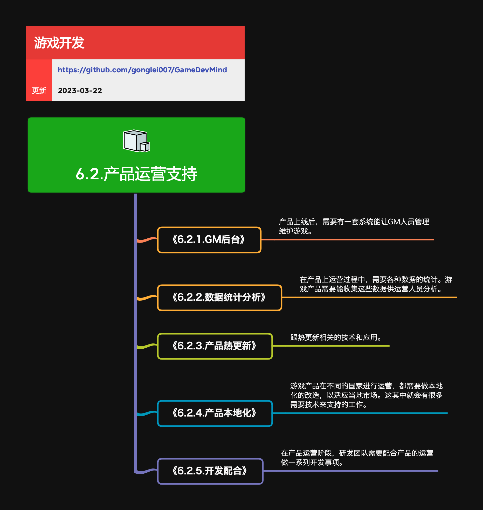

<h2 align="center">产品运营支持</h2>

发布出去的产品如何赚钱，全要靠运营团队的全力运作。做好配合与保障，能让大家过得都很滋润。

**关键词:**  
*分发*

**标签:** 
*等级: 中级, 阶段: 运营, 分类: 运营能力, 角色: 管理|运维|策划*

## 图谱

* [6.2.1.GM后台](6.2.1.GM后台.md)
* [6.2.2.数据统计分析](6.2.2.数据统计分析.md)
* [6.2.3.产品热更新](6.2.3.产品热更新.md)
* [6.2.4.产品本地化](6.2.4.产品本地化.md)
* [6.2.5.开发配合](6.2.5.开发配合.md)
* [6.2.6.AI助力游戏运营](6.2.6.AI助力游戏运营.md)
