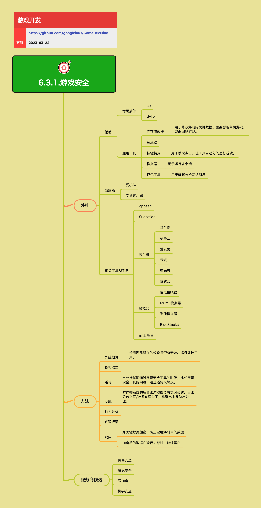

<h2 align="center">游戏安全</h2>

产品上线后，可能会发生各种破坏产品的情况。比如网络攻击、作弊、破解等等，这些都会破严重坏游戏的环境，影响大部分玩家的体验。
  了解一下所有跟安全相关的事情，做好防范、做好应对、做好善后，让产品别被搞垮。

**关键词:**  
*透传,混淆,加固,外挂,按键精灵*

**标签:** 
*等级: 中级|高级, 阶段: 开发|运营, 分类: 运营能力, 角色: 客户端开发|服务端开发|运维*

## 图谱

## 子主题

### 外挂威胁

**是什么？在哪用？**

- **作用**：了解游戏面临的外挂威胁，识别各种外挂类型
- **应用场景**：
  - 游戏安全防护规划
  - 外挂威胁分析
  - 安全策略制定

**会遇到哪些问题？用什么解决？**

- **如何应对辅助外挂？**
  - **问题**：游戏面临各种辅助外挂威胁
  - **解决方向**：
    - **辅助外挂：** 外挂类型
      - **专用插件：** 插件外挂
        - **so/dylib：动态库注入，修改游戏逻辑：** 动态库注入
          - 动态库注入
          - 修改游戏逻辑
      - **通用工具：** 通用工具
        - **内存修改器：用于修改游戏内关键数据。主要影响单机游戏，或弱网络游戏：** 内存修改
          - 用于修改游戏内关键数据
          - 主要影响单机游戏，或弱网络游戏
        - **变速器：修改游戏运行速度：** 变速工具
          - 修改游戏运行速度
        - **按键精灵：用于模拟点击，让工具自动化的运行游戏：** 模拟点击
          - 用于模拟点击
          - 让工具自动化的运行游戏
        - **模拟器：用于运行多个端：** 多开工具
          - 用于运行多个端
        - **抓包工具：用于破解分析网络消息：** 网络分析
          - 用于破解分析网络消息
    - 识别各种辅助外挂类型
    - 针对不同类型外挂采取相应的防护措施
    - 网络游戏相比单机游戏，外挂影响相对较小，但仍需防范

- **如何应对破解版？**
  - **问题**：游戏面临破解版威胁
  - **解决方向**：
    - **破解版：** 破解类型
      - **脱机挂：脱离客户端运行的外挂：** 脱机外挂
        - 脱离客户端运行的外挂
      - **受损客户端：被修改的客户端程序：** 客户端修改
        - 被修改的客户端程序
    - 识别破解版威胁
    - 采取相应的防护措施
    - 检测受损客户端

**要点和思考方向：**
- 外挂是游戏安全的主要威胁之一
- 外挂种类繁多，需要多层次的防护
- 网络游戏相比单机游戏，外挂影响相对较小，但仍需防范
- 需要了解常见外挂工具，才能有效防护
- 针对不同类型外挂采取相应的防护措施

### 外挂相关工具和环境

**是什么？在哪用？**

- **作用**：了解外挂相关的工具和环境，识别潜在威胁
- **应用场景**：
  - 外挂检测
  - 安全防护
  - 异常行为识别

**会遇到哪些问题？用什么解决？**

- **如何识别外挂工具和环境？**
  - **问题**：需要识别外挂相关的工具和环境
  - **解决方向**：
    - **相关工具&环境：** 工具识别
      - **Xposed：Android框架，可以修改系统行为：** 系统框架
        - Android框架
        - 可以修改系统行为
      - **SudoHide：隐藏root权限：** 权限隐藏
        - 隐藏root权限
      - **云手机：红手指、多多云、爱云兔、云派、蓝光云、蜂窝云等：** 云手机平台
        - 红手指
        - 多多云
        - 爱云兔
        - 云派
        - 蓝光云
        - 蜂窝云
        - 云手机和模拟器可能被用于多开、自动化等
      - **模拟器：雷电模拟器、Mumu模拟器、逍遥模拟器、BlueStacks等：** 模拟器平台
        - 雷电模拟器
        - Mumu模拟器
        - 逍遥模拟器
        - BlueStacks
        - 云手机和模拟器可能被用于多开、自动化等
      - **mt管理器：文件管理工具，可用于修改游戏文件：** 文件管理
        - 文件管理工具
        - 可用于修改游戏文件
    - 识别各种外挂工具和环境
    - 检测这些工具和环境，识别异常行为
    - 外挂工具和环境不断更新，需要持续关注

**要点和思考方向：**
- 外挂工具和环境不断更新，需要持续关注
- 云手机和模拟器可能被用于多开、自动化等
- 需要检测这些工具和环境，识别异常行为
- 建立完善的工具和环境检测机制

### 外挂检测方法

**是做什么的？在哪用？**

- **作用**：检测和识别外挂行为，保护游戏环境
- **应用场景**：游戏运行时的实时检测

**会遇到哪些问题？用什么解决？**

- **如何检测外挂？**
  - **问题**：需要检测游戏所在的设备是否有安装、运行外挂工具
  - **解决方向**：
    - **外挂检测：** 检测机制
      - **检测设备环境，识别外挂工具：** 环境检测
        - 检测设备环境
        - 识别外挂工具
        - 外挂检测需要多维度、多层次的方法
    - 检测设备环境，识别外挂工具
    - 外挂检测需要多维度、多层次的方法
    - 实时检测和后台分析相结合

- **如何检测模拟点击？**
  - **问题**：需要识别是否是人工操作还是模拟点击
  - **解决方向**：
    - **模拟点击检测：** 点击检测
      - **分析点击行为模式，识别异常：** 行为分析
        - 分析点击行为模式
        - 识别异常
        - 区分人工操作和模拟点击
    - 分析点击行为模式，识别异常
    - 区分人工操作和模拟点击
    - 建立点击行为模型

- **如何实现透传？**
  - **问题**：当外挂试图通过屏蔽安全工具的时候，比如屏蔽安全工具的网络
  - **解决方向**：
    - **透传：** 透传机制
      - **通过透传来解决，确保安全工具能正常工作：** 透传方案
        - 通过透传来解决
        - 确保安全工具能正常工作
        - 防止外挂屏蔽安全工具
    - 通过透传来解决，确保安全工具能正常工作
    - 防止外挂屏蔽安全工具
    - 建立透传机制

- **如何实现心跳监控？**
  - **问题**：需要实时监控客户端状态
  - **解决方向**：
    - **心跳：** 心跳机制
      - **防作弊系统的后台跟游戏端要有定时心跳，当跟后台交互/数据有异常了，检测出来并做出处理：** 心跳监控
        - 防作弊系统的后台跟游戏端要有定时心跳
        - 当跟后台交互/数据有异常了，检测出来并做出处理
        - 实时监控客户端状态
    - 防作弊系统的后台跟游戏端要有定时心跳
    - 当跟后台交互/数据有异常了，检测出来并做出处理
    - 实时监控客户端状态

- **如何进行行为分析？**
  - **问题**：需要识别异常游戏行为
  - **解决方向**：
    - **行为分析：** 分析机制
      - **通过AI和数据分析，识别异常行为模式：** AI分析
        - 通过AI和数据分析
        - 识别异常行为模式
        - 行为分析是重要的检测手段，可以识别新型外挂
        - 需要持续更新检测方法，应对新的外挂手段
    - 通过AI和数据分析，识别异常行为模式
    - 行为分析是重要的检测手段，可以识别新型外挂
    - 需要持续更新检测方法，应对新的外挂手段

**要点和思考方向**

- 外挂检测需要多维度、多层次的方法
- 实时检测和后台分析相结合
- 行为分析是重要的检测手段，可以识别新型外挂
- 需要持续更新检测方法，应对新的外挂手段

### 代码保护方法

**是做什么的？在哪用？**

- **作用**：保护游戏代码和数据，防止被破解和修改
- **应用场景**：游戏客户端保护

**会遇到哪些问题？用什么解决？**

- **如何实现代码混淆？**
  - **问题**：代码容易被反编译和分析
  - **解决方向**：
    - **代码混淆：** 混淆机制
      - **使用代码混淆，增加逆向难度：** 混淆方案
        - 使用代码混淆
        - 增加逆向难度
        - 代码混淆可以增加逆向难度，但不能完全防止
    - 使用代码混淆，增加逆向难度
    - 代码混淆可以增加逆向难度，但不能完全防止
    - 结合其他保护方法，形成多层防护

- **如何实现代码加固？**
  - **问题**：关键数据容易被破解
  - **解决方向**：
    - **加固：** 加固机制
      - **为关键数据加密，防止破解游戏中的数据：** 数据加密
        - 为关键数据加密
        - 防止破解游戏中的数据
      - **加密后的数据在运行加载时，能够解密：** 运行时解密
        - 加密后的数据在运行加载时，能够解密
        - 加固可以保护关键数据，但需要平衡性能和安全性
    - 为关键数据加密，防止破解游戏中的数据
    - 加密后的数据在运行加载时，能够解密
    - 加固可以保护关键数据，但需要平衡性能和安全性
    - 需要结合多种保护方法，形成多层防护

**要点和思考方向**

- 代码保护是游戏安全的基础
- 代码混淆可以增加逆向难度，但不能完全防止
- 加固可以保护关键数据，但需要平衡性能和安全性
- 需要结合多种保护方法，形成多层防护

### 游戏安全服务商

**是做什么的？在哪用？**

- **作用**：提供专业的游戏安全防护服务
- **应用场景**：需要专业安全防护能力的团队

**会遇到哪些问题？用什么解决？**

- **如何选择安全服务商？**
  - **问题**：自建安全系统成本高、技术门槛高
  - **解决方向**：
    - **安全服务商：** 服务选择
      - **使用专业的安全服务商：** 服务方案
        - 使用专业的安全服务商
        - 使用服务商可以快速获得专业的安全防护能力
        - 需要根据业务需求选择合适的服务商
        - 安全服务是持续性的，需要考虑长期成本
      - **服务商候选：** 服务商列表
        - **网易安全：提供游戏安全防护服务：** 网易安全
          - 提供游戏安全防护服务
        - **腾讯安全：提供游戏安全防护服务：** 腾讯安全
          - 提供游戏安全防护服务
        - **爱加密：提供移动应用安全服务：** 爱加密
          - 提供移动应用安全服务
        - **梆梆安全：提供移动应用安全服务：** 梆梆安全
          - 提供移动应用安全服务
    - 使用专业的安全服务商
    - 使用服务商可以快速获得专业的安全防护能力
    - 需要根据业务需求选择合适的服务商
    - 安全服务是持续性的，需要考虑长期成本

**要点和思考方向**

- **服务商候选**：
  - **网易安全**：提供游戏安全防护服务
  - **腾讯安全**：提供游戏安全防护服务
  - **爱加密**：提供移动应用安全服务
  - **梆梆安全**：提供移动应用安全服务
- 使用服务商可以快速获得专业的安全防护能力
- 需要根据业务需求选择合适的服务商
- 安全服务是持续性的，需要考虑长期成本

### 游戏安全防护策略

**是什么？在哪用？**

- **作用**：制定和实施游戏安全防护策略，保护游戏环境
- **应用场景**：
  - 游戏安全规划
  - 安全策略制定
  - 安全防护实施

**会遇到哪些问题？用什么解决？**

- **如何建立多层次防护？**
  - **问题**：需要建立多层次、多维度的防护
  - **解决方向**：
    - **多层次防护：** 防护体系
      - **游戏安全需要多层次、多维度的防护：** 防护策略
        - 游戏安全需要多层次、多维度的防护
        - 客户端防护和服务端验证相结合
        - 实时检测和事后分析相结合
    - 游戏安全需要多层次、多维度的防护
    - 客户端防护和服务端验证相结合
    - 实时检测和事后分析相结合

- **如何建立安全监控机制？**
  - **问题**：需要建立完善的安全监控和响应机制
  - **解决方向**：
    - **安全监控：** 监控机制
      - **需要建立完善的安全监控和响应机制：** 监控体系
        - 需要建立完善的安全监控和响应机制
        - 需要持续更新防护策略，应对新的威胁
    - 需要建立完善的安全监控和响应机制
    - 需要持续更新防护策略，应对新的威胁
    - 建立快速响应机制

- **如何平衡用户体验和安全性？**
  - **问题**：需要平衡用户体验和安全性
  - **解决方向**：
    - **平衡策略：** 平衡方案
      - **安全防护要平衡用户体验和安全性：** 用户体验
        - 安全防护要平衡用户体验和安全性
        - 避免过度防护影响用户体验
      - **需要建立玩家举报和处理机制：** 举报机制
        - 需要建立玩家举报和处理机制
        - 让玩家参与安全防护
    - 安全防护要平衡用户体验和安全性
    - 避免过度防护影响用户体验
    - 需要建立玩家举报和处理机制

**要点和思考方向：**
- 游戏安全需要多层次、多维度的防护
- 客户端防护和服务端验证相结合
- 实时检测和事后分析相结合
- 需要建立完善的安全监控和响应机制
- 需要持续更新防护策略，应对新的威胁
- 安全防护要平衡用户体验和安全性
- 需要建立玩家举报和处理机制

## 更多资料
