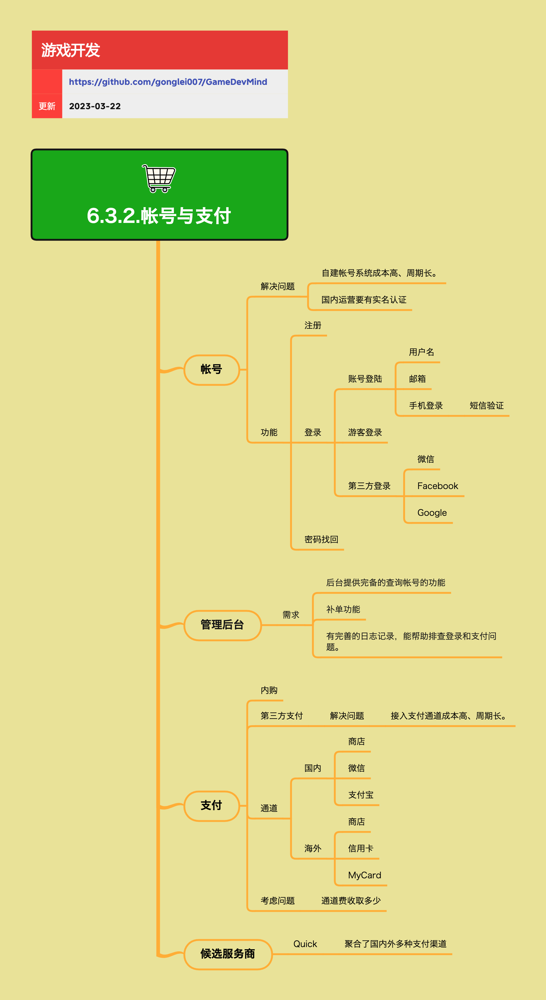

<h2 align="center">帐号与支付</h2>

用户要能跟产品建立关联，并且能把钱支付过来。

**关键词:** 
*用户验证,支付通道*

**标签:** 
*等级: 中级, 阶段: 开发|运营, 分类: 运营能力, 角色: 客户端开发|服务端开发|管理*

## 图谱

## 子主题

### 帐号系统

**是做什么的？在哪用？**

- **作用**：管理用户账号，建立用户与产品的关联
- **应用场景**：用户注册、登录、身份验证

**会遇到哪些问题？用什么解决？**

- **问题**：
  - 自建帐号系统成本高、周期长
  - 国内运营要有实名认证
- **解决方案**：
  - 使用第三方账号服务，降低开发成本
  - 接入实名认证服务，满足合规要求

**功能需求**：

- **注册**：用户注册账号
- **登录**：
  - **账号登录**：
    - 用户名登录
    - 邮箱登录
    - 手机登录（短信验证）
  - **游客登录**：临时账号，方便快速体验
  - **第三方登录**：
    - 微信（国内）
    - Facebook（海外）
    - Google（海外）
- **密码找回**：用户忘记密码时的找回功能

**要点和思考方向**

- 账号系统是产品的基础功能，需要稳定可靠
- 支持多种登录方式可以提升用户体验
- 第三方登录可以降低注册门槛，提高转化率
- 国内运营需要实名认证，需要提前规划
- 游客登录可以降低体验门槛，但需要引导绑定账号

### 账号管理后台

**是做什么的？在哪用？**

- **作用**：提供账号管理功能，支持运营人员查询和管理账号
- **应用场景**：账号查询、问题排查、订单补单

**会遇到哪些问题？用什么解决？**

- **需求**：
  - **后台提供完备的查询帐号的功能**：支持多种查询方式，快速定位账号
  - **补单功能**：支付异常时的补单处理
  - **有完善的日志记录，能帮助排查登录和支付问题**：记录关键操作日志，便于问题排查

**要点和思考方向**

- 管理后台是运营的重要工具，需要功能完善
- 账号查询功能要支持多种查询方式（账号、手机、邮箱等）
- 补单功能是支付异常处理的重要工具
- 日志记录要详细，包括登录、支付等关键操作
- 需要支持账号封禁、解封等管理功能

### 支付系统

**是做什么的？在哪用？**

- **作用**：处理用户支付，实现产品变现
- **应用场景**：游戏内购、道具购买、会员订阅等

**会遇到哪些问题？用什么解决？**

- **问题**：接入支付通道成本高、周期长
- **解决方案**：
  - 使用第三方支付服务，降低接入成本
  - 使用支付聚合服务，统一接入多个支付渠道

**支付方式**：

- **内购**：应用商店内购（App Store、Google Play等）
- **第三方支付**：
  - **国内**：
    - 商店（应用商店内购）
    - 微信支付
    - 支付宝
  - **海外**：
    - 商店（应用商店内购）
    - 信用卡
    - MyCard

**考虑问题**：

- **通道费收取多少**：不同支付渠道的手续费不同，需要综合考虑成本和用户体验

**要点和思考方向**

- 支付系统是产品变现的关键，需要稳定可靠
- 需要支持多种支付方式，满足不同用户需求
- 支付通道费用是重要成本，需要合理选择
- 需要处理支付异常情况，如掉单、重复支付等
- 需要建立支付监控和告警机制，及时发现问题

### 支付服务商

**是做什么的？在哪用？**

- **作用**：提供支付聚合服务，统一接入多个支付渠道
- **应用场景**：需要接入多个支付渠道的产品

**会遇到哪些问题？用什么解决？**

- **问题**：接入多个支付渠道成本高、维护复杂
- **解决方案**：使用支付聚合服务，统一接入和管理

**要点和思考方向**

- **候选服务商**：
  - **Quick**：聚合了国内外多种支付渠道
- 支付聚合服务可以降低接入成本，简化维护
- 需要选择有良好口碑和稳定服务的服务商
- 需要关注服务商的手续费和结算周期
- 需要了解服务商的技术支持和问题处理能力

### 账号与支付的安全考虑

**要点和思考方向**

- 账号和支付涉及用户隐私和资金安全，需要高度重视
- 需要采用加密传输，保护用户数据安全
- 需要建立完善的风控机制，防范欺诈和盗刷
- 需要定期进行安全审计，及时发现和修复漏洞
- 需要建立应急响应机制，快速处理安全问题
- 需要遵守相关法律法规，保护用户权益
