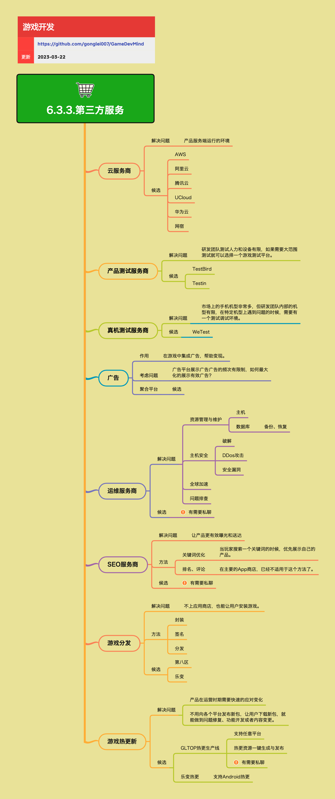

<h2 align="center">第三方服务</h2>

在游戏的商业化过程中，可能会需要接入一些第三方服务。

**关键词:** 
*分发,SEO,云测试,广告*

**标签:** 
*等级: 初级|中级, 阶段: 运营, 分类: 运营能力, 角色: 管理|运维|策划*

## 图谱

## 子主题

### 云服务商

**是做什么的？在哪用？**

- **作用**：提供产品服务端运行的环境
- **应用场景**：游戏服务器部署、数据存储、CDN加速等

**会遇到哪些问题？用什么解决？**

- **问题**：需要服务器、存储、网络等基础设施
- **解决方案**：使用云服务商，降低基础设施成本，提高灵活性

**要点和思考方向**

- **候选服务商**：
  - **AWS**：全球领先的云服务商
  - **阿里云**：国内主流云服务商
  - **腾讯云**：国内主流云服务商
  - **UCloud**：国内云服务商
  - **华为云**：国内云服务商
  - **网宿**：CDN和云服务商
- 云服务商选择需要考虑价格、服务、地域覆盖等因素
- 需要关注云服务商的稳定性和技术支持能力

### 产品测试服务商

**是做什么的？在哪用？**

- **作用**：提供产品测试服务，支持大范围测试
- **应用场景**：需要大量测试设备和人员的测试场景

**会遇到哪些问题？用什么解决？**

- **问题**：研发团队测试人力和设备有限，如果需要大范围测试就可以选择一个游戏测试平台
- **解决方案**：使用产品测试服务商，获得大量测试设备和专业测试服务

**要点和思考方向**

- **候选服务商**：
  - **TestBird**：游戏测试平台
  - **Testin**：移动应用测试平台
- 产品测试服务商可以提供大量真机测试环境
- 可以降低测试成本，提高测试效率
- 需要根据测试需求选择合适的服务商

### 真机测试服务商

**是做什么的？在哪用？**

- **作用**：提供真机测试环境，支持特定机型测试
- **应用场景**：在特定机型上遇到问题时的测试调试

**会遇到哪些问题？用什么解决？**

- **问题**：市场上的手机机型非常多，但研发团队内部的机型有限，在特定机型上遇到问题的时候，需要有一个测试调试环境
- **解决方案**：使用真机测试服务商，获得各种机型的测试环境

**要点和思考方向**

- **候选服务商**：
  - **WeTest**：腾讯WeTest，提供真机测试服务
- 真机测试服务商可以提供各种机型的测试环境
- 可以快速定位机型相关问题
- 适合解决特定机型的兼容性问题

### 广告服务

**是做什么的？在哪用？**

- **作用**：在游戏中集成广告，帮助变现
- **应用场景**：游戏内广告展示，实现广告变现

**会遇到哪些问题？用什么解决？**

- **问题**：广告平台展示广告的频次有限制，如何最大化的展示有效广告？
- **解决方案**：
  - 使用广告聚合平台，整合多个广告源
  - 优化广告展示策略，提高广告效果

**要点和思考方向**

- **聚合平台**：可以整合多个广告源，提高填充率和收益
- 需要平衡用户体验和广告收益
- 广告展示要合理，避免过度影响用户体验
- 需要关注广告质量和用户反馈

### 运维服务商

**是做什么的？在哪用？**

- **作用**：提供运维服务，支持资源管理和维护
- **应用场景**：需要专业运维支持的产品

**会遇到哪些问题？用什么解决？**

- **问题**：
  - **资源管理与维护**：主机、数据库（备份、恢复）等资源管理
  - **主机安全**：破解、DDos攻击、安全漏洞等安全问题
  - **全球加速**：跨地区网络加速需求
  - **问题排查**：运维问题排查和解决
- **解决方案**：使用运维服务商，获得专业的运维支持

**要点和思考方向**

- **候选服务商**：有需要私聊
- 运维服务商可以提供专业的运维服务，降低运维成本
- 可以快速响应运维问题，提高服务稳定性
- 需要选择有良好口碑和稳定服务的服务商

### SEO服务商

**是做什么的？在哪用？**

- **作用**：让产品更有效曝光和送达
- **应用场景**：产品推广和获客

**会遇到哪些问题？用什么解决？**

- **问题**：产品在应用商店中的曝光和排名不够
- **解决方案**：
  - **关键词优化**：当玩家搜索一个关键词的时候，优先展示自己的产品
  - **排名、评论**：在主要的App商店，已经不适用于这个方法了

**要点和思考方向**

- **候选服务商**：有需要私聊
- SEO服务可以帮助提升产品在应用商店中的曝光
- 关键词优化是重要的SEO手段
- 需要关注应用商店的规则变化，避免违规操作

### 游戏分发

**是做什么的？在哪用？**

- **作用**：不上应用商店，也能让用户安装游戏
- **应用场景**：绕过应用商店的分发需求

**会遇到哪些问题？用什么解决？**

- **问题**：需要绕过应用商店进行游戏分发
- **解决方案**：
  - **封装**：将游戏封装成可安装的包
  - **签名**：对游戏包进行签名
  - **分发**：通过分发平台分发游戏

**要点和思考方向**

- **候选服务商**：
  - **第八区**：游戏分发平台
  - **乐变**：游戏分发平台
- 游戏分发可以绕过应用商店，但需要注意合规性
- 需要关注分发平台的服务质量和稳定性
- 需要考虑分发成本和用户获取效果

### 游戏热更新

**是做什么的？在哪用？**

- **作用**：产品在运营时期需要快速的应对变化，不用向各个平台发布新包，让用户下载新包，就能做到问题修复、功能开发或者内容变更
- **应用场景**：快速修复问题、更新内容、发布活动

**会遇到哪些问题？用什么解决？**

- **问题**：
  - 产品在运营时期需要快速的应对变化
  - 不用向各个平台发布新包，让用户下载新包，就能做到问题修复、功能开发或者内容变更
- **解决方案**：使用游戏热更新服务，实现快速更新

**要点和思考方向**

- **候选服务商**：
  - **GLTOP热更生产线**：
    - 支持任意平台
    - 热更资源一键生成与发布
    - 有需要私聊
  - **乐变热更**：
    - 支持Android热更
- 游戏热更新可以大大提高运营效率
- 需要选择支持多平台的热更新服务
- 需要关注热更新的稳定性和兼容性

### 第三方服务选择考虑

**要点和思考方向**

- 第三方服务可以降低开发成本，提高开发效率
- 需要根据业务需求选择合适的服务商
- 需要关注服务商的服务质量、稳定性和技术支持能力
- 需要考虑服务成本和长期维护成本
- 需要建立服务商评估和切换机制，降低依赖风险

## 更多资料