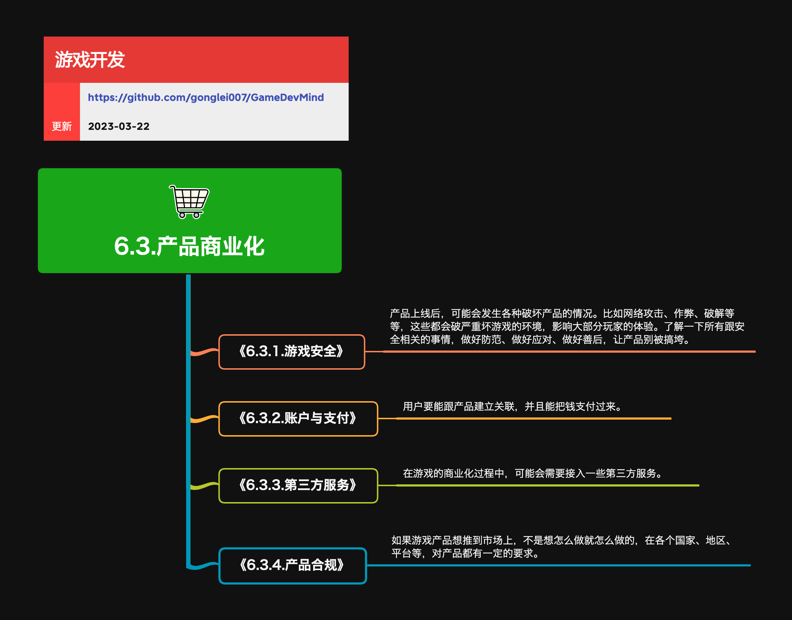

## 商业化与产品分发

商业化与产品分发负责把游戏产品转化为可持续收入，包括商品、支付、渠道、广告、归因和第三方服务。产品安全、反作弊和合规治理独立归入“产品安全与合规”。

**关键词:**  
*游戏热更，游戏分发，SEO，运维，广告聚合，真机测试，数据统计*

**标签:** 
*等级: 中级, 阶段: 运营, 分类: 运营能力, 角色: 管理|运维|策划*

## 图谱

* [6.3.支付与变现](6.3.2.帐号与支付.md)
* [6.3.3.第三方服务](6.3.3.第三方服务.md)

> 用户身份和登录属于 [3.3.5.用户与帐号系统](../3.研发能力/3.3.5.用户与帐号系统.md)；游戏安全与合规参见 [6.4.产品安全与合规](6.4.产品安全与合规.md)。

## 更多资料

- [Game Developer (原 Gamasutra)](https://www.gamedeveloper.com/) — 游戏行业商业、设计与运营深度文章，涵盖 F2P 变现、广告聚合等专题
- [Deconstructor of Fun](https://www.deconstructoroffun.com/) — 专注游戏商业化与产品策略分析的知名博客，由资深从业者撰写
- [GamesIndustry.biz](https://www.gamesindustry.biz/) — 全球游戏产业新闻与分析，覆盖发行、平台政策与市场趋势
- [Mobile Free to Play](https://mobilefreetoplay.com/) — 移动游戏 F2P 设计、变现与数据分析案例分析
- [Unity Monetization 文档](https://docs.unity.com/ads/) — Unity Ads 与 IAP 变现接入的官方技术文档
