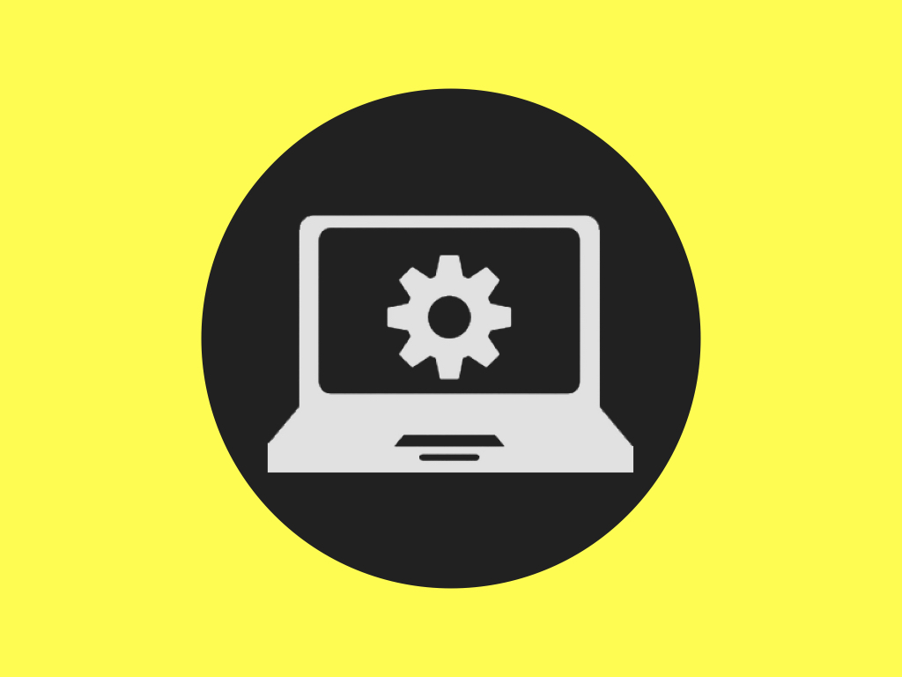

<h2 align="center">Test</h2>

| 基础能力 | 技术能力 | 研发能力 | 管理能力  | 商品化能力 |
|--- | --- | --- | --- | ---|
|  |  |  |  |  |
| 游戏产品也是一种软件产品，所有的软件研发， 就需要有一些共通的基础能力。 这些基础能力是软件开发的基本功，基本功越强， 整个产品的开发过程就会越稳健、高效。 |游戏软件有其特定的技术要求，要研发游戏产品，就可能会需要具备这些技术。 | 游戏产品也是一种软件产品，所有的软件研发， 就需要有一些共通的基础能力。 这些基础能力是软件开发的基本功，基本功越强， 整个产品的开发过程就会越稳健、高效。 |游戏产品也是一种软件产品，所有的软件研发， 就需要有一些共通的基础能力。 这些基础能力是软件开发的基本功，基本功越强， 整个产品的开发过程就会越稳健、高效。  |游戏产品也是一种软件产品，所有的软件研发， 就需要有一些共通的基础能力。 这些基础能力是软件开发的基本功，基本功越强， 整个产品的开发过程就会越稳健、高效。 |

<table border="none">
    <thead>
    </thead>
    <tbody>
        <tr>
            <td><a href="1.1.编程语言.md" target="_blank"></img></a></td>
            <td></img></td>
            <td></img></td>
            <td></img></td>
            <td></img></td>
        </tr>
        <tr>
            <td width="20%" align="center">基础能力</td>
            <td width="20%" align="center">技术能力</td>
            <td width="20%" align="center">研发能力</td>
            <td width="20%" align="center">管理能力</td>
            <td width="20%" align="center">商品化能力</td>
        </tr>
        <tr>
            <td>游戏产品也是一种软件产品，所有的软件研发，就需要有一些共通的基础能力。这些基础能力是软件开发的基本功，基本功越强，整个产品的开发过程就会越稳健、高效。</td>
            <td>游戏软件有其特定的技术要求，要研发游戏产品，就可能会需要具备这些技术。</td>
            <td>游戏是一种有艺术成分的商品，它是由数字内容和互动功能构建起来的。开发一款游戏产品，要有跟其它软件产品不同的一系列的技术、方法、流程。</td>
            <td>管理中最具挑战的是尺度、分寸与随机应变。火候少一分，生了；火候多一分，焦了。追求的是复杂的事情简单化，面对的也可能是简单的事情复杂化。</td>
            <td>作为一个组织，不论你有什么样的技术或能力，一个最重要的目标是——赚钱。在当下的市场环境下，一款好玩的游戏做出来了不一定就能够赚钱。还需要有一系列商品化能力，才能让产品运转和盈利，让团队持续存活。/* 这里只展示跟技术有关的那些事情 */</td>
        </tr>
    </tbody>
</table>

<table border="none">
        <tr>
            <td width="400"><a href="1.1.编程语言.md" target="_blank"></img></a></td>
            <td>【基础能力】  游戏产品也是一种软件产品，所有的软件研发，就需要有一些共通的基础能力。这些基础能力是软件开发的基本功，基本功越强，整个产品的开发过程就会越稳健、高效。</td>
        </tr>
        <tr>
            <td></img></td>
            <td>【技术能力】 游戏软件有其特定的技术要求，要研发游戏产品，就可能会需要具备这些技术。</td>
        </tr>
        <tr>
            <td></img></td>
            <td>【研发能力】 游戏是一种有艺术成分的商品，它是由数字内容和互动功能构建起来的。开发一款游戏产品，要有跟其它软件产品不同的一系列的技术、方法、流程。</td>
        </tr>
        <tr>
            <td></img></td>
            <td>【管理能力】 管理中最具挑战的是尺度、分寸与随机应变。火候少一分，生了；火候多一分，焦了。追求的是复杂的事情简单化，面对的也可能是简单的事情复杂化。</td>
        </tr>
        <tr>
            <td></img></td>
            <td>【商品化能力】 作为一个组织，不论你有什么样的技术或能力，一个最重要的目标是——赚钱。在当下的市场环境下，一款好玩的游戏做出来了不一定就能够赚钱。还需要有一系列商品化能力，才能让产品运转和盈利，让团队持续存活。/* 这里只展示跟技术有关的那些事情 */</td>
        </tr>
</table>

<table border="none">
    <thead>
    </thead>
    <tbody>
        <tr>
            <td><a href="1.1.编程语言.md" target="_blank"></img></a></td>
            <td></img></td>
            <td></img></td>
            <td></img></td>
            <td></img></td>
        </tr>
        <tr>
            <td width="20%" align="center"><a href="1.基础能力.md" target="_blank">基础能力</a></td>
            <td width="20%" align="center"><a href="2.技术能力.md" target="_blank">技术能力</a></td>
            <td width="20%" align="center"><a href="3.研发能力.md" target="_blank">研发能力</a></td>
            <td width="20%" align="center"><a href="4.管理能力.md" target="_blank">管理能力</a></td>
            <td width="20%" align="center"><a href="5.商品化能力.md" target="_blank">商品化能力</a></td>
        </tr>
    </tbody>
</table>
