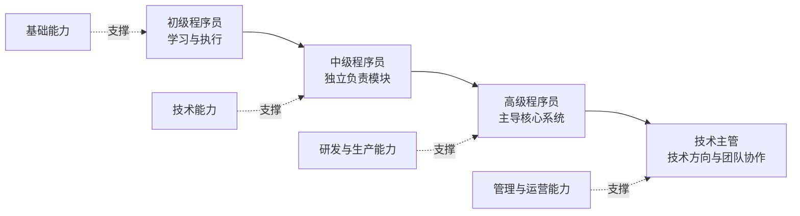

## 游戏程序员职业发展路径

游戏程序员在不同职业阶段需要具备的能力和职责，以及对应的学习资源。从初级程序员到技术主管，每个阶段都有明确的能力要求、职责范围和成长路径。本指南帮助你了解各阶段的核心要求，并找到相应的学习资源。

**关键词:** 
*职业发展,程序员,技术能力,管理能力,学习路径,职业规划*

**标签:** 
*等级: 入门|初级|中级|高级, 阶段: 学习|开发|管理, 分类: 专题内容, 角色: 客户端开发|服务端开发|全栈开发|技术管理*

---

## 目录

- [职业发展路径总览](#职业发展路径总览)
- [各阶段详细说明](#各阶段详细说明)
  - [初级程序员](#初级程序员)
  - [中级程序员](#中级程序员)
  - [高级程序员](#高级程序员)
  - [技术主管](#技术主管)
- [成长建议](#成长建议)

---

## 职业发展路径总览

<table width="100%" border=1 style="border-collapse: collapse;">
    <thead style="background-color: #f6f8fa; font-weight: bold;">
        <tr>
            <th width="15%" style="padding: 12px; text-align: center;">职级</th>
            <th width="25%" style="padding: 12px; text-align: center;">主要职责</th>
            <th width="30%" style="padding: 12px; text-align: center;">所需能力</th>
            <th width="30%" style="padding: 12px; text-align: center;">相关学习资源</th>
        </tr>
    </thead>
    <tbody>
        <tr>
            <td style="padding: 12px; vertical-align: top;">
                <strong>初级程序员</strong> 
                <em>(Junior Programmer)</em>
            </td>
            <td style="padding: 12px; vertical-align: top;">
                <ul style="margin: 0; padding-left: 20px;">
                    <li>完成简单模块的编码任务</li>
                    <li>修复基础功能的 Bug</li>
                    <li>协助开发工具的使用与维护</li>
                </ul>
            </td>
            <td style="padding: 12px; vertical-align: top;">
                <ul style="margin: 0; padding-left: 20px;">
                    <li>掌握至少一种编程语言（如 C++、C#）</li>
                    <li>了解常用数据结构与算法</li>
                    <li>熟悉游戏引擎的基本使用（如 Unity、Unreal）</li>
                </ul>
            </td>
            <td style="padding: 12px; vertical-align: top;">
                <ul style="margin: 0; padding-left: 20px;">
                    <li><a href="../1.基础能力/1.基础能力.md">基础能力图谱</a></li>
                    <li><a href="../2.技术能力/2.技术能力.md">技术能力图谱</a></li>
                </ul>
            </td>
        </tr>
        <tr>
            <td style="padding: 12px; vertical-align: top;">
                <strong>中级程序员</strong> 
                <em>(Intermediate Programmer)</em>
            </td>
            <td style="padding: 12px; vertical-align: top;">
                <ul style="margin: 0; padding-left: 20px;">
                    <li>独立负责模块的设计与实现</li>
                    <li>优化现有系统的性能</li>
                    <li>参与代码评审与技术文档编写</li>
                </ul>
            </td>
            <td style="padding: 12px; vertical-align: top;">
                <ul style="margin: 0; padding-left: 20px;">
                    <li>深入理解游戏引擎的工作原理</li>
                    <li>具备良好的系统设计能力</li>
                    <li>掌握调试与性能分析工具的使用</li>
                </ul>
            </td>
            <td style="padding: 12px; vertical-align: top;">
                <ul style="margin: 0; padding-left: 20px;">
                    <li><a href="../3.研发能力/3.研发能力.md">研发能力图谱</a></li>
                    <li><a href="../4.生产能力/4.生产能力.md">生产能力图谱</a></li>
                </ul>
            </td>
        </tr>
        <tr>
            <td style="padding: 12px; vertical-align: top;">
                <strong>高级程序员</strong> 
                <em>(Senior Programmer)</em>
            </td>
            <td style="padding: 12px; vertical-align: top;">
                <ul style="margin: 0; padding-left: 20px;">
                    <li>主导核心系统的架构设计</li>
                    <li>解决复杂的技术难题</li>
                    <li>指导初中级程序员的工作</li>
                </ul>
            </td>
            <td style="padding: 12px; vertical-align: top;">
                <ul style="margin: 0; padding-left: 20px;">
                    <li>精通多种编程语言与开发框架</li>
                    <li>具备跨平台开发经验</li>
                    <li>优秀的沟通与团队协作能力</li>
                </ul>
            </td>
            <td style="padding: 12px; vertical-align: top;">
                <ul style="margin: 0; padding-left: 20px;">
                    <li><a href="../5.管理能力/5.管理能力.md">管理能力图谱</a></li>
                    <li><a href="../6.运营能力/6.运营能力.md">运营能力图谱</a></li>
                </ul>
            </td>
        </tr>
        <tr>
            <td style="padding: 12px; vertical-align: top;">
                <strong>技术主管</strong> 
                <em>(Technical Lead)</em>
            </td>
            <td style="padding: 12px; vertical-align: top;">
                <ul style="margin: 0; padding-left: 20px;">
                    <li>制定技术发展方向与标准</li>
                    <li>协调各技术团队的工作</li>
                    <li>推动技术创新与优化</li>
                </ul>
            </td>
            <td style="padding: 12px; vertical-align: top;">
                <ul style="margin: 0; padding-left: 20px;">
                    <li>深厚的技术背景与项目管理经验</li>
                    <li>战略思维与决策能力</li>
                    <li>出色的领导与沟通技巧</li>
                </ul>
            </td>
            <td style="padding: 12px; vertical-align: top;">
                <ul style="margin: 0; padding-left: 20px;">
                    <li><a href="../5.管理能力/5.管理能力.md">管理能力图谱</a></li>
                    <li><a href="../6.运营能力/6.运营能力.md">运营能力图谱</a></li>
                </ul>
            </td>
        </tr>
    </tbody>
</table>

---

## 各阶段详细说明

### 初级程序员

**阶段特点：** 这是进入游戏开发行业的起点，主要任务是学习和执行。

**核心目标：**
- 快速掌握基础编程技能
- 熟悉游戏开发流程和工具
- 能够独立完成简单的功能模块

**能力要求：**
- **编程基础：** 熟练掌握至少一种编程语言（推荐 C++ 或 C#），理解面向对象编程
- **数据结构与算法：** 掌握常用数据结构（数组、链表、栈、队列等）和基础算法
- **游戏引擎：** 熟悉 Unity 或 Unreal 等主流游戏引擎的基本使用
- **版本控制：** 熟练使用 Git 等版本控制工具

**学习建议：**
- 从 [基础能力图谱](../1.基础能力/1.基础能力.md) 开始，系统学习编程语言、数据结构等基础知识
- 参考 [技术能力图谱](../2.技术能力/2.技术能力.md)，了解游戏开发所需的技术栈
- 多做小项目练习，积累实践经验

---

### 中级程序员

**阶段特点：** 能够独立负责模块开发，开始关注代码质量和系统设计。

**核心目标：**
- 独立设计和实现复杂功能模块
- 优化系统性能，提升代码质量
- 参与技术决策和团队协作

**能力要求：**
- **系统设计：** 能够设计中等规模的系统架构，理解设计模式和软件工程原则
- **性能优化：** 掌握性能分析工具，能够识别和解决性能瓶颈
- **问题解决：** 具备独立调试和解决复杂问题的能力
- **技术文档：** 能够编写清晰的技术文档和代码注释

**学习建议：**
- 深入学习 [研发能力图谱](../3.研发能力/3.研发能力.md)，掌握游戏研发的核心技术
- 参考 [生产能力图谱](../4.生产能力/4.生产能力.md)，了解提高开发效率的工具和方法
- 参与代码评审，学习他人的优秀实践

---

### 高级程序员

**阶段特点：** 成为技术专家，能够解决复杂技术问题，并指导团队成员。

**核心目标：**
- 主导核心系统的架构设计
- 解决项目中的关键技术难题
- 培养和指导初级、中级程序员

**能力要求：**
- **技术深度：** 精通多种编程语言和开发框架，对技术有深入理解
- **架构能力：** 能够设计大型系统的架构，考虑可扩展性、可维护性
- **跨平台经验：** 具备多平台开发经验，理解不同平台的特性
- **团队协作：** 优秀的沟通能力，能够与不同角色的人员有效协作

**学习建议：**
- 学习 [管理能力图谱](../5.管理能力/5.管理能力.md)，提升团队协作和项目管理能力
- 参考 [运营能力图谱](../6.运营能力/6.运营能力.md)，了解产品运营相关的技术需求
- 关注行业前沿技术，持续学习新技术和最佳实践

---

### 技术主管

**阶段特点：** 从技术专家转向技术管理者，关注技术战略和团队发展。

**核心目标：**
- 制定技术发展方向和技术标准
- 协调和管理技术团队
- 推动技术创新和流程优化

**能力要求：**
- **技术战略：** 能够从业务角度思考技术问题，制定技术路线图
- **团队管理：** 具备团队管理经验，能够激励和培养团队成员
- **决策能力：** 在复杂情况下做出正确的技术决策
- **领导力：** 能够影响和推动技术变革，建立技术文化

**学习建议：**
- 深入学习 [管理能力图谱](../5.管理能力/5.管理能力.md)，掌握项目管理、团队管理等技能
- 参考 [运营能力图谱](../6.运营能力/6.运营能力.md)，理解技术与业务的结合
- 学习管理学和领导力相关课程，提升软技能

---

## 成长建议

### 持续学习
- 保持对新技术的好奇心，但不要盲目追新
- 定期回顾和总结自己的技术成长
- 参与技术社区，与同行交流学习

### 实践积累
- 多做项目，从实践中学习
- 参与开源项目，贡献代码
- 尝试解决工作中的实际问题

### 软技能培养
- 提升沟通表达能力
- 培养团队协作精神
- 学习时间管理和项目管理

### 职业规划
- 明确自己的职业目标和发展方向
- 定期评估自己的能力和差距
- 主动寻求挑战和成长机会

---

> 💡 **提示：** 职业发展不是线性的，每个人的成长路径可能不同。重要的是找到适合自己的方向，持续学习和实践，在技术深度和广度之间找到平衡。

## 更多资料

- [Milo Yip 的游戏程序员学习路径](https://github.com/miloyip/game-programmer) — 腾讯技术专家叶劲峰整理的完整游戏程序员知识体系（GitHub）
- [Game Engine Architecture (豆瓣)](https://book.douban.com/subject/26829016/) — Jason Gregory 著，游戏引擎架构经典必读，涵盖引擎各子系统
- [80 Level](https://80.lv/) — 游戏开发技术前沿文章，访谈与案例分析，覆盖美术、程序、TA 各方向
- [GDC Vault](https://www.gdcvault.com/) — 游戏开发者大会官方演讲存档，行业顶级专家分享技术与职业经验
- [r/gamedev Career Threads](https://www.reddit.com/r/gamedev/wiki/getting_started/) — Reddit gamedev Wiki 新人指南与职业规划资源汇总
