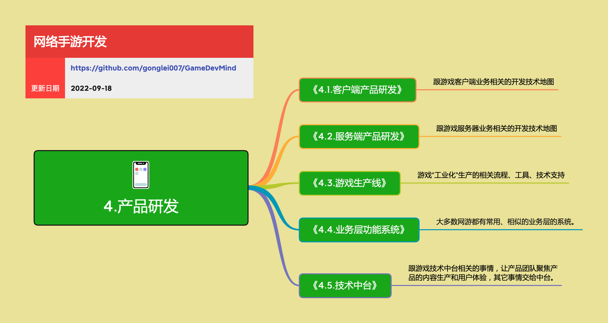

<h2 align="center">产品研发</h2>

游戏是一种有艺术成分的商品，它是由数字内容和互动功能构建起来的。开发一款游戏产品，要有跟其它软件产品不同的一系列的技术、方法、流程。

**关键词:**  
*游戏研发*

**标签:** 
*等级: 中级|高级, 阶段: 开发, 分类: 研发能力, 角色: 客户端开发|服务端开发|管理*

## 图谱

## 目录

- [子主题](#子主题)

----

## 子主题
* [4.1.客户端产品研发](3.研发能力/3.1.客户端产品研发.md)
    * [4.1.1.客户端底层通用系统](3.研发能力/3.1.1.客户端底层通用系统.md)
    * [4.1.2.客户端3D场景开发](3.研发能力/3.1.2.客户端3D场景开发.md)
    * [4.1.3.客户端优化](3.研发能力/3.1.3.客户端优化.md)
* [4.2.服务端产品研发](3.研发能力/3.2.服务端产品研发.md)
    * [4.2.1.服务端架构](3.研发能力/3.2.1.服务端底层架构.md)
* [4.3.业务层功能系统](3.研发能力/3.3.业务层功能.md)
* [4.4.游戏生产线](4.生产能力/4.1.游戏生产.md)
    * [4.4.1.数字内容生产线](4.生产能力/4.1.1.数字内容生产.md)
    * [4.4.2.系统开发生产线](4.生产能力/4.2.工具开发.md)
    * [4.4.3.持续交付](4.生产能力/4.3.3.DevOps.md)
* [4.5.技术中台](4.生产能力/4.3.技术中台.md)
    * [4.5.1.游戏开发支持](4.生产能力/4.3.1.快速开发框架.md)
