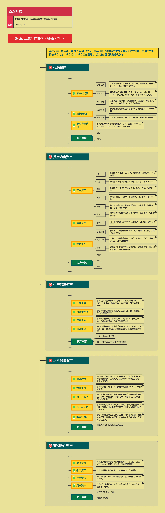

<h2 align="center">游戏研运资产样例-SLG手游（2D）</h2>

要开发并上线运营一款 SLG 手游（2D），需要准备好并积累下来的全套相关资产清单。可用于辅助评估项目内容、项目成本、项目工作量等，为游戏立项或投资提供参考。

**关键词:** 
*SLG,手游,游戏资产,项目评估,成本评估*

**标签:** 
*等级: 中级|高级, 阶段: 开发|运营, 分类: 专题内容, 角色: 管理|策划|客户端开发|服务端开发*

## 图谱

